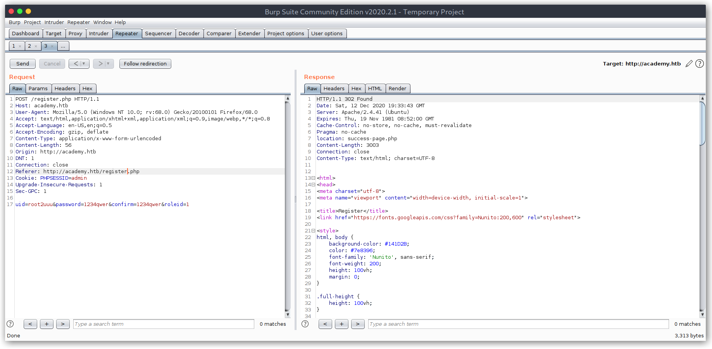
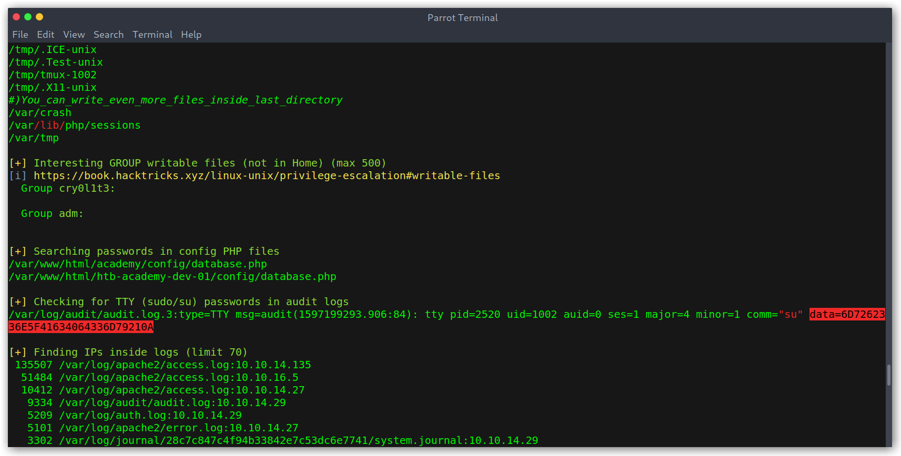

# Hack The Box: Academy write-up

Academy was an easy-rated machine that starts with a parameter tampering that grants admin privileges in the web app. From there we get a new vhost where we find a Laravel APP key, which can be used to gain RCE. To get user we just need to do some enumeration and find a reused password. The way to root is not that direct, we first need to do a horizontal privilege escalation taking advantage of the fact that our current user is in the `adm` group and can read logs. Finding a password in one of the logfiles leads to the other user, who can run `Composer` as root (and easily escalate privileges).

Let's start! The IP of the machine is ``10.10.10.215``.

## Enumeration

I start by enumerating open ports to discover the services running in the machine. As always, I'll first add `academy.htb` to my `/etc/hosts` file, then fire up nmap:

*Result of nmap scan*

```
# Nmap 7.80 scan initiated Sat Dec 12 19:26:28 2020 as: nmap -sV -sC -oA nmap/initial academy.htb
Nmap scan report for academy.htb (10.10.10.215)
Host is up (0.018s latency).
Not shown: 998 closed ports
PORT   STATE SERVICE VERSION
22/tcp open  ssh     OpenSSH 8.2p1 Ubuntu 4ubuntu0.1 (Ubuntu Linux; protocol 2.0)
80/tcp open  http    Apache httpd 2.4.41 ((Ubuntu))
|_http-server-header: Apache/2.4.41 (Ubuntu)
|_http-title: Hack The Box Academy
Service Info: OS: Linux; CPE: cpe:/o:linux:linux_kernel

Service detection performed. Please report any incorrect results at https://nmap.org/submit/ .
# Nmap done at Sat Dec 12 19:26:37 2020 -- 1 IP address (1 host up) scanned in 8.28 seconds
```

Not too much, just SSH and HTTP on the standard ports.

### Port 80 enumeration

We can see some sort of HTB Academy website with courses.

*Main website*


There seems to be a login / register functionality, so I signed up for an account:

*Registering a user*


However, none of the details I entered are displayed, instead I get the account of a user named `egre55` (creator of the box).

*Logged in user view*


After inspecting everything I couldn't find anything interesting, so I fired up `ffuf` and started directory bruteforcing. Noticing that the endpoints I had seen before all had `.php` extensions I tried to enumerate more PHP files.

*Directory bruteforce*


Cool! Looks like `admin.php` and `config.php` could be interesting. I got my hopes up too much, as `config.php` just returned a blank page and `admin.php` was just a login page.

*Admin login page*


### Registering an admin user

From here on it seemed clear, I had to find a way to escalate my normal user privileges to be an admin. I was a bit lost so I started monitoring requests with Burp to see how the registration flow was implemented. To my surprise there was a parameter, `roleid`, set to `0`. I imagined that could indicate whether the user was an admin or not, so I changed it to `1`.

*Creating an admin*



Then I tried to log in to the admin panel I had seen earlier and could access it with this new account!

*Admin panel*


Stuff to point out from this page was:

- Two usernames: `cry0l1t3` and `mrb3n`.
- A new virtual host: `de-staging-01.academy.htb`.

### Laravel RCE

I added the new vhost `de-staging-01.academy.htb` to my hosts file and upon visting it I was greeted with a Laravel exception!

*Website Laravel Exception*


I dug through the `Envirnoment & details` section and found the APP key.

*Laravel APP key leak*


Now, if you are not aware, the APP key can be used to gain RCE because of an insecure unserialize call:

> This module exploits a vulnerability in the PHP Laravel Framework for versions 5.5.40, 5.6.x <= 5.6.29.
        Remote Command Execution is possible via a correctly formatted HTTP X-XSRF-TOKEN header, due to
        an insecure unserialize call of the decrypt method in Illuminate/Encryption/Encrypter.php.
        Authentication is not required, however exploitation requires knowledge of the Laravel APP_KEY.
        Similar vulnerabilities appear to exist within Laravel cookie tokens based on the code fix.
        In some cases the APP_KEY is leaked which allows for discovery and exploitation.

There is a [Metasploit module](https://www.exploit-db.com/exploits/47129) that we can use to exploit this issue. One thing to take into account is that it needs the dev vhost in order to work.

*Metasploit module*


Then we just run it and get a shell as `www-data`.

*Shell as www-data*


## User Privileges

I started by enumerating the `/var/www/html/htb-academy-dev-01/` directory that contained the code for the dev vhost.

*Directory with code for dev vhost*


Going over some files I found that `.env` contained some interesting `DB_` credentials: `homestead:homestead`.

*.env file credentials*


I tried to use them to check the database contents but had no luck.

*Trying to access the DB with the .env credentials*


This was strange since the database was working when registering (otherwise we wouldn't be able to create a new user). I knew there had to be some valid credentials lying around, so I kept on digging and found that on the `academy` directory was the same file with different size.

*/var/www/html directories*


*.env file on the academy directory*


The credentials were different: `dev:mySup3rP4s5w0rd!!`. Still I kept getting access denied!

*Trying to access the DB with new credentials*


Then, while going over the files I remembered about the `config.php` file that I saw during my directory bruteforcing and decided to check it out.

*Contents of config.php*


Got it! Those were the credentials being used to connect to the database: `root:GkEWXn4h34g8qx9fZ1`. I was finally able to access the database and take a look at what was in there.

*Accessing the DB*


*users table contents*


I was a bit let down, as the first few entries (which were the ones not created by other users trying to pwn the box) only had `mySup3rP4s5w0rd!!` (md5 hash) and then `test0` through to `test2`.

At this point I wanted to check if the gathered credentials had been reused somewhere else.

- `users.txt`:

```
root
21y4d
ch4p
cry0l1t3
egre55
g0blin
mrb3n
```

- `passwords.txt`

```
GkEWXn4h34g8qx9fZ1
mySup3rP4s5w0rd!!
```

*CrackMapExec to get valid SSH credentials*


We can log in as SSH with `cry0l1t3:mySup3rP4s5w0rd!!` and read `user.txt`.

*Getting user*


## Root Privileges

Once logged in as `cry0l1t3` I ran a common linux enumeration script, [linpeas.sh](https://github.com/carlospolop/privilege-escalation-awesome-scripts-suite/blob/master/linPEAS/linpeas.sh). After a while it found something interesting, a `su` call with a password!

*Inspecting audit logs*



Note that this is only possible because `cry0l1t3` is in the `adm` group:

> Group adm is used for system monitoring tasks. Members of this group can read many log files in /var/log, and can use xconsole.

Hex decoding `6D7262336E5F41634064336D79210A` to ascii gave me `mrb3n_Ac@d3my!`, which I then tried with CrackMapExec against all users I had (for obvious reasons the user was `mrb3n`).

*New user credentials*


From here on it was crystal clear, as always I checked `sudo -l` and saw that `mrb3n` can run `Composer` as sudo. Following this [post](https://gtfobins.github.io/gtfobins/composer/) I was able to get root in no time.

*Running Composer as sudo*


This is quite simple, `Composer` lets you define custom commands, so here we are defining a script with a single command, called `x`. The [docs](https://getcomposer.org/doc/articles/scripts.md#writing-custom-commands) have an example that's really simple and may explain it better than me.

Once root I explored a bit and noticed an `academy.txt` file under `/root`.

*Root directory*


*academy.txt contents*


*HackTheBox academy*


Cool! Seems like we'll get some HTB courses, they'll definitely be worth taking a look at.

## Conclusion

This is everything, I hope you enjoyed the writeup and learned something new. If you liked it you can give me respect on Hack The Box through the following link: <https://www.hackthebox.eu/home/users/profile/31531>. Until next time!

---

*Diego Bernal Adelantado*
