# Hack The Box: Blunder machine write-up

Blunder is an easy box based on a not so popular CMS, called Blundit. We start by finding a hidden file by bruteforcing and after reading the content of the blog we find the password for that user. The exploit gives us a low privilege shell, which we can use to find a hash to get to user. Finally, the privilege escalation is based on a sudo 1.8 bypass.

Let's dig in! The IP of the machine is ``10.10.10.191``.

## Enumeration

I start by enumerating open ports to discover the services running in the machine. I fire up nmap:

*Result of nmap scan*

```
# Nmap 7.80 scan initiated Sun Jun 21 23:51:50 2020 as: nmap -sV -sV -oA nmap/initial blunder.htb
Nmap scan report for blunder.htb (10.10.10.191)
Host is up (0.080s latency).
Not shown: 998 filtered ports
PORT   STATE  SERVICE VERSION
21/tcp closed ftp
80/tcp open   http    Apache httpd 2.4.41 ((Ubuntu))

Service detection performed. Please report any incorrect results at https://nmap.org/submit/ .
# Nmap done at Sun Jun 21 23:52:06 2020 -- 1 IP address (1 host up) scanned in 16.39 seconds
```

Weirdly, ftp is closed, so I will start poking at the web server.

### Port 80 enumeration

We can see that this is some sort of personal facts website:

*Initial webpage*

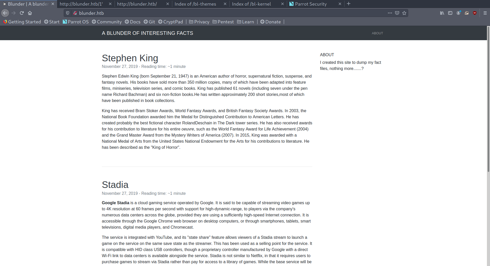

I checked out the source code and found some paths I had never seen.

*Source code and directory listing enabled*

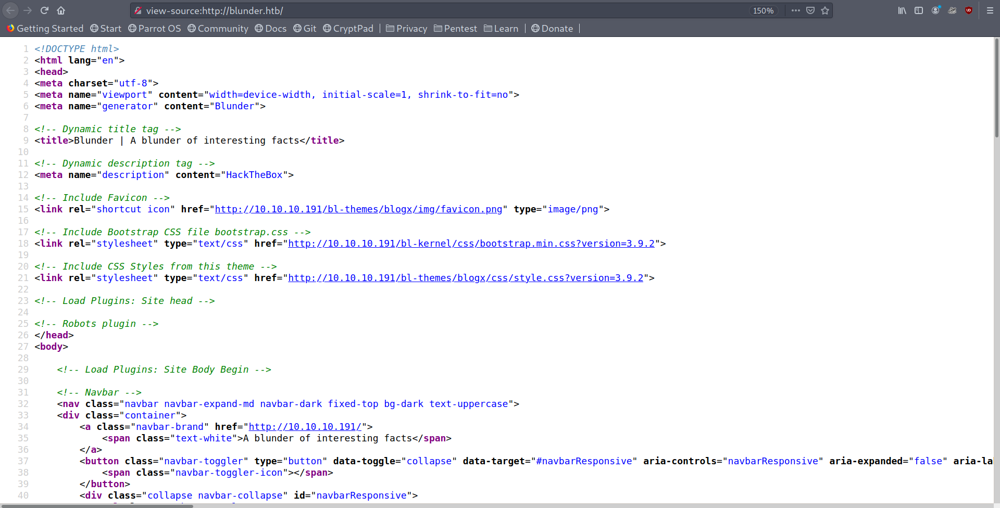

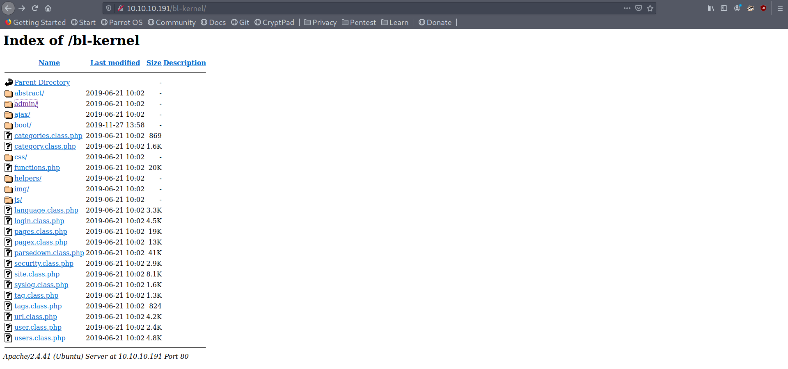

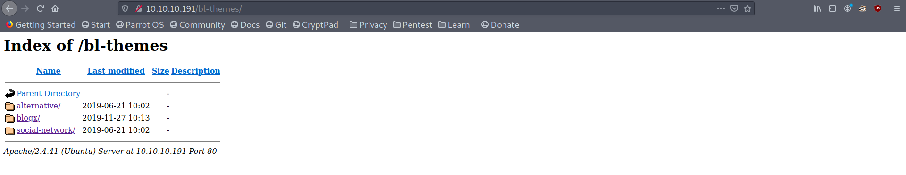

I googled a bit, as this looked like some sort of CMS and found one on github:

*CMS on the box*

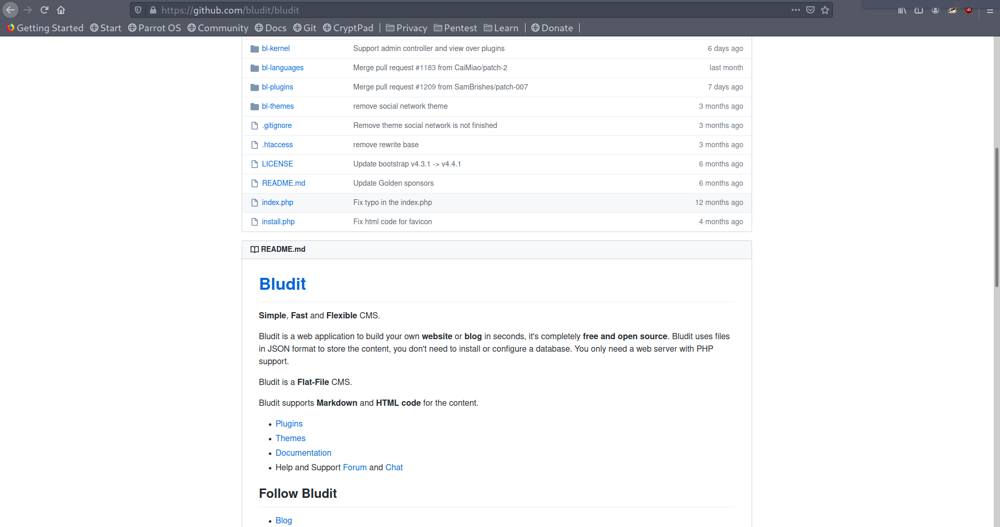

At this point my bruteforce attack had finished so I checked the results:

```
$ffuf -u http://blunder.htb/FUZZ -w /usr/share/wordlists/dirbuster/directory-list-2.3-medium.txt -e .txt -fs 7561

        /'___\  /'___\           /'___\       
       /\ \__/ /\ \__/  __  __  /\ \__/       
       \ \ ,__\\ \ ,__\/\ \/\ \ \ \ ,__\      
        \ \ \_/ \ \ \_/\ \ \_\ \ \ \ \_/      
         \ \_\   \ \_\  \ \____/  \ \_\       
          \/_/    \/_/   \/___/    \/_/       

       v1.1.0-git
________________________________________________

 :: Method           : GET
 :: URL              : http://blunder.htb/FUZZ
 :: Wordlist         : FUZZ: /usr/share/wordlists/dirbuster/directory-list-2.3-medium.txt
 :: Extensions       : .txt
 :: Follow redirects : false
 :: Calibration      : false
 :: Timeout          : 10
 :: Threads          : 40
 :: Matcher          : Response status: 200,204,301,302,307,401,403
 :: Filter           : Response size: 7561
________________________________________________

about                   [Status: 200, Size: 3280, Words: 225, Lines: 106]
admin                   [Status: 301, Size: 0, Words: 1, Lines: 1]
robots.txt              [Status: 200, Size: 22, Words: 3, Lines: 2]
todo.txt                [Status: 200, Size: 118, Words: 20, Lines: 5]
usb                     [Status: 200, Size: 3959, Words: 304, Lines: 111]
LICENSE                 [Status: 200, Size: 1083, Words: 155, Lines: 22]
```

Contents of `todo.txt`:

```
-Update the CMS
-Turn off FTP - DONE
-Remove old users - DONE
-Inform fergus that the new blog needs images - PENDING
```

Good! So now we have a user: `fergus`. I couldn't find anything else so I went back to the beginning and started reading the articles, where one detail caught my eye:

*fergus' password*

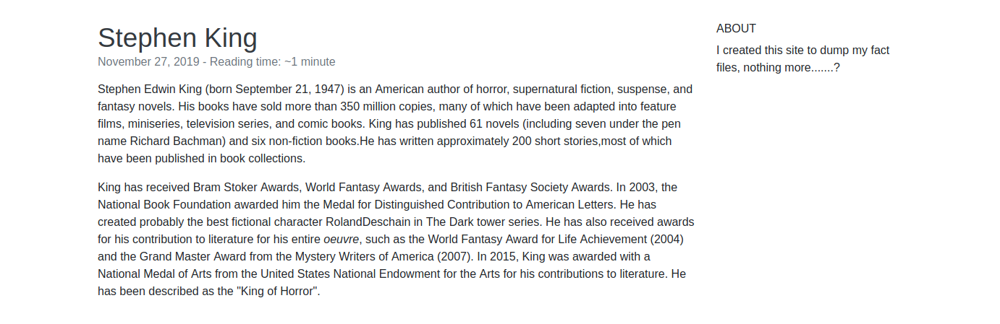

If reading closely we can see `RolandDeschain` in the second paragraph, which is either a typo or something else. Mmmmm....

## Gaining access to the system

I thought a pair of credentials could be `fergus:RolandDeschain`, so I looked for exploits and found a few that could be successful:

*Using searchsploit for finding exploits*

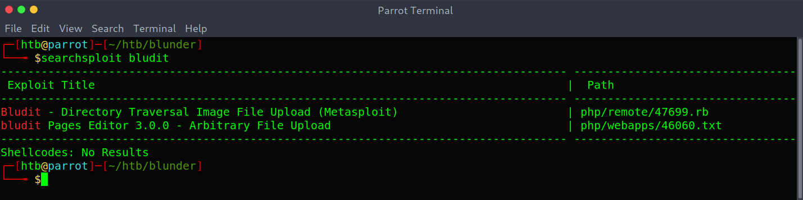

I then fired up metasploit and ran the exploit.

*Running the exploit*

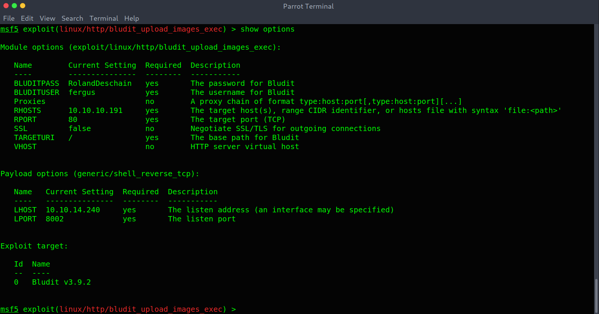

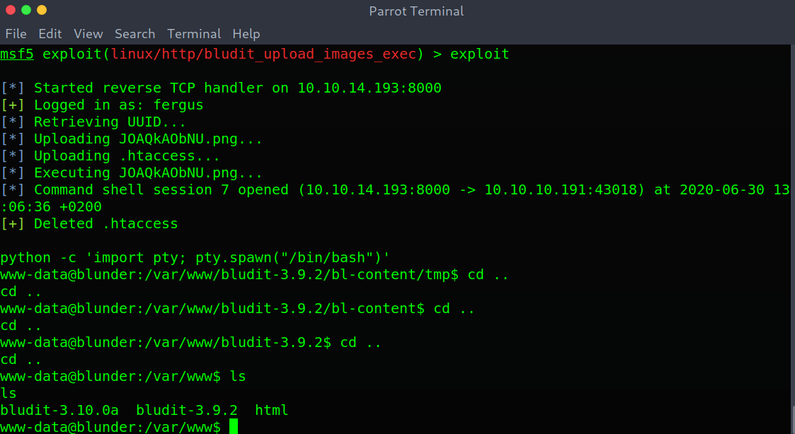

Good! We are in with a low privileged shell.

## Privilege Escalation I

I noticed there were two installations of Bludit and then started enumerating the filesystem. Under `/` a directory stood out: `/ftp`.

*Uncommon directory*

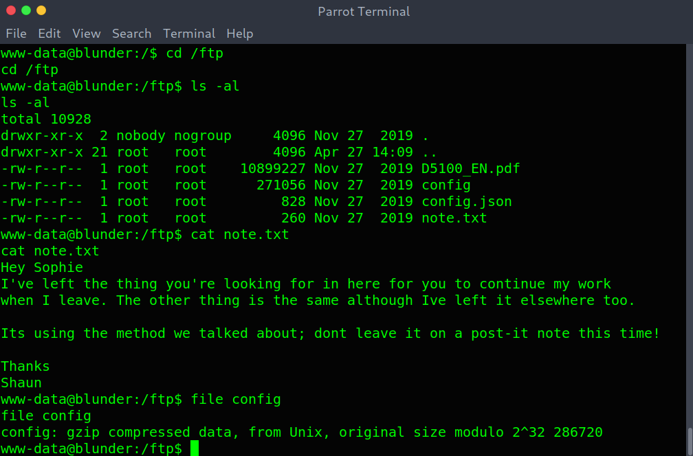

It had a note with some method (?) and some compressed data in `config`. So I decompressed it multiple times and got `buzz.wav`. Nothing could be heard so I thought this was some stego challenge.

### Rabbit Hole I

I spent quite some time trying to figure out how to extract data and finally came up with the password used to extract the data:

*Steganography part*

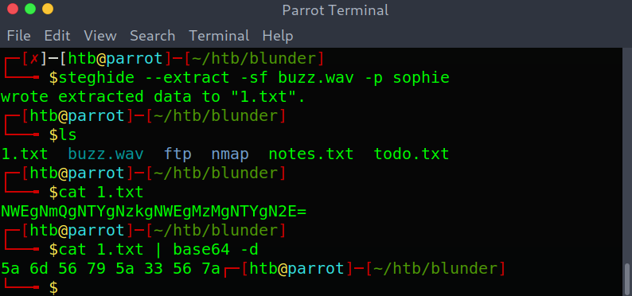

After converting `5a6d56795a33567a` from hex to ASCII I got `ZmVyZ3Vz`. However, I couldn't use it anywhere.

### Getting user

I then remembered there were two installations of Bludit so I started looking at the source code and found a `users.php` file with a hash for `hugo`.

*users.php contents*

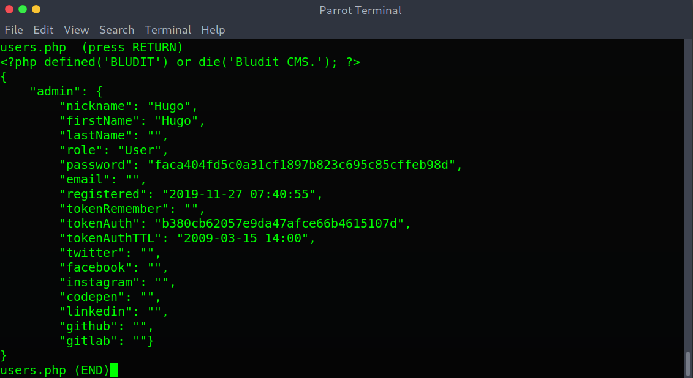

Then using crackstation I got the password: `Password120`.

*Cracking the hash*

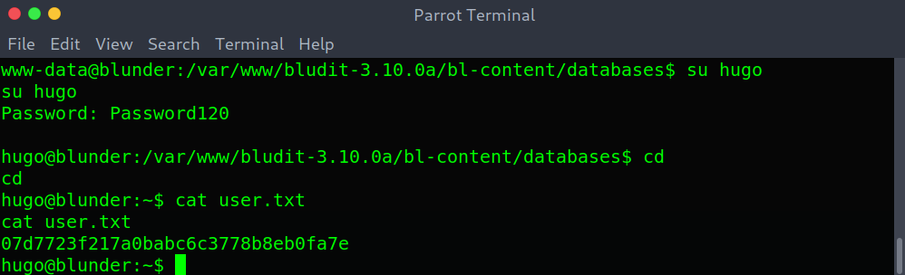

## Privilege escalation II

Being `hugo` I ran `sudo -l` as always and found some interesting rule.

*Sudo rule*

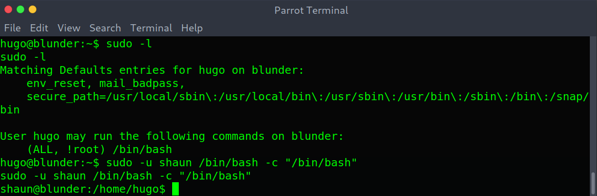

### Rabbit hole II

I didn't immediately google the rule, as the rule itself implied I could run `/bin/bash` as everyone apart from `root`. Seeing there was another user's home directory under `/home/shaun` I thought the privilege escalation would be as that user.

```sh
sudo -u shaun /bin/bash -c "/bin/bash"
```

However I couldn't find anything new as that user, so I thought maybe the user was a rabbit hole.

### Intended way to root

I retraced my steps and googled the rule to immediately find an exploit-db entry: <https://www.exploit-db.com/exploits/47502>. The exploit is explained as follows:

> Sudo doesn't check for the existence of the specified user id and executes the with arbitrary user id with the sudo priv
-u#-1 returns as 0 which is root's id and /bin/bash is executed with root permission.

*Becoming root*

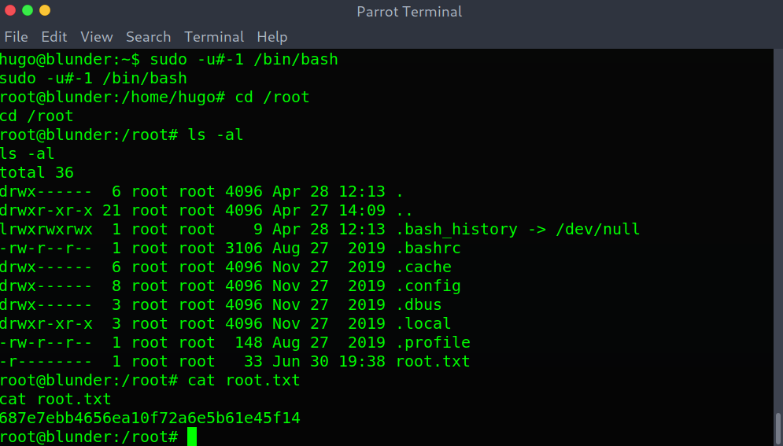

This is everything, I hope you enjoyed the writeup and learned something new! If you liked it you can give me respect on Hack The Box through the following link: <https://www.hackthebox.eu/home/users/profile/31531>. Until next time!

---

*Diego Bernal Adelantado*
