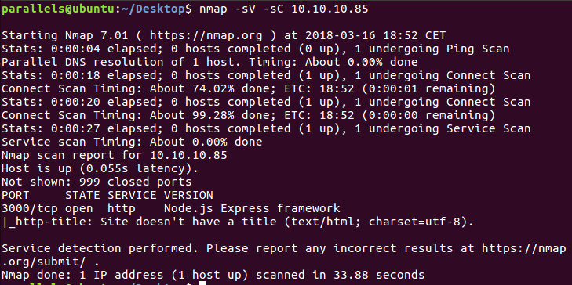
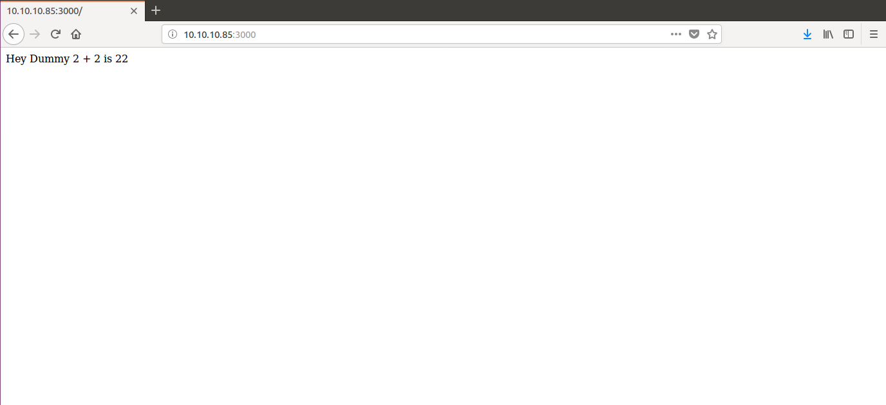
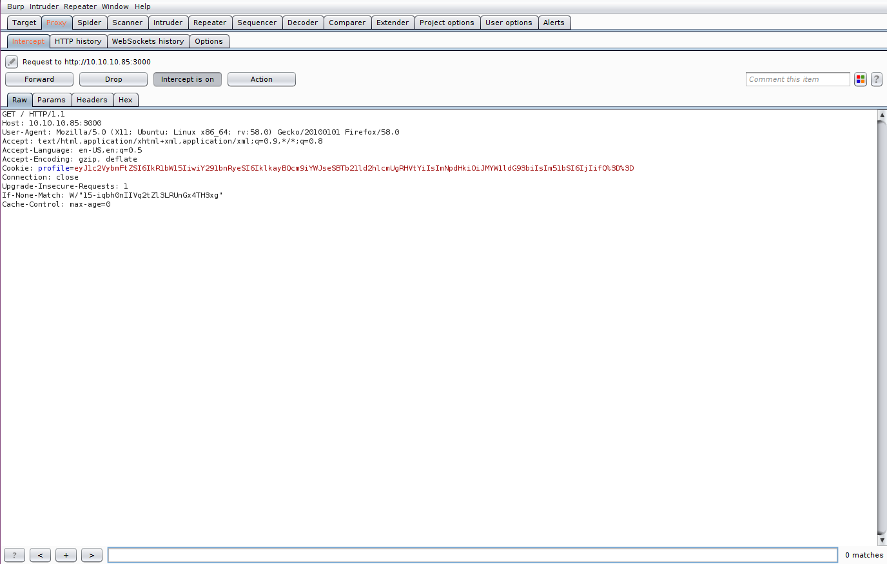
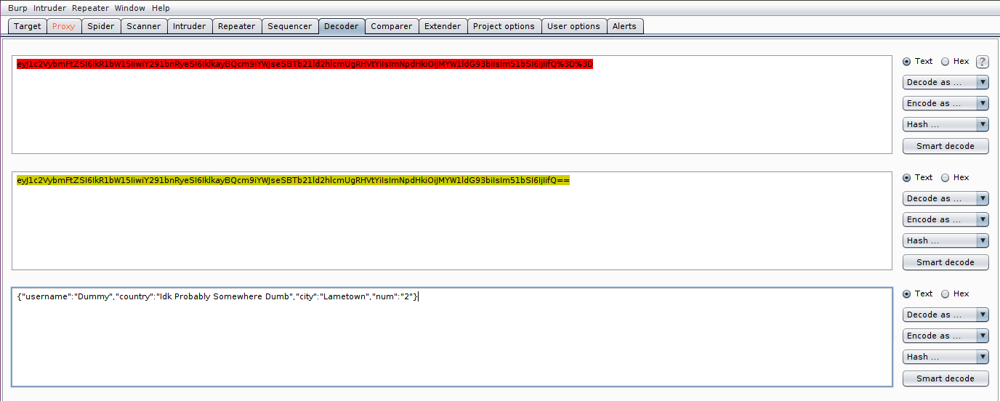
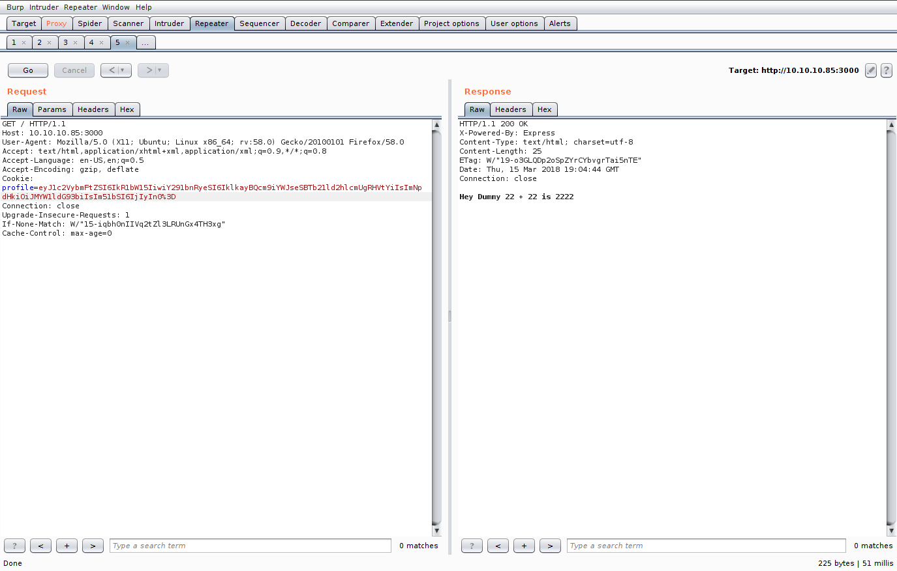
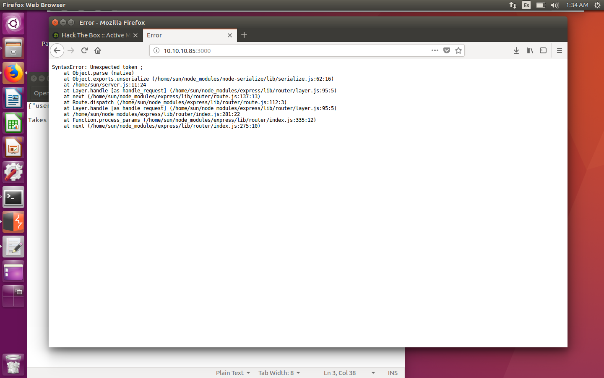
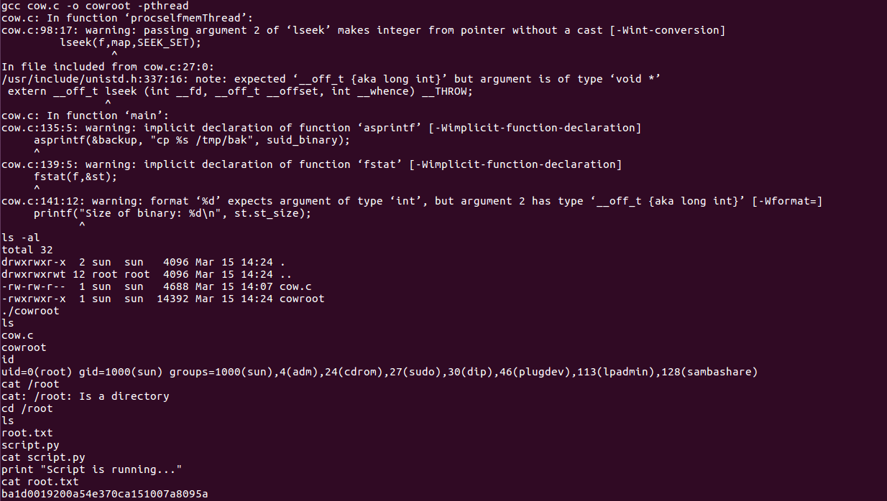

# Hack The Box: Celestial machine write-up

This was my first experience in Hack The Box, and so I decided to start on the easiest machine of all: Celestial, running with ip 10.10.10.85.

#### Enumeration

First of all, I started enumerating open ports in order to see the services that were active in the machine. I ran the following:

```sh
$ nmap -sV -sC 10.10.10.85
```

After a minute or less, I got that the only port open was 3000 with a Node.js Express Framework. Hence, I know where the vulnerability is.

*Result of nmap scan*



#### Vulnerability

After accessing the machine with the port (10.10.10.85:3000) on Firefox, I am greeted with the following:

*Welcome message*



By inspecting the request with Burp Suite, I find a weird cookie named profile. It is encoded first with url-encoding and then with base64, so I decode the value and obtain a json:

*Burp intercept of the request*



*Decoding of cookie*



The first interesting thing here to notice is that by modifying the last parameter we can change the welcome message.

*Modification of the json results in other message*



Therefore, the code must decode the cookie, read the last value and then use it as an argument to print the message. However, if we try something that is not an integer, we get an error.

*Error message*



This was a really important clue, as it told me that a deserialization from the node-serialize module was taking place. It could be the vulnerability, so I started reading up on node deserialization.

I found this https://www.cvedetails.com/cve/CVE-2017-5954/. After reading the first article (https://opsecx.com/index.php/2017/02/08/exploiting-node-js-deserialization-bug-for-remote-code-execution/), I was almost sure that was the vulnerability I was looking for.

#### Exploit (User access)

As it was explained in the tutorial, the exploit was based on passing a function on the json parameter, so that it gets executed and we get a reverse tcp shell.

First of all, I ran ifconfig to get my local ip address, which was 10.10.15.99. Than, I call nodejsshell.py from the tutorial with my ip and a port (for example 1337) as arguments.

Then I copy the eval() returned by the script and insert it in the brackets in
``
_$$ND_FUNC$$_function (){}()
``
Afterwards, I replace the "2" in the json by the function expression and encode it all back again. Then, after intercepting the request with Burp and changing the cookie, I get "Hey Dummy, Undefined + Undefined is NaN". we succeeded in the exploit, as listening with netcat opens up a shell:

*Netcat opens with reverse shell*


Then we just have to find the hash inside Documents/user.txt:

9a093cd22ce86b7f41db4116e80d0b0f

#### Exploit (Root access)

To escalate privileges and get from normal user to root I used the dirty cow exploit, which was compatible with the Linux running in the machine (``cat /etc/*-release``). In order to see the options I went to https://github.com/dirtycow/dirtycow.github.io/wiki/PoCs, where I chose the second link, as I want to get permanent root.

However, as I couldn't use wget to download the cowroot.c script when I was logged in to the machine (dunno why), I set up a SimpleHTTPServer with python and wget'ed my local machine. Then I compiled the cowroot.c script in gcc and launched the executable. Now I am root and can see the hash inside /root.

*Escalation of privileges and hash*




*Diego Bernal Adelantado*
