# Hack The Box: Jarvis machine write-up

Jarvis was one of the funniest and most interesting machines I've done so far. I learned a lot from it. It starts with a SQL injection that can be exploited to obtain some credentials, which are then used to log in to a phpmyadmin panel. Then, the version used is vulnerable, so we can gain command execution as ``www-data``. After that, it's possible to pivot to the user ``pepper`` by running encapsulation commands on a script run as that user. Finally, in order to escalate to root we just need to enumerate SUID binaries and find out that ``systemctl`` is one of those (which is not normal).

Let's start! The IP of the machine is ``10.10.10.143``.

### Enumeration

As always, we start by enumerating open ports to discover the services running in the machine. I fire up nmap:

*Result of nmap scan*

```sh
# Nmap 7.70 scan initiated Sun Jun 30 18:12:38 2019 as: nmap -p- -sV -sC -oN nmap/initial 10.10.10.143
Nmap scan report for supersecurehotel.htb (10.10.10.143)
Host is up (0.047s latency).
Not shown: 65532 closed ports
PORT      STATE SERVICE VERSION
22/tcp    open  ssh     OpenSSH 7.4p1 Debian 10+deb9u6 (protocol 2.0)
| ssh-hostkey:
|   2048 03:f3:4e:22:36:3e:3b:81:30:79:ed:49:67:65:16:67 (RSA)
|   256 25:d8:08:a8:4d:6d:e8:d2:f8:43:4a:2c:20:c8:5a:f6 (ECDSA)
|_  256 77:d4:ae:1f:b0:be:15:1f:f8:cd:c8:15:3a:c3:69:e1 (ED25519)
80/tcp    open  http    Apache httpd 2.4.25 ((Debian))
| http-cookie-flags:
|   /:
|     PHPSESSID:
|_      httponly flag not set
|_http-server-header: Apache/2.4.25 (Debian)
|_http-title: Stark Hotel
64999/tcp open  http    Apache httpd 2.4.25 ((Debian))
|_http-server-header: Apache/2.4.25 (Debian)
|_http-title: Site doesn't have a title (text/html).
Service Info: OS: Linux; CPE: cpe:/o:linux:linux_kernel

Service detection performed. Please report any incorrect results at https://nmap.org/submit/ .
# Nmap done at Sun Jun 30 18:26:53 2019 -- 1 IP address (1 host up) scanned in 855.12 seconds
```

We can see different things: SSH on the usual port and two http servers on port 80 and 64999. I started by taking a look at port 80 and didn't even need to look at 64999 to root the box, so it was probably a rabbit hole.

#### Port 80 enumeration

We can see that we are going to deal with a hotel booking website. So, I immediately started up DirBuster to run in the background while I tinkered around manually looking at the functionality.

DirBuster didn't find many things, only that there was a phpmyadmin panel under ``/phpmyadmin``. The report can be found [here](files/DirBusterReport.txt).

*Website found on port 80*


Manually I bumped into this interesting parameter, which was vulnerable to SQL injection. So I fired up sqlmap and it dumped the database and some credentials:

*``code`` parameter vulnerable*

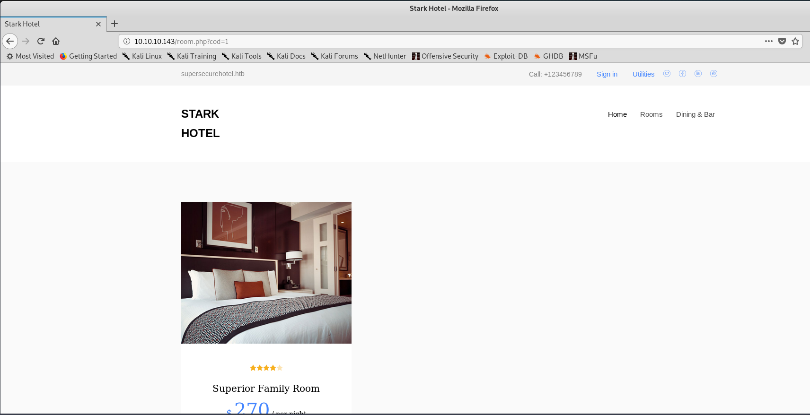

*sqlmap result: ``user`` table from ``mysql`` db*

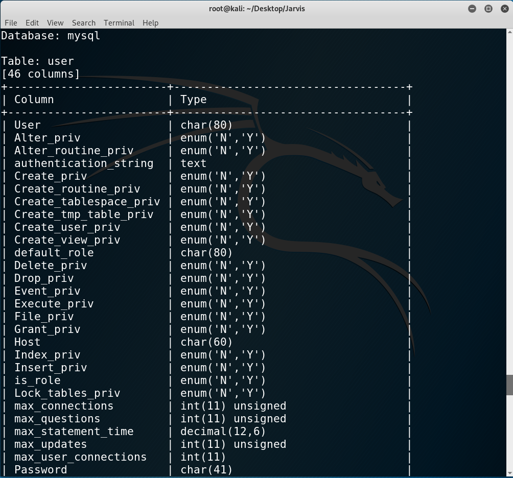

We can see there is a ``user`` and ``password`` column:

*Obtained credentials*

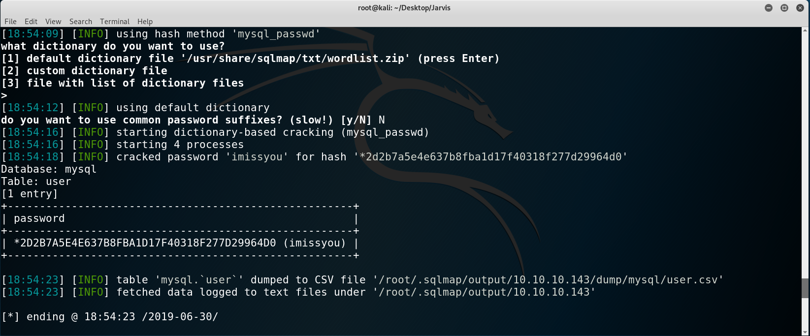

Good! We have the following credentials: ``DBadmin:imissyou``.

#### Gaining a shell

With the creds we can access the phpmyadmin panel and upon inspecting the version we find out it's vulnerable:

*Vulnerable version 4.8.0*

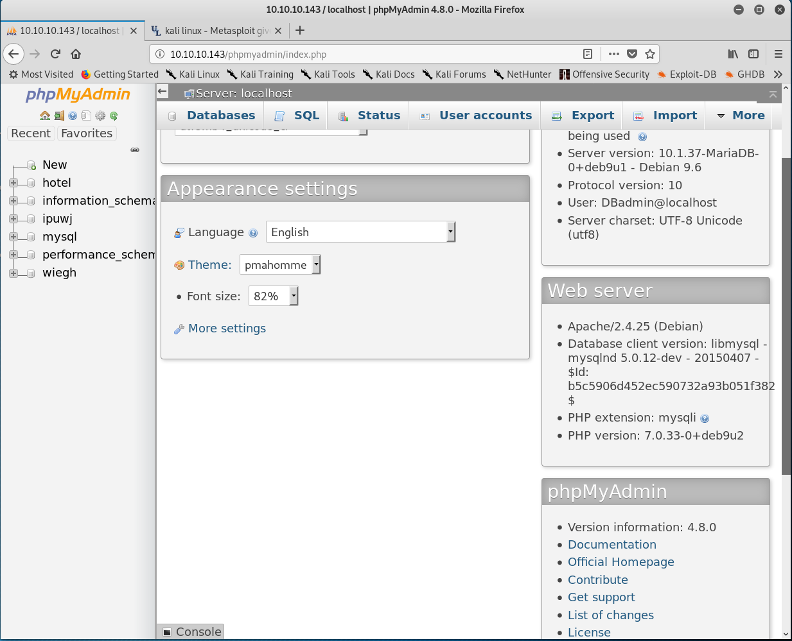

Using metasploit:

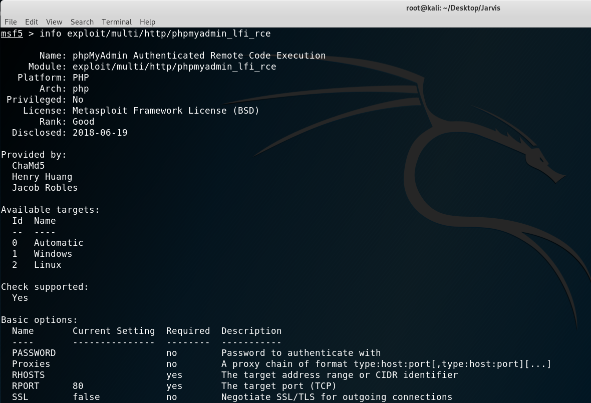

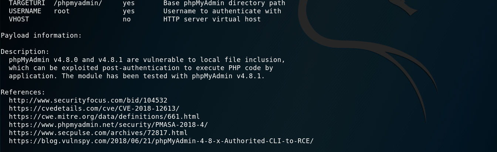

We can see that the version 4.8.0 and 4.8.1 are vulnerable, so we can immediately set the options and exploit!

*Setting the options and getting a proper shell with python*

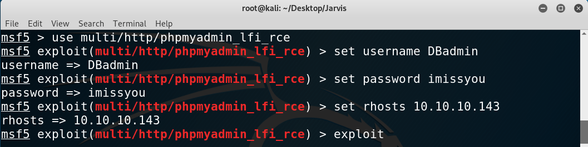

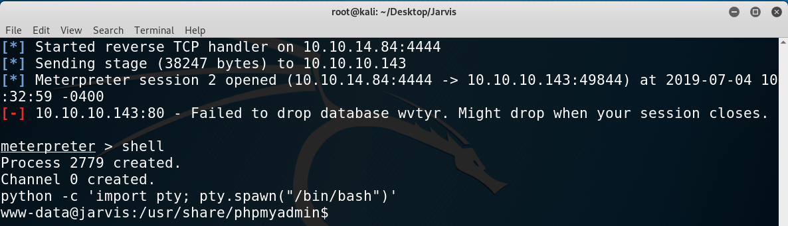

#### From ``www-data`` to ``pepper``

Once there I started enumerating with the usual ``sudo -l`` and found something really juicy, a python script I could run as ``pepper`` (the user account on the box).

*Output of ``sudo -l``*

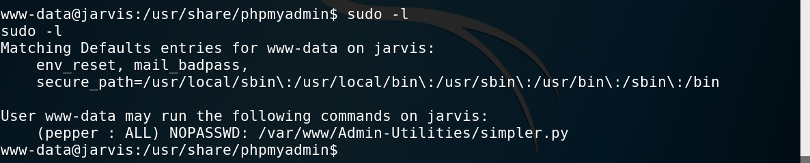

I checked the contents of the [script](files/simpler.py) and found this interesting and dangerous functionality:

```py
def exec_ping():
    forbidden = ['&', ';', '-', '`', '||', '|']
    command = input('Enter an IP: ')
    for i in forbidden:
        if i in command:
            print('Got you')
            exit()
    os.system('ping ' + command)
```

Obviously we need to bypass that blacklist. That is really easy with commands encapsulation: $(command).

My idea was the following: getting a pair of SSH keys, then via the command injection copy my public key to ``.ssh/authorized_keys`` and then just log in through SSH. Simple!

1. I generated the keys with ``ssh-keygen``.
2. I copy my public key key to ``/tmp/mykey``.
3. I copy ``/tmp/mykey`` into ``/home/pepper/.ssh/authorized_keys``. We need to add the ``-p`` option to the script to call that function and remember to add the ``sudo -u pepper`` at the beginning to run as that user.
4. I log in through SSH and can read ``user.txt``.

*Steps above visualized*

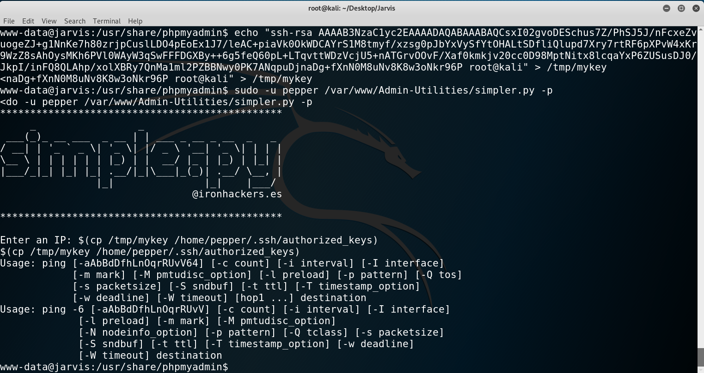

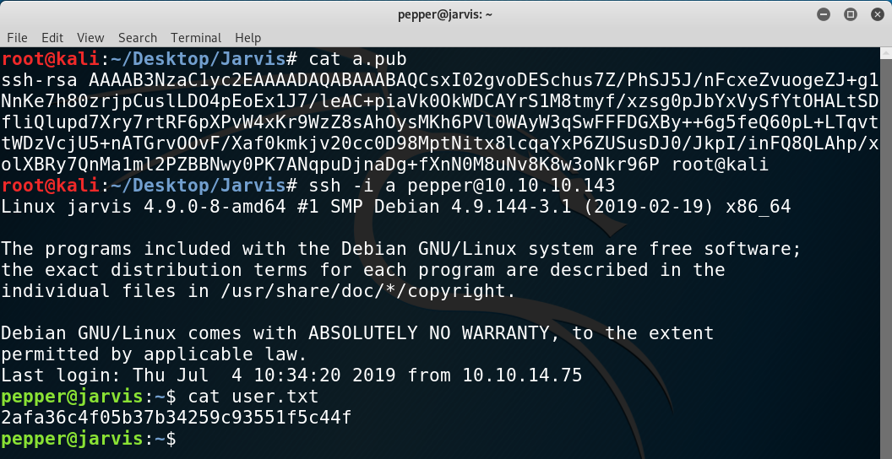

#### From ``pepper`` to ``root``

This privilege escalation was one of the best I've come across so far. It turned out to be simple yet a great learning curve.

I ran the usual enumeration tool, ``LinEnum.sh``, and searched manually for SUID executables to find that ``/bin/systemctl`` was one. If you don't know what a SUID executable means I recommend you read this [article](https://www.hackingarticles.in/linux-privilege-escalation-using-suid-binaries/).

As that is not usual, I thought that was the misconfiguration that would give me root. So I created a service from a template like this:

*s.service*

```
[Unit]
Description=TEST

[Service]
ExecStart=/bin/cat /root/root.txt > /tmp/myHASH

[Install]
WantedBy=multi-user.target

```

However, there was a problem: neither``/bin/systemd`` nor ``/etc/systemd`` were writeable. After researching I found out that there exists the `link` option, which basically lets us run it as if it was in the directory.

I ran the following:

```
systemctl link /tmp/s.service
systemctl start s
```

However, no file appeared in the ``/tmp`` directory. I checked the status and it turns out there was an error with which I got the flag (lol):

*Getting root hash*

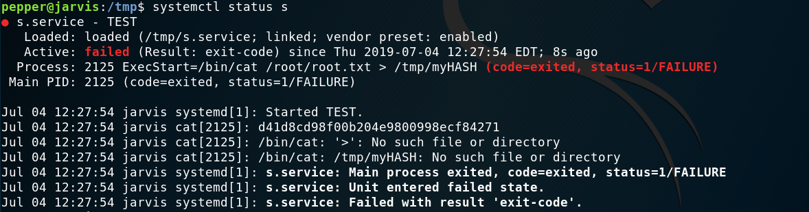

However, I was bothered, so I tried to make it work by runnning instead a bash file. So I created a file named ``script.sh`` (creative, I know) with the following contents:

```sh
#!/bin/sh -
/bin/cat /root/root.txt > /tmp/test.txt
```

At first I forgot the first line and that's why there is an error on the next image. After adding it everything ran smoothly and I got my ``test.txt``.

*Making the service work with a bash script*

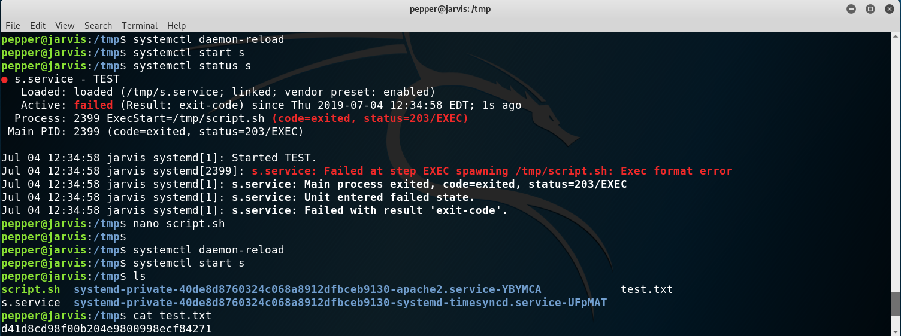

I was still bothered for not making it work without a bash script so I came up with the idea of using ``/bin/sh -c ´command´`` in the ``ExecStart`` field of the service. And it worked!

*Making the service work without a bash script*

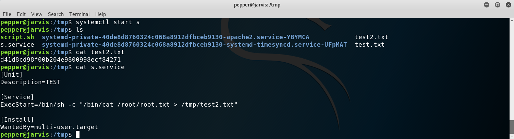

Of course, I could have set up a listener on netcat and then executed a reverse shell instead of just using ``cat`` or ``cp``.

I hope you learned as much as I did! Until next time!

---

*Diego Bernal Adelantado*
