# Hack The Box: Magic machine write-up

This was an easy machine if you were a bit experienced in web application bugs, as the main vulnerability was a file upload that was used to get a reverse shell to the box. From there, a connection to a MySQL database was needed to obtain credentials to get the user. Finally, the privilege escalation was quite simple, a SUID binary that was calling other binaries without absolute paths, so we could change the path to get to root!

Let's dig in! The IP of the machine is ``10.10.10.185``.

### Enumeration

I start by enumerating open ports to discover the services running in the machine. I fire up nmap:

*Result of nmap scan*

```bash
# Nmap 7.70 scan initiated Sat May 16 11:27:08 2020 as: nmap -p- -sV -sC -oA nmap/initial 10.10.10.185
Nmap scan report for 10.10.10.185 (10.10.10.185)
Host is up (0.062s latency).
Not shown: 65530 closed ports
PORT      STATE    SERVICE   VERSION
22/tcp    open     ssh       OpenSSH 7.6p1 Ubuntu 4ubuntu0.3 (Ubuntu Linux; protocol 2.0)
| ssh-hostkey:
|   2048 06:d4:89:bf:51:f7:fc:0c:f9:08:5e:97:63:64:8d:ca (RSA)
|   256 11:a6:92:98:ce:35:40:c7:29:09:4f:6c:2d:74:aa:66 (ECDSA)
|_  256 71:05:99:1f:a8:1b:14:d6:03:85:53:f8:78:8e:cb:88 (ED25519)
80/tcp    open     http      Apache httpd 2.4.29 ((Ubuntu))
|_http-title: Magic Portfolio
4159/tcp  filtered nss
4661/tcp  filtered kar2ouche
28375/tcp filtered unknown
Service Info: OS: Linux; CPE: cpe:/o:linux:linux_kernel

Service detection performed. Please report any incorrect results at https://nmap.org/submit/ .
# Nmap done at Sat May 16 11:28:55 2020 -- 1 IP address (1 host up) scanned in 106.80 seconds
```

Given that we only have SSH on port 22 and an HTTP server on port 80 I assumed that the initial exploitation vector had to be through the web app.

#### Port 80 enumeration

We bump into what looks like a simple PHP application that is used as a gallery and can see that it has a log in page.

*Initial webpage*

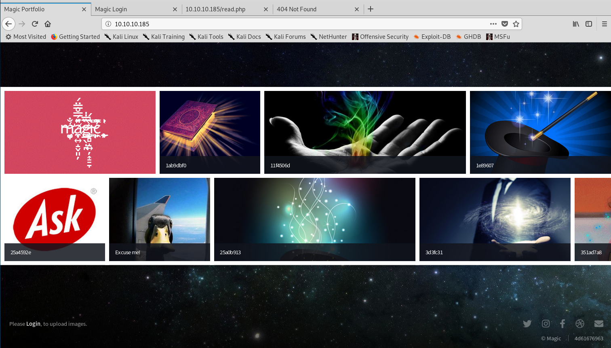

*Log in page*

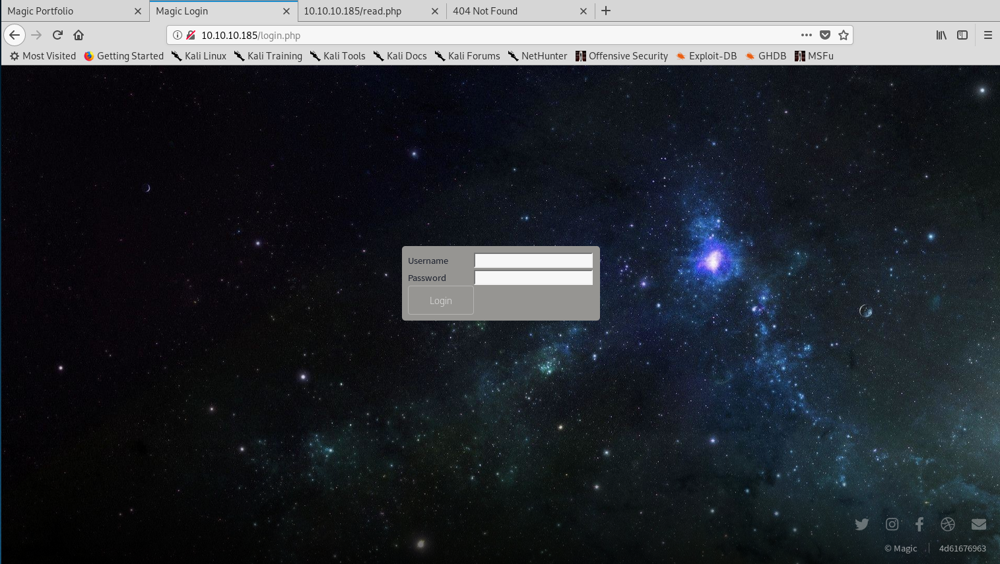

I tried a simple SQL injection and entered username `admin` and password `' OR '1'='1` and guess what? I was in and presented with the upload page!

*Uploads page*

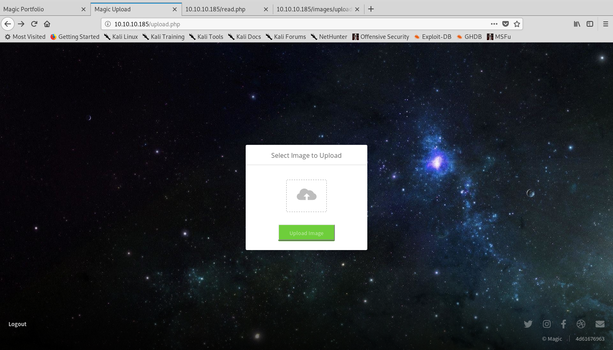

I first tried to upload a text file and the application checks for image extensions:

*Application blocking non-image extensions*

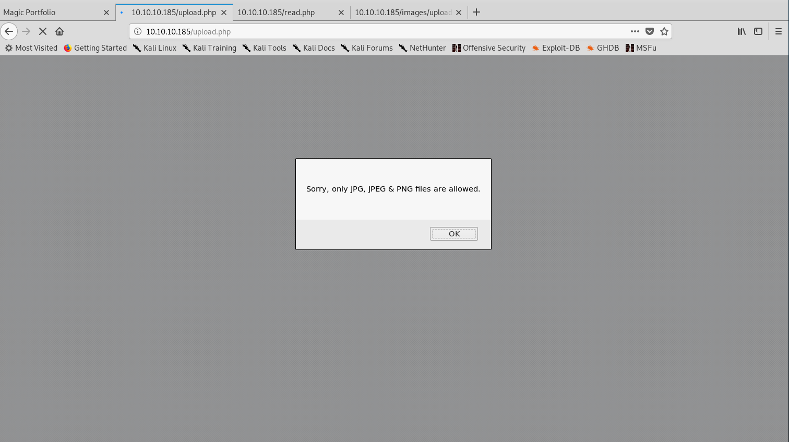

Then I tried renaming the file to have a PNG extension. However, the following message appeared, which made me suspect it was also checking the magic bytes at the beginning of the file:

*Application checking files magic bytes*

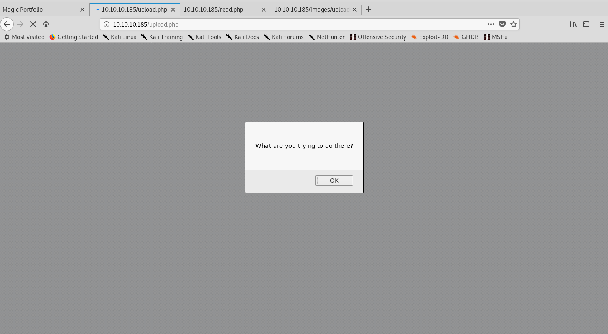

Finally, I decided to add the magic bytes of an JPEG file (`FF D8 FF DB`) and use the `.php.jpg` extension with PHP code after those bytes, as that can lead to command execution and bypass the extension filter at the same time. And it works!

*Image with PHP code uploaded*

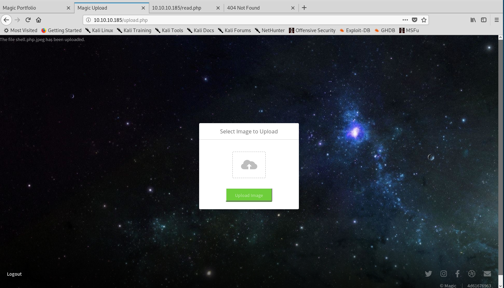

I didn't know where it was uploaded though, so went back to the main page and checked the source code to find if the directory was disclosed. Indeed it was:

*Uploaded image directory disclosed*

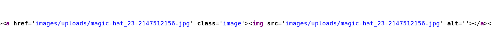

From there I just accessed the path with the command I wanted and we have RCE!

*RCE from uploaded file*

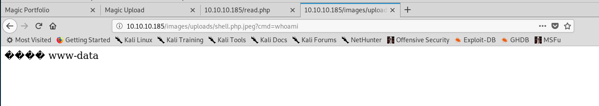

I then modified the payload to include a one-liner reverse shell and set up a listener with netcat (`nc -lnvp 8001`):

*Obtaining a reverse shell*

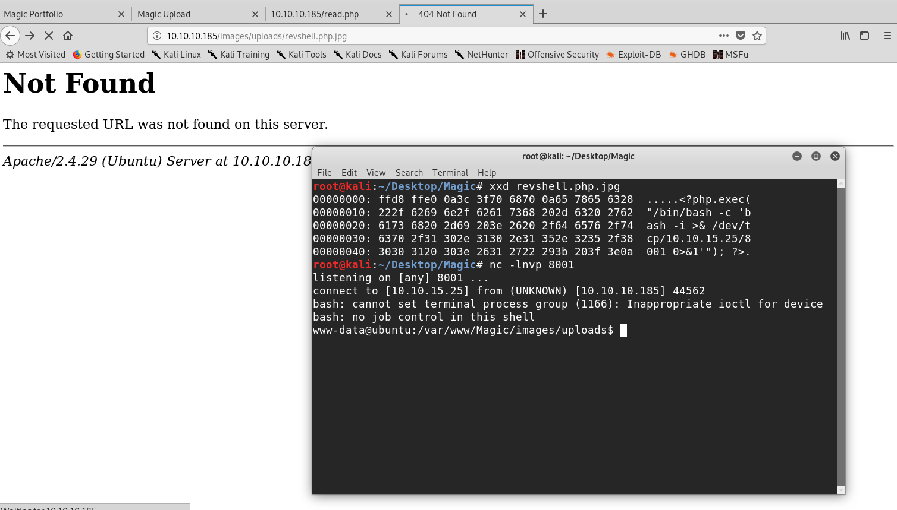

Once in, I first upgraded my shell with `python3 -c "import pty;pty.spawn('/bin/bash')"` and started inspecting the files on the web application for sensitive information and found an interesting file: `db.php5`:

*Database connection with credentials*

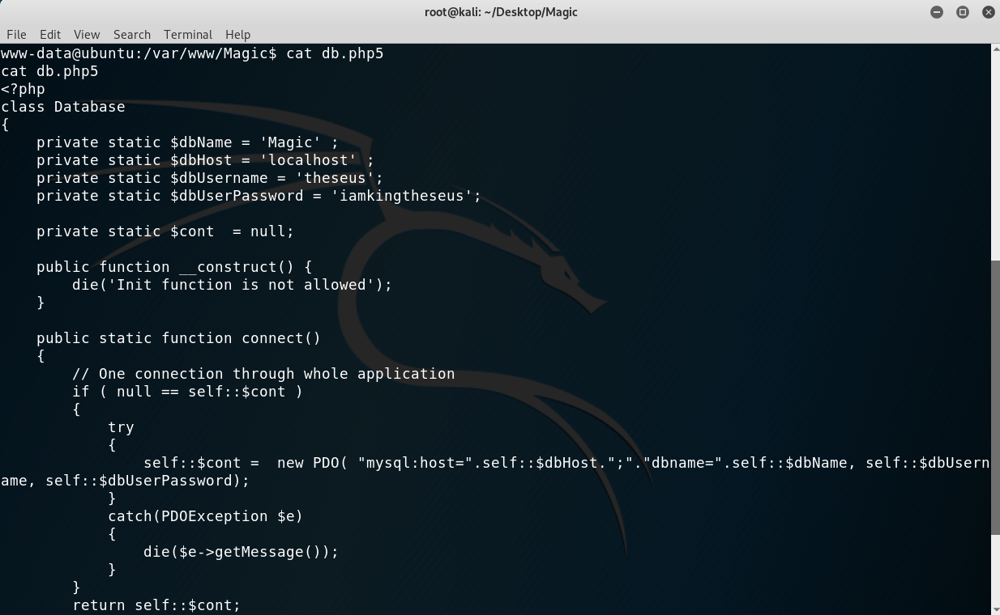

However, I tried to change into that use but the password wasn't valid. I thought that the password may have been in the MySQL database but tried accessing it with the `mysql` command but it wasn't installed. I then decided to use the script that was available to us and show the tables:

*Retrieving information from the database*

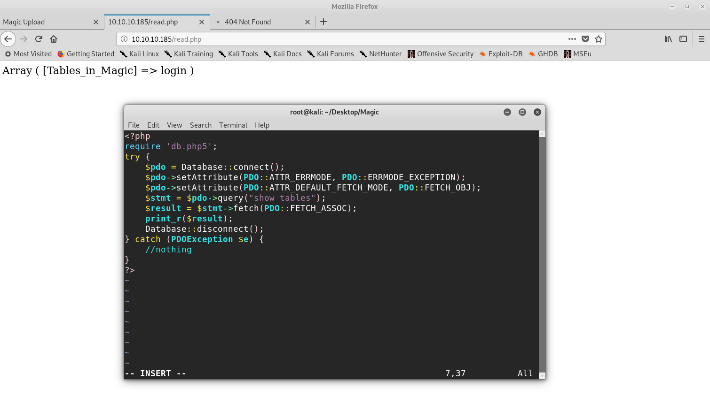

Then the final payload was:

```
<?php
require 'db.php5';
try {
    $pdo = Database::connect();
    $pdo->setAttribute(PDO::ATTR_ERRMODE, PDO::ERRMODE_EXCEPTION);
    $pdo->setAttribute(PDO::ATTR_DEFAULT_FETCH_MODE, PDO::FETCH_OBJ);
    $stmt = $pdo->query("select * from login");
    $result = $stmt->fetch(PDO::FETCH_ASSOC);
    print_r($result);
    Database::disconnect();
} catch (PDOException $e) {
    //nothing
}
?>
```

Which gave me the user credentials:

*Retrieving user credentials from the database*

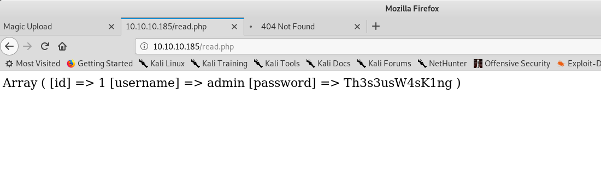

I then did `su theseus` with password `Th3s3usW4sK1ng` and have user!

*Getting user*

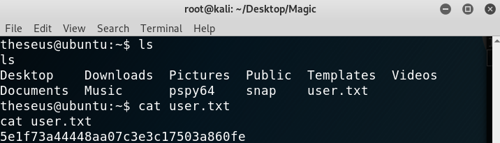

### Privilege Escalation

I started my linux enumeration with `linpeas.sh` and quickly saw that there was an interesting binary that belonged to root and had the SUID bit set, which meant that it was probably the privilege escalation vector.

*Interesting SUID binary*

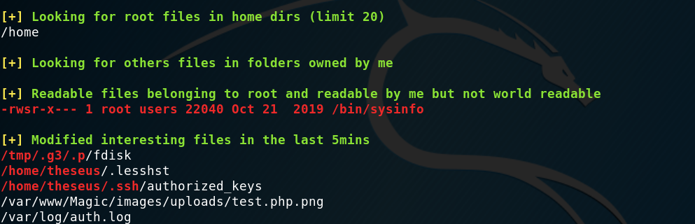

I ran `strings` on it and found that it was calling some other commands, from relative paths.

*/bin/sysinfo strings*

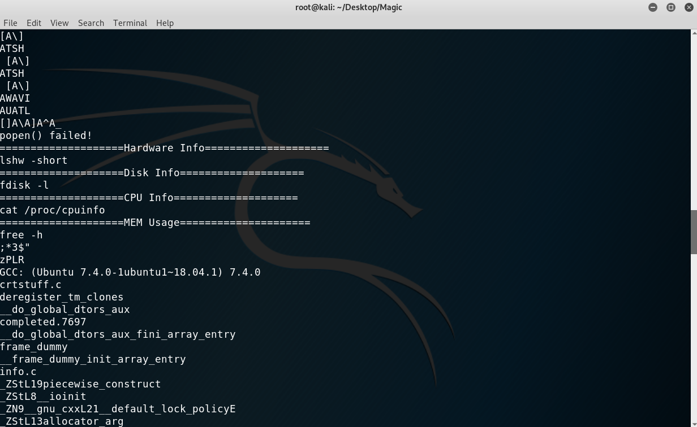

A classical privilege escalation: we just needed to overwrite the path so that the system would first find our binary to run and hence we would have root command execution! Here are the steps I took:

1. Modify the path: `PATH=/tmp:$PATH`.
2. Add our script: `echo "cat /root/* > /tmp/mine.txt" > /tmp/lshw`.
3. Make it executable: `chmod +x /tmp/lshw` (otherwise it won't run).
4. Run `sysinfo`.

*Getting the root hash*

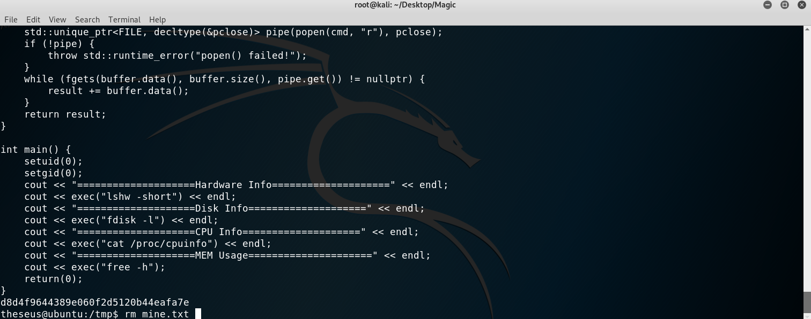

We could have also run a reverse shell to another port on our machine to get a root shell but for me this was enough. Another thing was that we could have, instead of running `strings`, used `pspy` to get information about processes running and notice that whenever we run `sysinfo` this one calls `lshw` with a relative path:

*pspy to monitor processes*

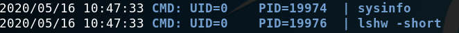

This is everything, I hope you enjoyed the writeup and learned the following lesson: use quotes with bash commands! If you liked it you can give me respect on hackthebox through the following link: <https://www.hackthebox.eu/home/users/profile/31531>. Until next time!

---

*Diego Bernal Adelantado*
