# Hack The Box: Passage write-up

Passage was a medium box that really required attention to detail. It starts with noticing that there is a custom CMS that allows self-registration and has an authenticated RCE, followed by some hash cracking on some `.htpasswd` files found on the server. With the password we can upgrade our privileges to the first user and then inspecting `.ssh/` we notice we can just SSH into the second one. After that, a `.viminfo` file hints us at a USB utility that has a vulnerability we can use to overwrite files as root.

Let's start! The IP of the machine is ``10.10.10.206``.

## Enumeration

I start by enumerating open ports to discover the services running in the machine. I fire up nmap:

*Result of nmap scan*

```
# Nmap 7.80 scan initiated Sun Sep 20 20:37:44 2020 as: nmap -sV -sC -oA nmap/initial 10.10.10.206
Nmap scan report for 10.10.10.206
Host is up (0.13s latency).
Not shown: 998 closed ports
PORT   STATE SERVICE VERSION
22/tcp open  ssh     OpenSSH 7.2p2 Ubuntu 4 (Ubuntu Linux; protocol 2.0)
| ssh-hostkey:
|   2048 17:eb:9e:23:ea:23:b6:b1:bc:c6:4f:db:98:d3:d4:a1 (RSA)
|   256 71:64:51:50:c3:7f:18:47:03:98:3e:5e:b8:10:19:fc (ECDSA)
|_  256 fd:56:2a:f8:d0:60:a7:f1:a0:a1:47:a4:38:d6:a8:a1 (ED25519)
80/tcp open  http    Apache httpd 2.4.18 ((Ubuntu))
|_http-server-header: Apache/2.4.18 (Ubuntu)
|_http-title: Passage News
Service Info: OS: Linux; CPE: cpe:/o:linux:linux_kernel

Service detection performed. Please report any incorrect results at https://nmap.org/submit/ .
# Nmap done at Sun Sep 20 20:38:01 2020 -- 1 IP address (1 host up) scanned in 17.28 seconds
```

Not too much, just SSH and HTTP on the standard ports. I'll first add `passage.htb` to my `/etc/hosts` file.

### Port 80 enumeration

We can see some sort of blog upon visiting the website and the first article immediately caught my attention, as `Fail2Ban` is an IPS that blocks bruteforce attacks. This means that we cannot run any directory enumeration tool or sqlmap.

*Main website*

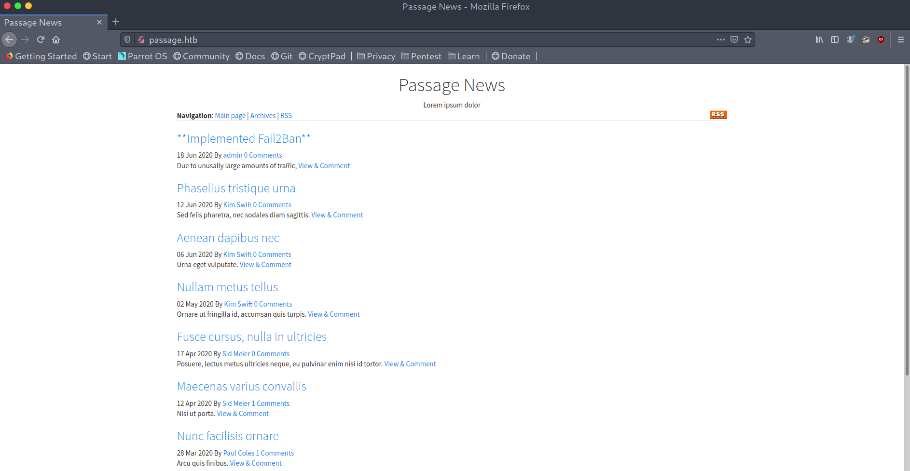

*Fail2Ban post*

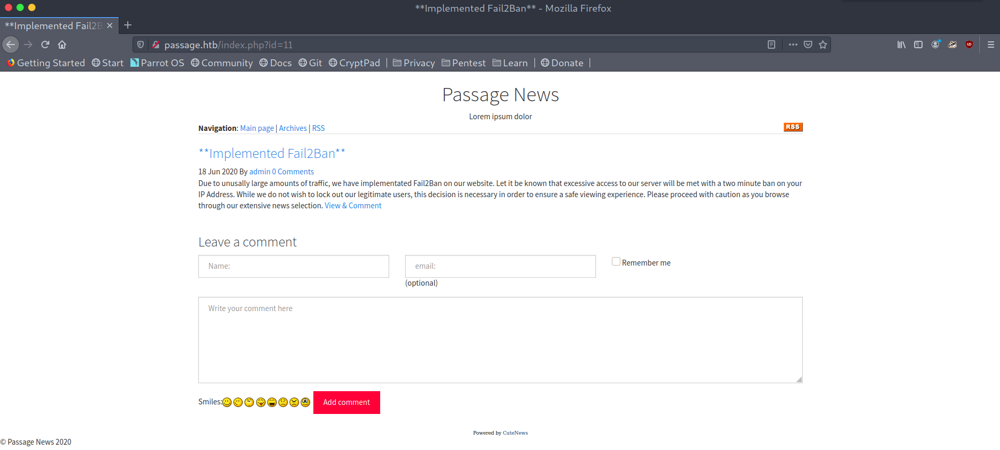

By looking at the source we can see two users in the `mailto:<user>@passage.htb` hrefs: `nadav` and `paul`.

*Users enumeration*

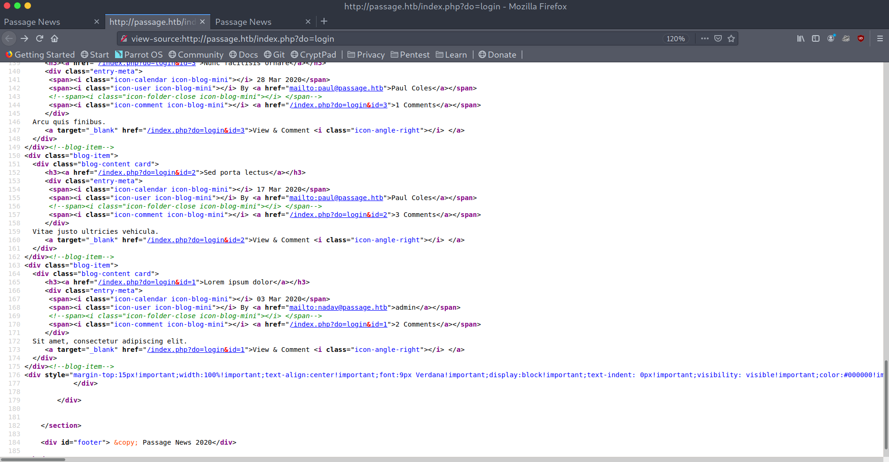

I tested a bit for SQL injection and we get something interesting when we give it a letter:

*Test for SQLi I*

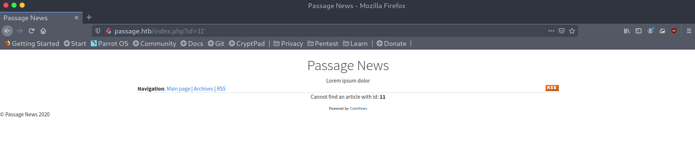

*Test for SQLi II*

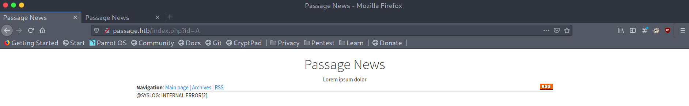

However this seems like a rabbit hole, I spent too much time on it and didn't get anything out of it. I was a bit lost when, looking at the `Fail2Ban` post, I noticed something interesting at the bottom: `Powered by CuteNews`. The link sent me to a CMS login page that allowed registration, this is promising!

*CuteNews login page*

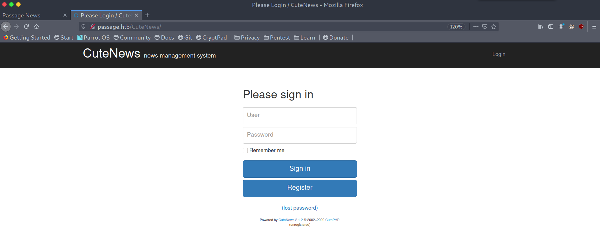

### Foothold: CuteNews exploit

I registered and had access to the dashboard, now I only had to find a way to get code execution.

*CuteNews register and dashboard*

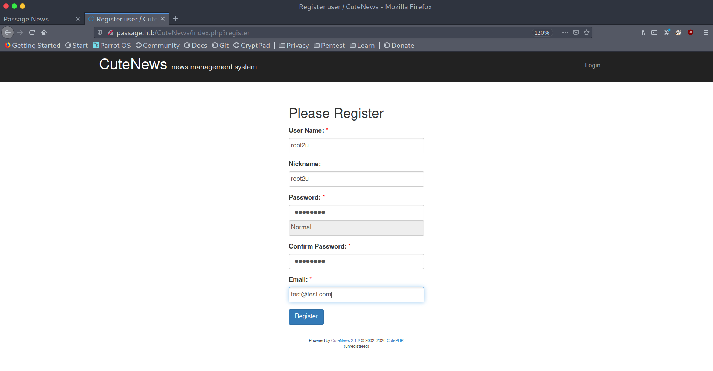

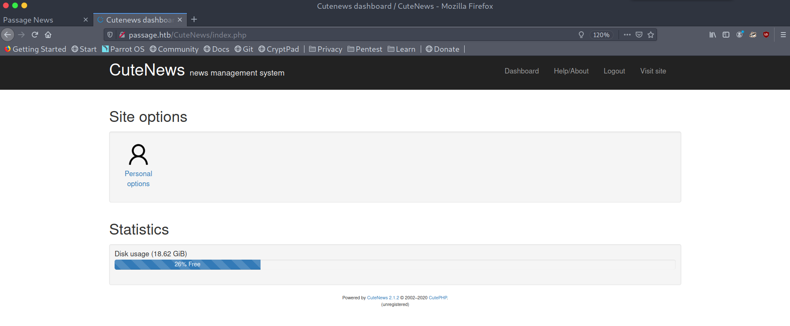

I googled for a bit until I came across this Github repo: https://github.com/CRFSlick/CVE-2019-11447-POC. The gist of the exploit is that we can upload a profile picture with some embedded PHP code on the metadata and then visiting the image under a certain path we can cause the server to treat it as PHP, thus leading to RCE.

*RCE with CuteNews exploit*

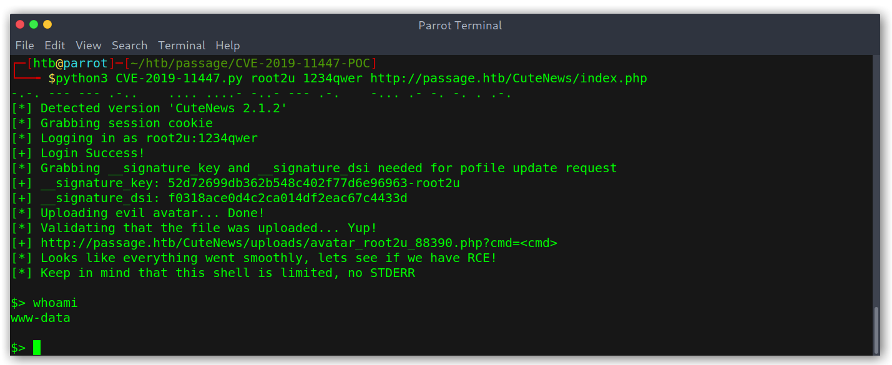

### PrivEsc I: paul

Being only `www-data` we need to escalate privileges. As always I downloaded `LinEnum.sh` to the box and ran it. Eventually it found something juicy: `.htpasswd` files that contained hashes.

*.htpasswd files found by LinEnum*

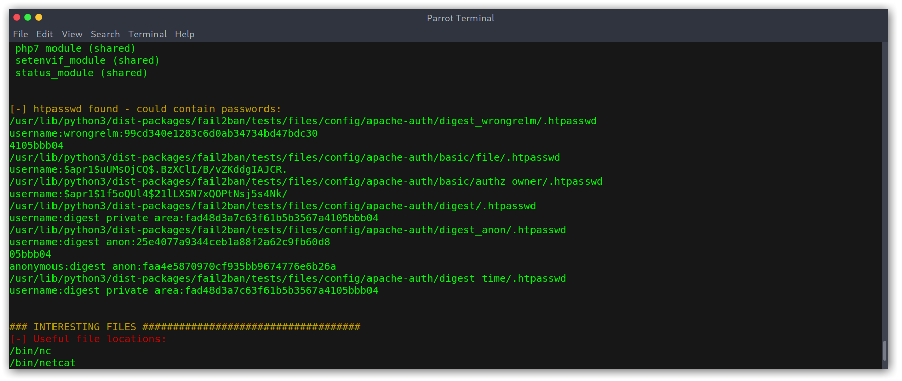

However, after cracking them they weren't useful, it was just tests like `admin:admin` that lead nowhere... I kept on digging and found this interesting file `/var/www/html/CuteNews/cdata/users/lines` which seemed to contain base64 encoded stirngs of pickled sessions:

```
$ base64 -d <<< "YToxOntzOjQ6Im5hbWUiO2E6MTp7czoxMDoicGF1bC1jb2xlcyI7YTo5OntzOjI6ImlkIjtzOjEwOiIxNTkyNDgzMjM2IjtzOjQ6Im5hbWUiO3M6MTA6InBhdWwtY29sZXMiO3M6MzoiYWNsIjtzOjE6IjIiO3M6NToiZW1haWwiO3M6MTY6InBhdWxAcGFzc2FnZS5odGIiO3M6NDoibmljayI7czoxMDoiUGF1bCBDb2xlcyI7czo0OiJwYXNzIjtzOjY0OiJlMjZmM2U4NmQxZjgxMDgxMjA3MjNlYmU2OTBlNWQzZDYxNjI4ZjQxMzAwNzZlYzZjYjQzZjE2ZjQ5NzI3M2NkIjtzOjM6Imx0cyI7czoxMDoiMTU5MjQ4NTU1NiI7czozOiJiYW4iO3M6MToiMCI7czozOiJjbnQiO3M6MToiMiI7fX19"
a:1:{s:4:"name";a:1:{s:10:"paul-coles";a:9:{s:2:"id";s:10:"1592483236";s:4:"name";s:10:"paul-coles";s:3:"acl";s:1:"2";s:5:"email";s:16:"paul@passage.htb";s:4:"nick";s:10:"Paul Coles";s:4:"pass";s:64:"e26f3e86d1f8108120723ebe690e5d3d61628f4130076ec6cb43f16f497273cd";s:3:"lts";s:10:"1592485556";s:3:"ban";s:1:"0";s:3:"cnt";s:1:"2";}}}
```

We can see that there is a `pass` field with value `e26f3e86d1f8108120723ebe690e5d3d61628f4130076ec6cb43f16f497273cd` for user `paul@passage.htb`. I got a few more and used `hashid` to check what kind of hash it was.

*Finding hash type*

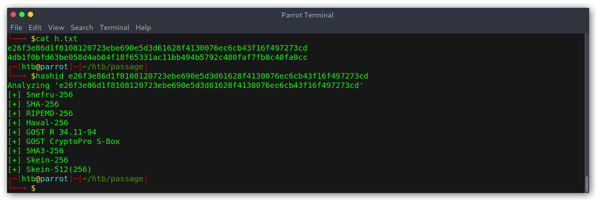

I assumed it was SHA-256 as it was the most common one, then started cracking and quickly got a hit for `atlanta1`!

*Cracking hashes*

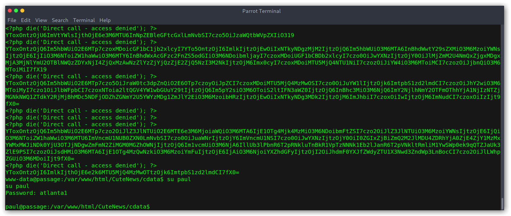

### PrivEsc II: nadav

Cool! Now we are `paul`, however there is still one more user, called `nadav` who has more privileges. I copied the `.ssh/id_rsa` private key to be able to ssh into the box more easily and then something struck me: there was an `authorized_hosts` file. That was weird, since we can just copy the key to get into the box. Wondering who was stupid enough to do that I read the file and to my surprise it was `nadav`! We can then just ssh as `nadav`, easy as that!

*Becoming nadav*

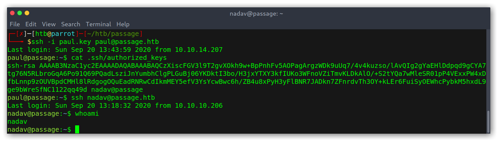

### PrivEsc III: root

As user `nadav` I started doing recon and quickly something got my attention: an uncommon SUID binary.

*Uncommon SUID binary*

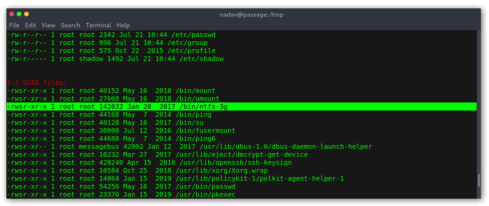

I googled and found an exploitDB page (https://www.exploit-db.com/exploits/41240). This was promising and too easy! All my joy quickly faded as the exploit didn't work, no matter how many times I tried. After looking for variations of the exploit I gave up and started enumerating to see if I had missed anything. Indeed I had, there was a `.viminfo` file on my home directory that contained some interesting recently edited files: `/etc/dbus-1/system.d/com.ubuntu.USBCreator.conf`.

*.viminfo file with interesting data*

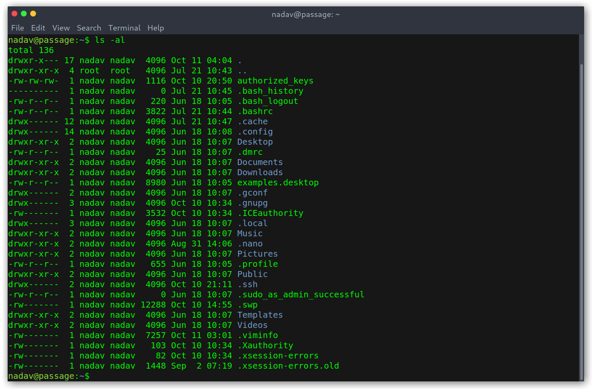

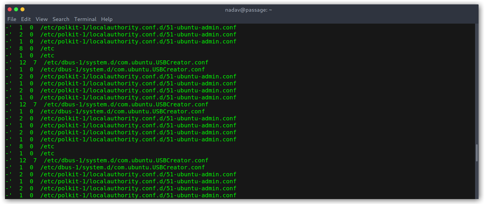

The file itself didn't have anything too interesting.

*USBCreator.conf file*

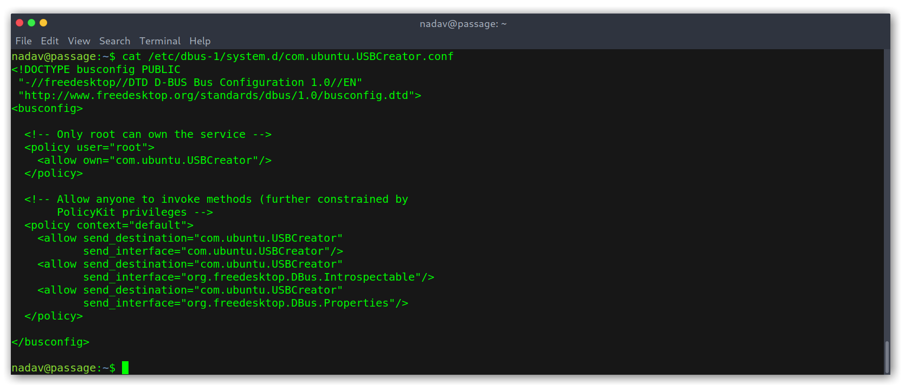

I searched for any exploits and found a blogpost (https://unit42.paloaltonetworks.com/usbcreator-d-bus-privilege-escalation-in-ubuntu-desktop/) with a local privilege escalation that seemed to have the key, as the author was `Nadav` (good hint).

*Blogpost with exploit*

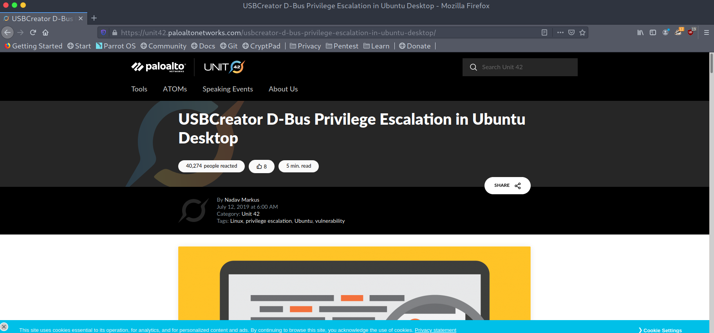

The main idea of the exploit is that we can create files as root, so I tested it to check that it worked and it did!

*Testing the exploit*

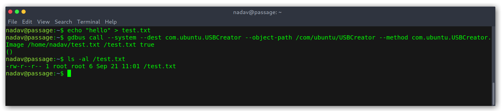

With the following command I was able to overwrite the `/etc/passwd` file and then become root:

```
gdbus call --system --dest com.ubuntu.USBCreator --object-path /com/ubuntu/USBCreator --method com.ubuntu.USBCreator.Image /home/nadav/test/passwd /etc/passwd true
```

*Weaponizing the exploit*

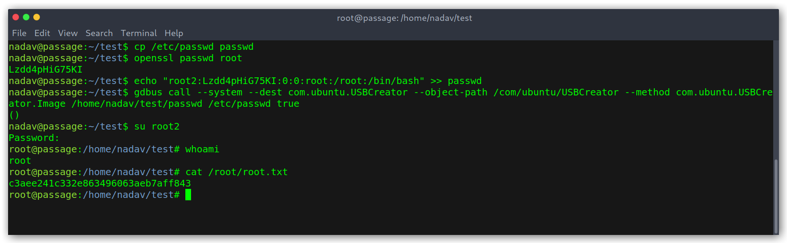

## Conclusion

This is everything, I hope you enjoyed the writeup and learned something new. It was definitely a cool box that required you pay attention to detail! If you liked it you can give me respect on Hack The Box through the following link: <https://www.hackthebox.eu/home/users/profile/31531>. Until next time!

---

*Diego Bernal Adelantado*
