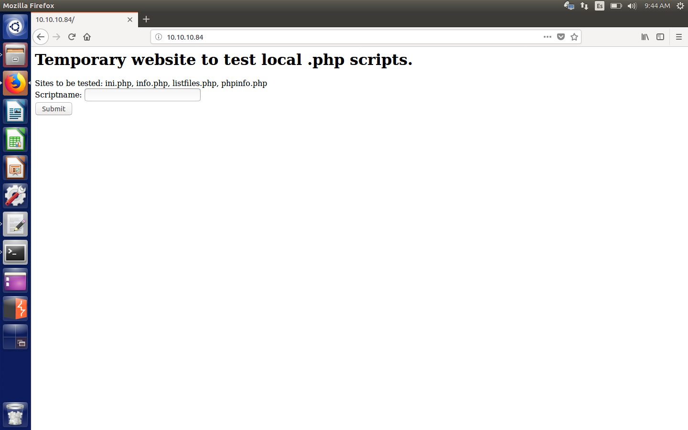
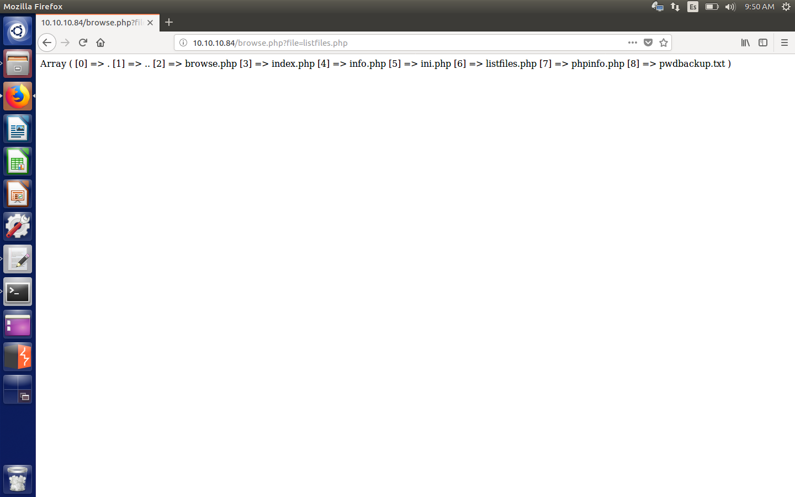
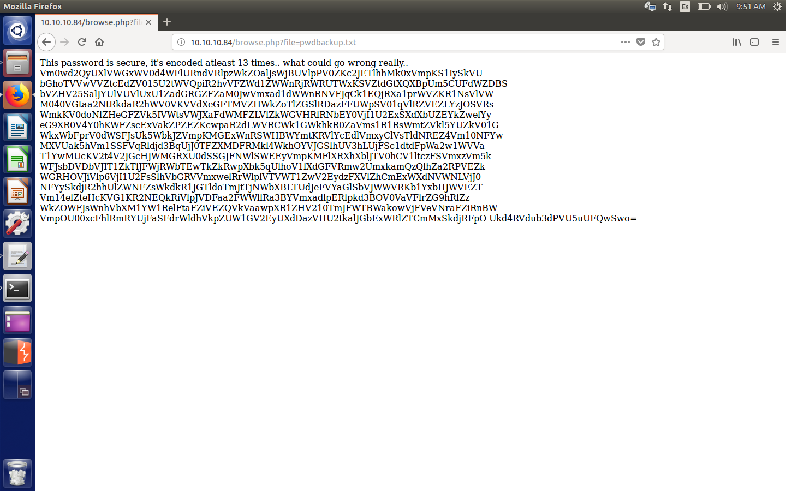
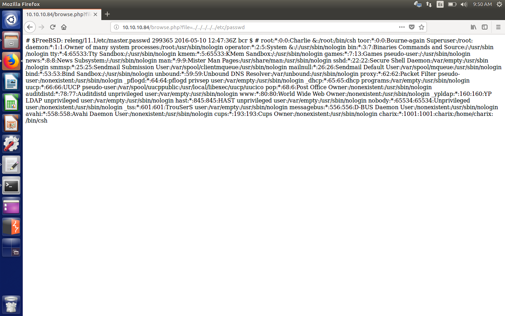
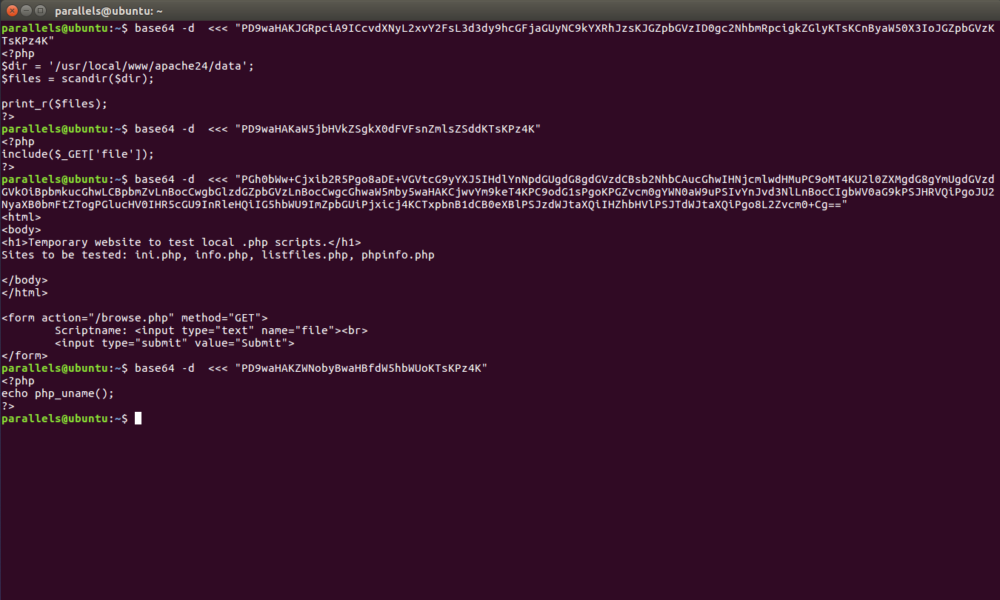
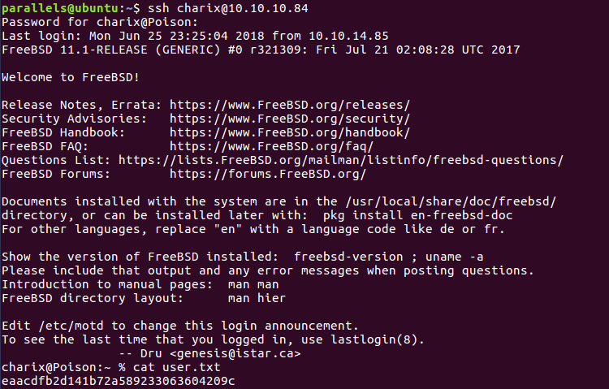
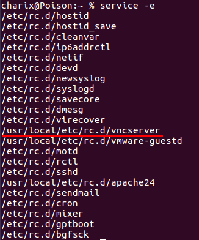
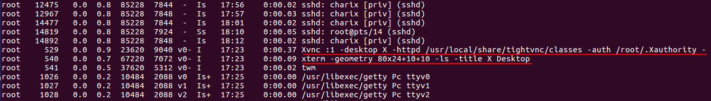
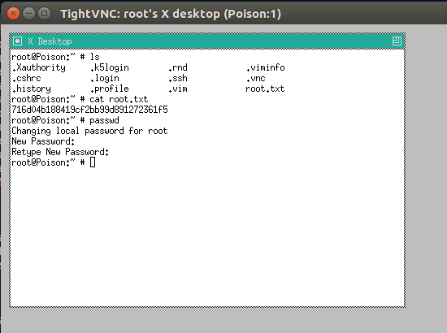
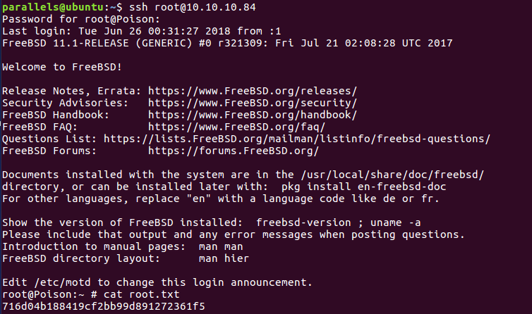

# Hack The Box: Poison machine write-up

This was listed as an easy box in Hack The Box so I thought I wouldn't have many problems. The machine runs with ip 10.10.10.84. While the user confirmed my assumptions, root turned out to be more challenging for me, given that I had never had experiences with ssh tunnelling and VNC services. Nevertheless, on this machine it wasn't necessary to exploit anything, instead you just had to know that you could do local port forwarding through ssh as an unprivileged user.

#### Enumeration

We start by enumerating open ports to discover the services running in the machine. I ran the following:

```sh
$ nmap -sV -sC -oA nmap/initial 10.10.10.60
```

After a minute or less, I get the following output:

*Result of nmap scan*

```sh
# Nmap 7.01 scan initiated Fri May 25 16:45:13 2018 as: nmap -sV -sC -oA nmap/initial 10.10.10.84
Nmap scan report for 10.10.10.84
Host is up (0.062s latency).
Not shown: 995 closed ports
PORT     STATE SERVICE VERSION
22/tcp   open  ssh     OpenSSH 7.2 (FreeBSD 20161230; protocol 2.0)
| ssh-hostkey:
|   2048 e3:3b:7d:3c:8f:4b:8c:f9:cd:7f:d2:3a:ce:2d:ff:bb (RSA)
|_  256 4c:e8:c6:02:bd:fc:83:ff:c9:80:01:54:7d:22:81:72 (ECDSA)
80/tcp   open  http    Apache httpd 2.4.29 ((FreeBSD) PHP/5.6.32)
|_http-server-header: Apache/2.4.29 (FreeBSD) PHP/5.6.32
|_http-title: Site doesn\'t have a title (text/html; charset=UTF-8).
5802/tcp open  http    Bacula http config
5902/tcp open  vnc     VNC (protocol 3.8)
| vnc-info:
|   Protocol version: 3.8
|   Security types:
|     VNC Authentication (2)
|_    Tight (16)
6002/tcp open  X11     (access denied)
Service Info: OS: FreeBSD; CPE: cpe:/o:freebsd:freebsd

Service detection performed. Please report any incorrect results at https://nmap.org/submit/ .
# Nmap done at Fri May 25 16:46:20 2018 -- 1 IP address (1 host up) scanned in 66.47 seconds
```

We see some interesting things, especially the VNC server running on port 5902. There is also ssh runnning, which we will use later. First of all, I check the webserver on port 80:

*Webserver*



Apparently, we can read files from that php script. Besides, we can see there are some files for us to see. Initially, one draws our attention: `listfiles.php`. So I check it and guess what? We obtain an encrypted password in `pwdbackup.txt`.

*Password*



*Contents of pwdbackup.txt*



So it's data base64 that has been encoded repeatedly 13 times. We decode it and obtain the password: `Charix!2#4%6&8(0`.

Now, that didn't give me much beacuse I didn't know neither the username nor the service it'd be useful for. I did have a hunch and though it could be for the ssh.

Going back to the main php file, I tried some basic LFI and successfully read the `/etc/passwd` file.

*Contents of /etc/passwd*



And looks like we found our user, called `charix` (in the last entry of the file). At first I didn't realise they were supposed to be ssh credentials, so I tried to get the php code of the files with this injection:

`file=php://filter/convert.base64-encode/resource=[file]`

That's how I got all the source codes, which I then decrypted:

*Source code of listfiles.php, browse.php, index.php, info.php*



Nothing too interesting, so that's when I realised about the ssh. Tried with the following credentials and I got access to the machine as charix and could read the user flag.

**SSH credentials:**

* Username: charix

* Password: Charix!2#4%6&8(0

*User flag*



#### Root

First of all, we find an encrypted zip file called secret.zip in the charix home directory, so we have to crack it open. After many tries, it turns out the user was so lazy that he had reused the password for the ssh login. We find another password, this time 8 bits long and with unprintable characters.

Nothing else could be done with it, so I left it for the time being and started looking for other things. The VNC port I saw when enumerating services before led me to think it was the vulnerability I was looking for, so I scanned the machine and listed the internal services.

*Scans (second one is output from `ps aux`)*


---


So now we find that we can only do: vncserver (to create new desktops) or vncpasswd (to set the password of the desktops created). With that in mind, I find that there is always a desktop, the :1, running, and as root and on port 5901 (the VNC desktops take ports 590x). I tried many things and in the forums found a reference to an article: http://www.cl.cam.ac.uk/research/dtg/attarchive/vnc/sshvnc.html. They made refences to the local port forwarding option, so I googled a bit more and found this article which explained everything to the detail (the image on it is self-explanatory and just what we need to do): https://cects.com/ssh-local-and-remote-port-forwarding-with-vnc.

The command I used were:

* `ssh -g -L 6666:localhost:5901 charix@10.10.10.84`

-g allows remote hosts to connect to forwarded ports

-L starts the local port forwarding and it means that my machine is going to start an ssh session to charix running on 10.10.10.84 and that my 6666 port is going to be bound to charix's 5901.

Once we have the ssh shell, we open up another terminal window and type the next command, which will read the secret (output of extracted zip).

* `vncviewer -passwd secret localhost:6666`

This will be a VNC client that will let me access the port (thanks to the local port forwarding), and consequently the VNC session owned by root. I will use my port 6666 given that it is being tunnelled to charix's 5901 through ssh.

*Output of command*



As I wanted to get a nice shell, I did `passwd` and set the root password so that I could access the machine through ssh as root (and also copy the hash).

*Root flag*



And that's it.

*Diego Bernal Adelantado*
