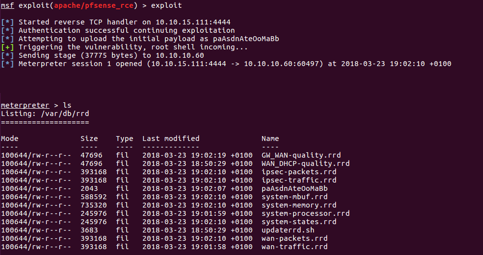
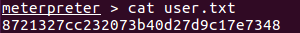

# Hack The Box: Sense machine write-up

I have had previous experiences in Hack The Box and, knowing this machine was going to get retired, I decided I'd give it a shot. It runs with ip 10.10.10.60.

I must say before hand that I didn't like this machine at all in comparison to others, as it was solely based on enumeration and a bit of luck :(. Once you got the first path, the rest could be done in less than five minutes. But until you discovered it, the process was rather tedious and wearisome.

#### Enumeration

As always, first of all I enumerate open ports to discover the services running in the machine. I ran the following:

```sh
$ nmap -sV -sC 10.10.10.60
```

After a minute or less, I get the following output:

*Result of nmap scan*


Seeing the port 80 was open, I connected through a browser and was greeted with the following pfSense login panel (pfSense is a FreeBSD distribution mainly used for setting up firewalls and routers).

*Login panel*


#### Vulnerability

I thought the vulnerability was related to the login function (some kind of injection or way of bypassing it). Besides, I also looked into csrf vulnerabilities, as the server returned a file called csrf-magic.js and there was a csrf cookie. However, after inspecting all of these attack vectors I got nothing. Hence, I visited the forum of the machine and read that there was a file with credentials (to log in) on the server. So back again to step 1.

#### Enumeration II

I used DirBuster for this, as with it I can choose to append an extension, if any, to the words from the wordlists I choose.

I used many times the different wordlists, changing the extension types between log, db and txt, as I knew from the forum the file contained plain data. Over ten hours later and many attempts, the program finally found a file, called *system-users.txt*. I used the default wordlist 2.3 medium from DirBuster to get this result.

*File contents*


So the username is *rohit* (lowercase) and the password is *pfsense*
(the default password for these kind of systems).

#### Exploit

Once inside, we can execute an exploit in order to get a shell and read the hashes. I came across one RCE which came in really handy, as I didn't even need to do a privilege escalation. That was because it got a root shell taking advantage of a GET request in the webGUI panel.

Link: https://packetstormsecurity.com/files/145575/pfSense-2.1.3-RELEASE-amd64-Remote-Command-Execution.html

I added it to metasploit, then set the parameters and voilà, shell spawned:

*Shell from RCE*



Then I just navigate to the directories and retrieve the hashes:

*Root and user hashes*




*Diego Bernal Adelantado*
