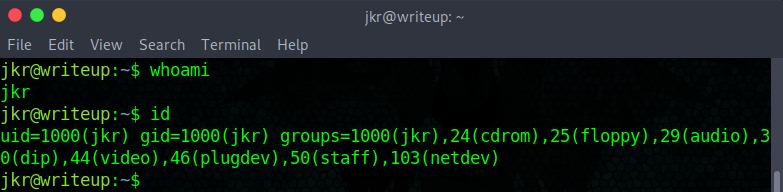
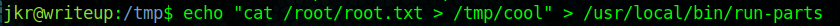

# Hack The Box: Writeup machine write-up

This machine with fun name was interesting in the sense that it taught me that recon needs to be done on google looking for existing exploits, as sometimes maybe there is no more data to find. After discovering the CMS and finding a SQL injection exploit we can access the machine through SSH. Then, to privesc we need to monitor processes on the machine to find out that there is a cronjob executed by root when a user logs in through SSH. Luckily for us, the executable path is relative, so we can hijack it and replace it with a different script of our choice, as the user we logged in as is part of the ``staff`` group. Let's dig in!

### Enumeration

As always, we start by enumerating open ports to discover the services running in the machine. I used nmap:

*Result of nmap scan*

```sh
# Nmap 7.70 scan initiated Tue Jun 18 11:42:20 2019 as: nmap -sV -sC -oN nmap/initial 10.10.10.138
Nmap scan report for writeup.htb (10.10.10.138)
Host is up (0.048s latency).
Not shown: 998 filtered ports
PORT   STATE SERVICE VERSION
22/tcp open  ssh     OpenSSH 7.4p1 Debian 10+deb9u6 (protocol 2.0)
| ssh-hostkey:
|   2048 dd:53:10:70:0b:d0:47:0a:e2:7e:4a:b6:42:98:23:c7 (RSA)
|   256 37:2e:14:68:ae:b9:c2:34:2b:6e:d9:92:bc:bf:bd:28 (ECDSA)
|_  256 93:ea:a8:40:42:c1:a8:33:85:b3:56:00:62:1c:a0:ab (ED25519)
80/tcp open  http    Apache httpd 2.4.25 ((Debian))
| http-robots.txt: 1 disallowed entry
|_/writeup/
|_http-server-header: Apache/2.4.25 (Debian)
|_http-title: Nothing here yet.
Service Info: OS: Linux; CPE: cpe:/o:linux:linux_kernel

Service detection performed. Please report any incorrect results at https://nmap.org/submit/ .
# Nmap done at Tue Jun 18 11:42:36 2019 -- 1 IP address (1 host up) scanned in 15.22 seconds
```

There is just SSH and a webserver with a ``robots.txt`` file that disallows ``/writeup``.

#### Web server enumeration & exploitation

*Webpage found on port 80*


We can see that there is a protection against scanners, which means no automated enumeration on this one. Then, as I had discovered the disallowed directory ``/writeup`` I checked it:

*``/writeup`` page*


Turns out it is some kind of blog with different entries of retired machines:

*``/ypuffy`` page*


Fun! At this point I tried to see if I could find a LFI with the ``page`` parameter without luck. Then, I opened up the source and bumped into something interesting:

*Finding out that the website uses CMS Made Simple*


I also discovered a directory that lead me nowhere:

*``/modules`` directory*


And found a protected directory under ``/writeup/admin``. I didn't have any credentials so I kept on looking. I eventually found an appropriate [exploit](https://www.exploit-db.com/exploits/46635) (after a lot of time) that required no authentication. It was based on a time-based SQL injection. After having it downloaded I just ran it with the URL:

```terminal
python 46635.py -u http://10.10.10.138/writeup/
```

*Output of command*


Then I saw there was an option to crack the hash so I re-ran the command with the rockyou.txt wordlist and got lucky!

```terminal
python 46635.py -u http://10.10.10.138/writeup/ -c -w /usr/share/wordlists/rockyou.txt
```

```
[+] Password cracked: raykayjay9
```

I tried to access the admin panel and it rejected the credentials when it dawned on me that SSH was available, I tried and voilà, we had a shell!

*Gaining access with SSH*


#### Privilege escalation

I started by doing the usual manual enumeration and with LinEnum.sh but found nothing apart from the fact that we can write into some directories as ``jkr`` is part of the ``staff`` group:

*Inspecting user permissions*



Then, I used pspy to monitor processes and found this interesting one run by root:

*Interesting cronjob detected with pspy*


We can see that ``run-parts`` is being executed with a relative path. And guess what? We can write into the directories. That means it's time for some hijacking!

But first I wanted to find out what the ``run-parts`` executable does. From man pages I discover it's used to run scripts on a certain directory, so I tried to create a script on the ``/etc/update-moto.d/`` directory but I had no permissions.

*Functionality of ``run-parts``*


Therefore, I created a file ``/usr/local/bin/run-parts`` with the following content: ``cat /root/root.txt > /tmp/cool``. And after a while when someone else logged in through SSH I got the contents of ``root.txt`` (I don't know why it didn't work if I logged on another window).

*Getting the root hash (there are other files from other people)*




I hope you found this box interesting and learnt something!

---

*Diego Bernal Adelantado*
